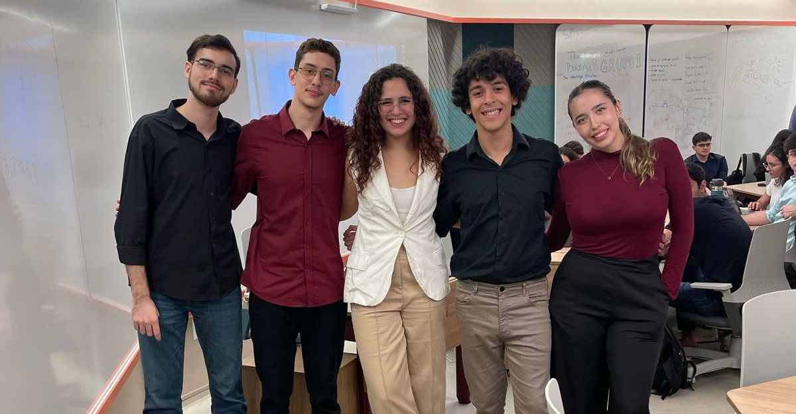

# Inteli - Instituto de Tecnologia e Liderança 

 

# Engage

</img>

## Time Engage:
</img>

## 👨‍🎓 Integrantes: 

  <table>
    <tr>
      <td align="center"><a href="https://www.linkedin.com/in/bruno-crusinski/"> <b> Bruno Carvalho Crusinski</b></a></td>
      <td align="center"><a href="https://www.linkedin.com/in/heitorfariacandido/"> <b> Heitor de Faria Cândido</b></a></td>
      <td align="center"><a href="http://www.linkedin.com/in/kaiovittor"> <b>Kaio Vittor Martins</b></a></td>
       <td align="center"><a href="http://www.linkedin.com/in/marianadepaulabarbosa"> <b>Mariana de Paula Barbosa</b></a></td>
      <td align="center"><a href="http://linkedin.com/in/yasmim-passos"> <b>Yasmim Marly Passos</b></a></td>
    </tr>
  </table>

## 👩‍🏫 Professores:
### Orientador(a) 
- <a href="http://linkedin.com/in/juliastateri">Julia Stateri</a>
### Instrutores
- <a href="http://linkedin.com/in/andre-godoi-chiovato-83730228">André Godoi Chiovato</a> 
- <a href="http://linkedin.com/in/bruna-mayer-00a556174">Bruna Mayer</a>
- <a href="http://linkedin.com/in/diogo-martins-gonçalves-de-morais-96404732">Diogo Martins Gonçalves de Morais</a>
- <a href="http://linkedin.com/in/filipe-gonçalves-08a55015b">Filipe Gonçalves de Souza Nogueira da Silva</a>
- <a href="http://linkedin.com/in/henrique-mohallem-paiva-6854b460">Henrique Mohallem Paiva</a>
- <a href="http://linkedin.com/in/kizzyterra">Kizzy Fernanda Terra Ferreira da Paz</a>
- <a href="http://linkedin.com/in/renato-penha">Renato Penha</a>

## Descrição
O projeto Engage surge como uma resposta inovadora à falta de engajamento dos usuários na plataforma Oracle Academy. Desenvolvido por alunos de graduação do Instituto de Tecnologia e Liderança (Inteli) em parceria com a Oracle Academy, este serious game combina elementos de gamificação e uma estética de "cozy game" para proporcionar uma experiência de aprendizado envolvente e confortável.

A gamificação tem se mostrado uma ferramenta poderosa para motivar a participação e o aprendizado em diversos contextos, especialmente na educação. Ao integrar elementos de jogos, como desafios, recompensas e progressão, o Engage transforma a navegação na plataforma Oracle Academy em uma jornada estimulante, onde os usuários são incentivados a explorar e descobrir os recursos disponíveis.

Além disso, ao adotar a estética de um "cozy game", o Engage busca criar um ambiente acolhedor e relaxante para os usuários. Esta abordagem visa eliminar possíveis barreiras emocionais que podem surgir ao aprender novos conceitos ou explorar novas plataformas. O objetivo é oferecer uma experiência de aprendizado que seja não apenas educativa, mas também reconfortante e inspiradora.

No Engage, os usuários são guiados por uma interface intuitiva e acessível, que facilita a exploração dos diferentes recursos e funcionalidades da plataforma. Feedbacks positivos e recompensas são fornecidos ao longo da jornada do usuário, incentivando o progresso e a participação contínua.

Mais do que simplesmente aumentar o engajamento dos usuários, o Engage visa criar uma comunidade de aprendizado vibrante e colaborativa. Ao proporcionar uma experiência de aprendizado mais envolvente e acessível, esperamos não apenas atrair mais usuários para a plataforma Oracle Academy, mas também capacitá-los a desenvolver habilidades tecnológicas essenciais para o mundo moderno.

O Engage está sendo desenvolvido com base em pesquisas e melhores práticas em gamificação e design de experiência do usuário. Testes e interações contínuas estão sendo realizados para garantir que o jogo atenda às necessidades e expectativas dos usuários.

Em resumo, o Engage representa uma abordagem inovadora e promissora para resolver o problema da falta de engajamento na plataforma Oracle Academy. Ao combinar gamificação e uma estética de "cozy game", este serious game oferece uma experiência de aprendizado que é ao mesmo tempo estimulante, confortável e acessível. Com o Engage, esperamos não apenas inspirar os usuários a explorar seu potencial educacional, mas também capacitá-los a prosperar no mundo da tecnologia e da inovação.

## 🎮 Jogue agora

Para acessar o jogo diretamente do seu navegador entre no seguinte link: [Engage](https://inteli-college.github.io/2024-T0011-IN01-G05/)

## 📁 Estrutura de pastas
Dentre os arquivos e pastas presentes na raiz do projeto, definem-se:

- <b>assets</b>: aqui estão os arquivos relacionados a imagens, sons e fontes utilizados no jogo.

- <b>document</b>: aqui estão todos os documentos do projeto, como o Game Development Document (GDD) bem como documentos complementares, na pasta "other".

  - <b>other</b>: nessa pasta se encontram todos os ítens relacionados a documentação que não são o Game Development Document (GDD), como imagens.

- <b>src</b>: Todo o código fonte criado para o desenvolvimento do projeto do jogo.

- <b>README.md</b>: arquivo que serve como guia e explicação geral sobre o projeto e o jogo.

## 🔧 Como executar o código
Para executar o nosso jogo é necessário cumprir alguns requisitos: 
- Ter acesso a internet.
- Ter um editor de código.
- Possuir um serviço para servidores locais (recomendamos a extensão Live Server do VSCode).

Tendo isso, siga as instruções abaixo para executar o código:

- 1º - Realize um clone deste repositório, executando o comando `git clone https://github.com/Inteli-College/2024-T0011-IN01-G05.git` no terminal.

- 2º - No editor de código abra o arquivo `index.html` usando a extensão Live Server ou outro serviço de hospedagem local da sua preferência.

E pronto você já conseguirá executar o código de modo local.

## 🗃 Histórico de lançamentos

* 0.5.0 - 11/04/2024
    * Aprimoramento do código.
      * Inserção dos sons.
      * Resolução de bugs.
* 0.4.0 - 29/03/2024
    * Entrega do MVP.
      * Inserção dos inputs de criar cadastro e login. 
      * Implementação do fim da fase 1.
      * Implementação de todas as falas.
* 0.3.0 - 15/03/2024
    * Implementação dos dois puzzles.
      * Inserção do jogo da memória.
      * Inserção do jogo da carga.
* 0.2.0 - 01/03/2024
    * Implementação da funcionalidade do scroll.
    * Implementação das falas do miguelzinho.
* 0.1.0 - 16/02/2024
    * Inserção do código base do jogo.
      * Adiciona o código e os assets da tela inicial.

## 📋 Licença/License

<a property="dct:title" rel="cc:attributionURL" href="https://github.com/Inteli-College/2024-T0011-IN01-G05">Engage</a> by <a rel="cc:attributionURL dct:creator" property="cc:attributionName" href="https://github.com/Inteli-College/2024-T0011-IN01-G05">Inteli, Bruno Crusinski, Heitor Cândido, Kaio Vittor, Mariana de Paula e Yasmim Passos</a> is licensed under <a href="https://creativecommons.org/licenses/by/4.0/?ref=chooser-v1" target="_blank" rel="license noopener noreferrer" style="display:inline-block;">CC BY 4.0</a>
