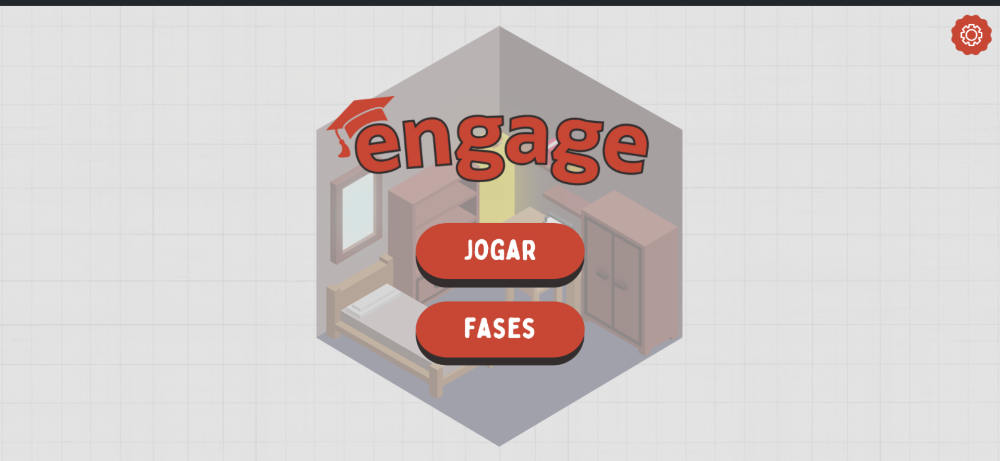
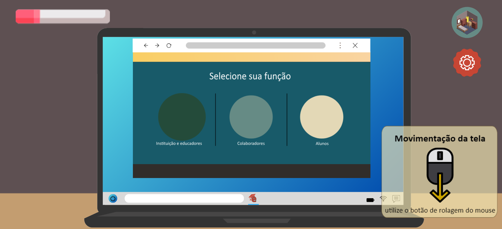

# GDD - Game Design Document - Módulo 1 - Inteli

## Grupo Engage

#### Bruno Carvalho Crusinski

#### Heitor de Faria Cândido

#### Kaio Vittor Martins Silva

#### Mariana de Paula Barbosa Souza

#### Yasmim Marly Passos

## Sumário

[1. Introdução](#c1)

[2. Visão Geral do Jogo](#c2)

[3. Game Design](#c3)

[4. Desenvolvimento do jogo](#c4)

[5. Casos de Teste](#c5)

[6. Conclusões e trabalhos futuros](#c6)

[7. Referências](#c7)

[Anexos](#c8)

<br>

# <a name="c1"></a>1. Introdução

## 1.1. Escopo do Projeto

### 1.1.1. Contexto da indústria

&nbsp;&nbsp;&nbsp;&nbsp; A Oracle é uma das maiores empresas atuais de tecnologia, tendo grande destaque no ramo e sendo referência em segurança cibernética. Produz majoritariamente sistemas e interfaces para bancos de dados, além de uma alta gama de softwares, hardwares e serviços relacionados à computação em nuvem.

&nbsp;&nbsp;&nbsp;&nbsp; Uma de suas ramificações é a Oracle Academy, uma plataforma de capacitação profissional para professores aprenderem a utilizarem melhor em sala de aula as ferramentas Oracle. No entanto, nos últimos anos, com o crescimento da utilização de serviços on-line, o setor educacional voltado para professores aumentou gradativamente, mesmo que ainda tal setor seja preenchido por startups e iniciativas pouco tecnológicas agregando pouco ao letramento digital dos profissionais. Empresas como Microsoft Learn, Google For Education, Cisco Networking Academy, Amazon Web Services (AWS) Educate e Coursera estão entre os concorrentes diretos, oferecendo plataformas de capacitação digital com foco em educação, embora suas ofertas possam variar em termos de especialização e abrangência.

&nbsp;&nbsp;&nbsp;&nbsp; Diante desse cenário competitivo, a entrada da Oracle Academy no mercado educacional visa preencher uma lacuna importante, fornecendo uma plataforma robusta e especializada para capacitar os professores no uso eficaz das tecnologias Oracle. No entanto, enfrentar a competição com essas empresas estabelecidas requer estratégias específicas para destacar os benefícios da plataforma.

&nbsp;&nbsp;&nbsp;&nbsp; Dentre as características principais da Oracle Academy, esses são alguns destaques que a fazem se sobrair de suas concorrentes:

 1. Especialização em tecnologias Oracle: Enquanto outras plataformas oferecem uma ampla gama de cursos em várias áreas, a Oracle Academy se destaca ao se concentrar especificamente nas tecnologias Oracle, oferecendo um conhecimento mais profundo e especializado nesse campo;

 2. Integração com currículos educacionais: A Oracle Academy pode destacar como sua plataforma se integra perfeitamente aos currículos educacionais, fornecendo recursos e materiais que complementam as disciplinas existentes, especialmente em cursos de tecnologia e ciência da computação;

 3. Suporte e recursos adicionais: Além dos cursos online, a Oracle Academy pode oferecer suporte adicional aos professores, como workshops presenciais, materiais didáticos personalizados e acesso a uma comunidade de educadores experientes.

### 1.1.2. Análise das 5 Forças de Porter

&nbsp;&nbsp;&nbsp;&nbsp; A análise das 5 Forças de Porter é uma ferramenta de grande utilização na análise setorial de um determinado seguimento. Seus tópicos se baseiam no estudo das forças competitivas em um setor específico e ajudar as empresas a avaliarem o ambiente em que operam. 

<div align="center">
Figura 1 - Análise das 5 Forças de Porter do jogo.
</img><figcaption>Fonte: Grupo ENGAGE (Autoria Própria), 2024, link: <a href="https://www.canva.com/design/DAGAKQtrJgo/i8qaiIusebt_rsh2-c6bmg/edit?utm_content=DAGAKQtrJgo&utm_campaign=designshare&utm_medium=link2&utm_source=sharebutton"> Canva </a> </figcaption>
</div>

### 1.1.3. Análise SWOT

&nbsp;&nbsp;&nbsp;&nbsp; A análise SWOT é uma ferramenta utilizada para analisar os agentes internos e externos que podem influenciar em um determinado espaço, bem como os pontos positivos e negativos que agregam ao resultado final.

<div align="center">
Figura 2 - Análise SWOT da empresa Oracle Academy.
<figcaption>Fonte: Grupo ENGAGE (Autoria Própria), 2024, link: <a href="https://www.canva.com/design/DAF8NoaQqLQ/Y7j20lcLC0cWeRpSlZe66Q/edit?utm_content=DAF8NoaQqLQ&utm_campaign=designshare&utm_medium=link2&utm_source=sharebutton."> Canva </a></figcaption>
</div>

#### Análise SWOT (Oracle Academy)

| #   | Forças (Strengths)                                                                                                                 |
| --- | ---------------------------------------------------------------------------------------------------------------------------------- |
| 1.  | Credibilidade da Oracle na prestação de serviços tecnológicos;                                                                               |
| 2.  | Alta quantidade de recursos tecnológicos disponíveis aos professores;                                                                                              |
| 3.  | Programa educacional abrangente com acesso mundial;                   |
| 4.  | Qualificação profissional aos professores em cursos de TI;                                                     |
| 5.  | Oferta de recursos exclusivos em sua plataforma como: Oracle Cloud Infrastructure (OCI), Oracle Database, Java, Oracle Application Express (APEX), Oracle Analytics Cloud (OAC); |
| 6.  | Sessão com histórias de sucesso por todo o mundo para incentivar os professores entrantes da plataforma.                                                                                              |

| #   | Fraquezas (Weaknesses)                                                                                                                     |
| --- | ------------------------------------------------------------------------------------------------------------------------------------------ |
| 1.  | Alto custo para utilização de algumas ferramentas Oracle;                                                                                            |
| 2.  | Necessidade de uma conta Oracle para poder criar uma nova no site da Oracle Academy;                                                                                                                     |
| 3.  | Experiência de usuário pouco intuitiva;                                                  |
| 4.  | Falta de flexibilidade curricular;                                                                                         |
| 5.  | Dificuldade de adoção global devido a diferenças culturais, linguísticas e infraestruturais.                                                                                                                    |
| 6.  | Alguns professores podem achar a curva de aprendizado do jogo íngreme, especialmente se não estiverem familiarizados com jogos educativos; |

| #   | Oportunidades (Opportunities)                                              |
| --- | -------------------------------------------------------------------------- |
| 1.  | Educação e instrução on-line cada vez mais requisitados; |
| 2.  | Parceria com instituições de ensino e secretarias educacionais;          |
| 3.  | Expansão para países emergentes;    |
| 4.  | A demanda por habilidades em tecnologia continua a crescer, oferecendo oportunidades de mercado para todas as empresas do setor;           |
| 5.  | Adesão de novas tecnologias emergentes como: IoT, inteligência artificial ou blockchain.                                        |

| #   | Ameaças (Threats)                                                                    |
| --- | ------------------------------------------------------------------------------------ |
| 1.  | Aumento da concorrência de empresas tecnológicas com segmentos educacionais;                                           |
| 2.  | Evolução tecnológica e utilização da IA para o meio de aprendizagem;                                                |
| 3.  | Alguns professores podem resistir à adoção de novas tecnologias e métodos de ensino; |
| 4.  | Concorrência Intensa: A Oracle Academy enfrenta competição de outras empresas de tecnologia e plataformas educacionais como: Microsoft Learn; Google For Education,  Cisco Networking Academy, Amazon Web Services (AWS) Educate e Coursera; |
| 5.  | Mudanças nas regulamentações educacionais e tecnológicas. 
 |

#### Análise SWOT (Engage)

| #   | Forças (Strengths)                                                                                                                 |
| --- | ---------------------------------------------------------------------------------------------------------------------------------- |
| 1.  | Produto agradável com boa luminosidade e sonoridade;                                                                               |
| 2.  | Jogo de fácil acesso e jogabilidade;                                                                                               |
| 3.  | Cores neutras e visuais pixelados baseadas na modalidade “Cozy Game’ (Confortável, desestressante e aconchegante);                 |
| 4.  | Musicalidade desenvolvida a partir de musicoterapia para concentração e foco;                                                      |
| 5.  | Dinâmica a partir de pistas e fragmentos para a resolução do enigma, em que o mesmo representa, ao final, a conclusão de uma fase; |
| 6.  | Metodologia de instruções gamificadas;                                                                                              |

| #   | Fraquezas (Weaknesses)                                                                                                                     |
| --- | ------------------------------------------------------------------------------------------------------------------------------------------ |
| 1.  | Acessível somente para professores acadêmicos;                                                                                             |
| 2.  | Formato somente em 2D;                                                                                                                     |
| 3.  | Foco isolado para engajamento e instrução, tornando o público alvo demasiadamente seleto;                                                  |
| 4.  | Não é adaptável a todas as plataformas e consoles;                                                                                         |
| 5.  | Dependente de internet;                                                                                                                    |
| 6.  | Alguns professores podem achar a curva de aprendizado do jogo íngreme, especialmente se não estiverem familiarizados com jogos educativos; |

| #   | Oportunidades (Opportunities)                                              |
| --- | -------------------------------------------------------------------------- |
| 1.  | Escalonamento do produto através de parcerias com escolas e universidades; |
| 2.  | Alavancar o compartilhamento do jogo e ressaltar sua importância;          |
| 3.  | Criação de mais fases para outras ferramentas mais complexas da Oracle;    |
| 4.  | Recebimento de feedbacks dos professores para futuras melhorias;           |
| 5.  | Oportunidade de letramento digital;                                        |

| #   | Ameaças (Threats)                                                                    |
| --- | ------------------------------------------------------------------------------------ |
| 1.  | Crescimento do mercado de “Serious Games”;                                           |
| 2.  | Instruções de cadastro pelo Chat GPT;                                                |
| 3.  | Alguns professores podem resistir à adoção de novas tecnologias e métodos de ensino; |

### 1.1.4 Descrição da Solução Desenvolvida

&nbsp;&nbsp;&nbsp;&nbsp; Em se tratando de plataformas de ensino virtual, um dos maiores desafios está associado à adoção do aprendizado oriundos destas plataformas em sala de aula pelos professores.
De acordo com a radiografia anual da TIC na Educação, cerca de 75% do corpo docente carece de uma plataforma para adquirir conhecimentos em ferramentas digitais. O artigo "Saúde Docente: Possibilidades e Limites" de 1999 destaca a tensão e o estresse causados pela desconexão entre as expectativas do sistema educacional e as condições reais dos professores.

&nbsp;&nbsp;&nbsp;&nbsp; Apresentado esse cenário, o projeto ENGAGE é um jogo que facilita  a compreensão do cadastro na plataforma Oracle Academy. Apresentando ao professor, que deseja participar dessa comunidde, um jogo instrutivo para o momento de cadastro, o qual possui uma diversidade de desafios e tarefas. 

&nbsp;&nbsp;&nbsp;&nbsp; Esse jogo deve ser utilizado precedendo o contato com o site da Oracle Academy, para que assim o professor possa aprender com ele a melhor forma de explorar sua interface e suas oportunidades. Portanto, ao criar uma nova ambientação envolvendo educação, jogabilidade e tecnologia, o processo de absorção e engajamento na hora do cadastro se torna muito mais eficaz e memorável.

&nbsp;&nbsp;&nbsp;&nbsp; Para avaliar o sucesso da proposta, serão avaliados os tópicos:

 * Taxa de Adesão Pós-Jogo:
   1. Porcentagem de professores que completam o jogo;

   2. Número absoluto de professores que aderem à plataforma Oracle Academy após a conclusão do jogo;

   3. Comparação entre a taxa de adesão pré-jogo e pós-jogo para medir o impacto do ENGAGE na adesão dos professores.

 * Taxa de Retenção de Professores:
   1. Porcentagem de professores que continuam utilizando a plataforma Oracle Academy após um determinado período de tempo desde a conclusão do jogo;

   2. Taxa de abandono dos professores que participaram do ENGAGE em comparação com aqueles que não participaram.

 * Avaliação do Desempenho/Engajamento dos Professores:
   1. Feedback qualitativo dos professores sobre a utilidade e eficácia do ENGAGE em prepará-los para a plataforma;

   2. Tempo médio gasto pelos professores no cadastro da plataforma após o jogo ser menor que o tempo médio gasto sem o jogo;

   3. Número de interações dos professores com os recursos da Oracle Academy após o ENGAGE.

 * Envolvimento dos Alunos:
   1. Observação da participação dos alunos em atividades relacionadas à Oracle Academy após a implementação do ENGAGE;

   2. Feedback dos alunos sobre mudanças percebidas no ensino após o professor ter passado pelo ENGAGE;


### 1.1.5. Proposta de Valor

&nbsp;&nbsp;&nbsp;&nbsp; A proposta de valor do ENGAGE é analisada a partir da ferramenta "canva proposta de valor" apresentada abaixo. Para a elevação da qualidade da porposta de valor do jogo, foi feito uma extensa análise do público alvo, especialmente do perfil do cliente, e com base em suas tarefas, dores e ganhos foi aquitetado essa proposta de valor.

<div align="center">
Figura 3 - Canva proposta de valor do ENGAGE.

<figcaption>Fonte: Grupo ENGAGE (Autoria Própria), 2024.</figcaption>
</div>

### 1.1.5. Matriz de Riscos

&nbsp;&nbsp;&nbsp;&nbsp; Dentro da elaboração do projeto Engage, há riscos de execução e finalização dele, sejam esses riscos positivos ou negativos à completude dele. Os riscos são incertezas futuras de um projeto que o impactam de alguma forma. Para analisar melhor os riscos e obter uma resposta planejada e organizada a eles, a matriz de riscos é indispensável. Com ela, há uma organização maior dos problemas potenciais de um projeto, classificando-os com baixo, médio e alto risco dependendo de sua probabilidade e seu impacto.

&nbsp;&nbsp;&nbsp;&nbsp; A seguir é apresentado uma matriz de risco com seu eixo vertical sendo a probabilidade do risco ocorrer e o eixo horizontal o impacto da ocorrência desse risco:

<div align="center"> Figura 4 - Matriz de riscos do projeto ENGAGE.

<figcaption>Fonte: Grupo ENGAGE (Autoria Própria), 2024.</figcaption>
</div>


| Risco                                                     | Descrição                                                                                                                                                                                                                                                                             | Validade              | Resposta                     | Plano de ação                                                                                                                                                                                                                                                                                                                                              |
| --------------------------------------------------------- | ------------------------------------------------------------------------------------------------------------------------------------------------------------------------------------------------------------------------------------------------------------------------------------- | --------------------- | ---------------------------- | ---------------------------------------------------------------------------------------------------------------------------------------------------------------------------------------------------------------------------------------------------------------------------------------------------------------------------------------------------------- |
| Perda de armazenamento do código pelo github.             | O github é o espaço utilizado para armazenar o código do jogo desenvolvido. Caso haja algum impedimento de acesso ou uma perda de dados ocasionado por essa plataforma de armazenamento, todo o código poderá ser perdido ou suspenso por um tempo, atrasando o andamento do projeto. | Sem validade.         | Haverá uma resposta ativa.   | Os integrantes irão armazenar até o final do projeto ao menos sua parte da programação em uma pasta local, diminuindo assim o impacto de uma perda total do código por completo.                                                                                                                                                                           |
| Entraves do código.                                       | O código pode apresentar falhas de funcionamento e apresentar comportamento fora do esperado, sendo prejudicial ao resultado do projeto.                                                                                                                                              | Durante as 5 sprints. | Haverá uma resposta ativa.   | Passar por uma análise do grupo, revisando o código e suas marcações. Caso persista ou não for encontrado o problema, deverá ser consultado um professor da área.                                                                                                                                                                                          |
| Risco de exposição de dados do projeto.                   | O armazenamento público do código no Github pode apresentar riscos ao projeto por ceder a outros usuários a possibilidade de plágio do jogo, vazamento de dados do jogo ou mesmo utilização indevida do jogo.                                                                         | Sem validade.         | Haverá uma resposta passiva. |
| Acesso limitado a plataforma pelos desenvolvedores.       | Durante o desenvolvimento do projeto, o grupo desenvolvedor do jogo não tem acesso direto a plataforma da Oracle Academy, o que além de prejudicar na compreensão integral dela pelo grupo, o jogo pode não acompanhar atualizações relevantes da plataforma.                         | Durante as 5 sprints. | Haverá uma resposta passiva. | Produzir o jogo levando em consideração o contato com a plataforma do primeiro sprint.                                                                                                                                                                                                                                                                     |
| Integração ao site da Oracle Academy.                       | O processo de integração é muito delicado e pode ocorrer em futuros bugs, já que a arquitetura dos códigos pode ser distinta, causando entraves no processo.     |  Após a finalização do jogo.         | Haverá uma resposta ativa.   | Realizar testes extensivos de integração entre o ENGAGE e a Oracle Academy, além de coletar feedback contínuo dos usuários para identificar e corrigir quaisquer problemas de integração que possam surgir.  |
| Adaptação dos usuários ao site após a experiência com o Engage. | Se os professores não conseguirem se adaptar ao site da Oracle Academy após completarem o ENGAGE, isso pode resultar em uma utilização limitada ou ineficaz da plataforma, reduzindo assim os benefícios esperados em termos de aprendizado digital.                                             | Sem validade.         | Haverá uma resposta passiva.   | Oferecer suporte adicional após a conclusão do ENGAGE, como sessões de treinamento prático ou tutoriais personalizados sobre o uso da Oracle Academy. Além disso, garantir que o ENGAGE proporcione uma simulação realista e abrangente da plataforma, de modo que os professores possam se sentir confiantes e preparados para explorar suas funcionalidades. |
| Baixa adesão dos professores ao jogo.| Se os professores resistirem à mudança, podem não aproveitar completamente os benefícios do ENGAGE e continuarão a enfrentar desafios no uso de ferramentas digitais em sala de aula.                                             | Sem validade.         | Haverá uma resposta passiva.   | Oferecer treinamento abrangente e suporte contínuo para os professores, garantindo que se sintam confortáveis e confiantes ao utilizar o ENGAGE e as ferramentas digitais associadas. |

## 1.2. Requisitos do Projeto

&nbsp;&nbsp;&nbsp;&nbsp; O projeto ENGAGE é uma proposta para a resolução de uma problemática trazida pela Oracle Academy. Além dessa situação problema, foi delimitada métricas para determinar o MVP do projeto final. Todos esses itens citados, requisitos do projeto ENGAGE, serão apresentados a seguir nesta seção.


&nbsp;&nbsp;&nbsp;&nbsp; PROBLEMA: O processo de onboarding e integração de novos professores membros do programa Oracle Academy é uma longa jornada de acesso a diferentes ferramentas e recursos curriculares. Muitas vezes, é um desafio para professores, na correria do seu dia a dia, conseguir se dedicar a conhecer e entender os diversos recursos que passam a ter acesso ao se tornarem membros do Oracle Academy. Com isso, estes professores ingressantes perdem a oportunidade de usufruir de maneira completa de tudo aquilo que poderiam utilizar para potencializar o seu fazer acadêmico.

&nbsp;&nbsp;&nbsp;&nbsp; Atualmente, o maior desafio a ser trabalhado neste projeto está no engajamento do professor, em especial aquele que está ligado a uma instituição de ensino que se cadastrou individualmente na plataforma.

&nbsp;&nbsp;&nbsp;&nbsp; Este projeto consiste em realizar o mapeamento da jornada do professor desde o primeiro contato com a solução da Oracle Academy, transformando este entendimento num serious game: a jornada do usuário será traduzida num jogo que compreenderá 5 fases, com suas respectivas etapas de progressão com base em objetivos claros e definidos.

| #   | Requisitos - Jogo para Oracle Academy                                                                                                                             |
| --- | ----------------------------------------------------------------------------------------------------------------------------------------------------------------- |
| 1.  | O jogo deverá seguir a temática de “serious game”, projetada para ensinar, treinar, simular ou resolver problemas em áreas específicas, como educação.            |
| 2.  | O jogo não deverá conter elementos risíveis.                                                                                                                      |
| 3.  | O jogo deverá ser em primeira pessoa e não conter nenhum avatar que se mova, apenas um assistente que acompanha o jogador durante toda a jornada.                 |
| 4.  | A criação precisará ser desenvolvida com base em 5 fases pré-estabelecidas\*                                                                                      |
| 5.  | Colocar o professor jogador como protagonista da experiência.                                                                                                     |
| 6.  | A paleta de cores só poderá conter cores pastéis/ sóbrias.                                                                                                        |
| 7.  | As mecânicas do jogo serão de clicar, arrastar, selecionar e digitar.                                                                                             |
| 8.  | A ambientação do jogo deve obrigatoriamente ser feita em 2D.                                                                                                      |
| 9.  | Não há limites para a quantidade de ambientações, mas todas devem representar cômodos de fácil jogabilidade.                                                      |
| 10. | Todos os objetos que podem ser movimentados deverão aumentar de tamanho ao serem arrastados para fora do ambiente referido (para melhor visualização do usuário). |
| 11. | As fases determinam uma sequência gradativa de desafios.                                                                                                          |
| 12. | O jogo deverá ser disponibilizado para acesso via Web Browser.                                                                                                    |

\* Detalhamento do requisito 4:

- FASE 1: Cadastro
- FASE 2: Conhecendo as plataformas e recursos disponíveis:
  - Navegação nos conteúdos;
  - Inscrição em cursos;
- FASE 3: Canais:
- Criação de canais;
  - Inclusão de conteúdos nos canais;
  - Cadastro de alunos nos canais;
- FASE 4: Cloud:
  - Solicitação de conta cloud;
  - Solicitação de conta cloud para alunos;
- FASE 5: Participação em sessão de suporte ao membro.|

## 1.3. Público-alvo do Projeto

&nbsp;&nbsp;&nbsp;&nbsp; O público-alvo do jogo é diversificado, englobando desde professores com zero experiência em plataformas online até aqueles que buscam utilizar a Oracle Academy de forma mais abrangente. A proposta do jogo é ser inclusivo, acolhendo educadores com diferentes níveis de alfabetização digital e experiência em ambientes virtuais de aprendizagem.

# <a name="c2"></a>2. Visão Geral do Jogo

&nbsp;&nbsp;&nbsp;&nbsp; Nesta seção, apresentamos as características essenciais que definem o ENGAGE:

- Gênero do Jogo: Puzzle educativo
- Plataforma do Jogo: Navegadores web (especificamente para desktop)
- Número de Jogadores: Jogo de jogador único
- Títulos Semelhantes e Inspirações: Inspirado em jogos como "Unpacking" e "Welcome to the Game"

&nbsp;&nbsp;&nbsp;&nbsp; Essas definições fundamentais fornecem uma visão clara do que os jogadores podem esperar ao embarcar na jornada educativa do ENGAGE.

## 2.1. Objetivos do Jogo

&nbsp;&nbsp;&nbsp;&nbsp; O ENGAGE foi desenvolvido com o propósito fundamental de capacitar professores no uso efetivo da Oracle Academy. Composto por cinco fases, o jogo tem como objetivo simplificar o cadastro na plataforma, apresentar a interface de forma intuitiva, estimular a exploração progressiva dos recursos, oferecer aprendizado prático em cada etapa e utilizar elementos de gamificação para motivar e engajar os professores. A metodologia usada no ENGAGE combina aspectos didáticos e divertidos, criando uma experiência envolvente. O projeto busca não apenas treinar professores, mas também enriquecer a experiência educacional, melhorando a eficácia do uso da Oracle Academy.

## 2.2. Características do Jogo

### 2.2.1. Gênero do Jogo

&nbsp;&nbsp;&nbsp;&nbsp; O ENGAGE tem o formato de um puzzle game, com o intuito de estimular o pensamento crítico e a resolução de problemas. Ao imergir os professores em um ambiente confortável, o jogo proporciona uma experiência educacional imersiva e interativa. O jogo é composto com uma variedade de puzzles que representam obstáculos que os professores devem superar para progredir na plataforma da Oracle Academy. Esses quebra-cabeças não apenas testam o conhecimento prático sobre a Oracle Academy, mas também prepara o jogador para conseguir se cadastrar na plataforma mais facilmente.

&nbsp;&nbsp;&nbsp;&nbsp; A escolha do gênero de um cozy game com puzzles busca proporcionar uma experiência confortável e gratificante, onde a resolução de cada puzzle representa um avanço na jornada de aprendizagem e incentiva os professores a iniciar e prosseguir no cadastro da Oracle Academy.

### 2.2.2. Plataforma do Jogo

&nbsp;&nbsp;&nbsp;&nbsp; O ENGAGE foi estrategicamente desenvolvido como um jogo para a web, com foco particular em desktops. O objetivo desta escolha é proporcionar uma experiência de jogo acessível a um público vasto, remover barreiras ao acesso e garantir que os professores possam participar ativamente. A plataforma web foi escolhida pela praticidade, permitindo que os educadores desfrutem do jogo sem a necessidade de instalações adicionais.

&nbsp;&nbsp;&nbsp;&nbsp; Além disso, ao otimizar para desktops, o ENGAGE oferece uma experiência de usuário consistente que aproveita todo o potencial do ambiente de jogo e fornece uma abordagem intuitiva aos desafios educacionais apresentados. Esta abordagem busca promover a inclusão e a acessibilidade, garantindo que todos os professores tenham a oportunidade de se envolver e melhorar as suas competências na Oracle Academy através do ENGAGE.

### 2.2.3. Número de jogadores

&nbsp;&nbsp;&nbsp;&nbsp; O jogo se concentra na jogabilidade individual, com foco principal no professor. A escolha de apoiar apenas um jogador condiz com o enredo emocionante do jogo, onde o personagem principal é um professor que busca o aprimoramento profissional. Essa abordagem única se aprofunda na história e oferece desafios, proporcionando ao jogador uma experiência individualizada e envolvente.

### 2.2.4. Títulos semelhantes e inspirações

&nbsp;&nbsp;&nbsp;&nbsp; O design e a mecânica de ENGAGE foram profundamente influenciados por duas fontes, cada uma trazendo elementos distintos que enriqueceram a experiência de jogo. A escolha da jogabilidade em uma casa isométrica foi inspirada no jogo “Unpacking”, que se destaca pela abordagem única na exploração de espaços isométricos. Usar essa perspectiva dá aos jogadores uma visão ampla e imersiva do ambiente do jogo, criando uma experiência imersiva e visualmente rica.

&nbsp;&nbsp;&nbsp;&nbsp; Por outro lado, a mecânica computacional do ENGAGE foi inspirada no jogo “Welcome to the Game”. Ao adotar essa inspiração, buscamos incorporar uma camada adicional de desafio e interatividade, incentivando os jogadores a explorarem a Oracle Academy de forma mais detalhada e envolvente. A mecânica computacional adiciona uma dimensão estratégica à jogabilidade, proporcionando aos professores uma simulação mais realista e prática de suas futuras interações na plataforma.

&nbsp;&nbsp;&nbsp;&nbsp; Essas inspirações foram cuidadosamente integradas ao ENGAGE, resultando em um jogo que combina elementos de jogabilidade inovadores e mecânicas envolventes, envolvendo não apenas educar, mas também entreter os jogadores enquanto enfrentam os desafios propostos.

### 2.2.5. Tempo estimado de jogo

&nbsp;&nbsp;&nbsp;&nbsp; O Jogo ENGAGE foi elaborado para ser finalizado em uma média de 20 minutos. Essa escolha de duração do game foi baseada no estudo prévio do público alvo, da finalidade educacional e proposta de ser uma introdução a plataforma da Oracle Academy.

&nbsp;&nbsp;&nbsp;&nbsp;Os 20 minutos são necessários para que os jogadores tenham o tempo necessário para realizar os puzzles e compreender os passos para o cadastro na plataforma. Além disso, o game não estende sua jornada por entender a necessidade de aplicação prática dos conhecimentos adquiridos no game, já que seus usuários saíram engajados, otimizando o jogo para ser efetivo e rápido.

# <a name="c3"></a>3. Game Design

 &nbsp;&nbsp;&nbsp;&nbsp; O Game design é um processo de concepção, planejamento e criação de jogos. Esse processo envolve a definição de regras, mecânicas de jogo, sistemas, narrativas, personagens, níveis de dificuldade, e todos os elementos que compõem a estética proporcionada no jogo.

&nbsp;&nbsp;&nbsp;&nbsp; O projeto ENGAGE possuiu um extenso trabalho no game design, desde a concepção conceitual e artistica do jogo até suas produções finais. Nesta seção serão abordados esses aspectos de game design do jogo ENGAGE.

## 3.1. Enredo do Jogo

&nbsp;&nbsp;&nbsp;&nbsp; No enredo ENGAGE, o jogador assume o papel de um professor dedicado cujo objetivo é aprimorar suas habilidades e enriquecer seu currículo por meio do uso da Oracle Academy em sala de aula. A narrativa começa com o professor, motivado pelo desejo de oferecer uma experiência educacional mais avançada e relevante aos seus alunos.

&nbsp;&nbsp;&nbsp;&nbsp; À medida que o jogo se desenrola, o professor se depara com diversos desafios, representados por puzzles que refletem o momento de cadastro na plataforma da Oracle Academy. O jogo apresenta uma nova oportunidade de aprendizagem, abordando aspectos específicos do momento de cadastro na plataforma e incentivando a exploração gradual dos recursos da Oracle Academy.

&nbsp;&nbsp;&nbsp;&nbsp; Ao final do jogo, o professor emerge não apenas com conhecimento teórico, mas com compreensão prática e a confiança necessária para se cadastrar agilmente na Oracle Academy e ter acesso aos seus conteúdos.

## 3.2. Personagens

### 3.2.1. Controláveis

&nbsp;&nbsp;&nbsp;&nbsp; Nesta seção, destacamos os itens controláveis que oferecem ao jogador interações diretas e envolventes no ENGAGE.

| \#  | Nome               |                                                 | Objetivo                                                                                           | Características                                                                                                                                                                        | Habilidades                                                                                                            | Diferenciais                                                                                |
| --- | ------------------ | ----------------------------------------------- | -------------------------------------------------------------------------------------------------- | -------------------------------------------------------------------------------------------------------------------------------------------------------------------------------------- | ---------------------------------------------------------------------------------------------------------------------- | ------------------------------------------------------------------------------------------- |
| 1   | Cama               |Figura 5.   <figcaption>Fonte: Grupo ENGAGE (Autoria Própria), 2024.</figcaption>      | Local para o jogador clicar e conseguir dormir                                                     | Produzido sob grade axonométrica, se trata de um objeto com aparência macia, contendo cores pastéis variadas e quatro elementos: Estrutura de madeira, colchão, travesseiro e cobertor | Possibilidade de representação de descanso e completude por oferecer a ação de dormir                                  | Item em grade axonométrica com “impressão 3D” e interativo para nova ação                   |
| 2   | Post-it pequeno    |Figura 6.    <figcaption>Fonte: Grupo ENGAGE (Autoria Própria), 2024.</figcaption>   | Objeto onde o jogador pode interagir para que o mesmo cresça e as informações fiquem mais visíveis | Produzido sob grade axonométrica, se trata de um objeto pequeno quadrado de cor amarela, aparência áspera e com escritos ilegíveis                                                     | Item clicável que possibilita o aumento das informações contidas no pequeno papel                                      | Item em grade axonométrica com “impressão 3D” e interativo para nova ação                   |
| 3   | Post-it grande     | Figura 7.  <figcaption>Fonte: Grupo ENGAGE (Autoria Própria), 2024.</figcaption> | Objeto que procede o post-it pequeno e contém as informações de login do usuário                   | Produzido sob grade axonométrica, se trata de um objeto grande quadrado de cor amarela, aparência áspera e com escritos legíveis em marrom e vermelho                                  | Item clicável que possibilita o aumento das informações contidas no pequeno papel, dando continuidade ao papel pequeno | Item em grade axonométrica com “impressão 3D” e interativo para nova ação                   |
| 4   | Notebook           | Figura 8.   <figcaption>Fonte: Grupo ENGAGE (Autoria Própria), 2024.</figcaption>       | Item clicável que possibilita o jogador a interagir com a tela do computador e navegar pela mesma  | Produzido sob grade axonométrica, se trata de um objeto pequeno com várias formas e sensação de 3D. Possui cores sólidas e escuras                                                     | Objeto clicável que possibilita o aumento da tela para um notebook maior e a navegação da interface                    | Item em grade axonométrica com “impressão 3D” e interativo para nova ação                   |
| 5   | Botão Recarregável |Figura 9.  <figcaption>Fonte: Grupo ENGAGE (Autoria Própria), 2024.</figcaption>| Botão de passar para a tela de criação de conta da Oracle                                          | O botão faz uma animação de queda no início da página e protagoniza o puzzle 2, sendo necessário carregá-lo com cargas para torná-lo funcional                                         | O botão é desfuncional até ser carregado e tem a capacidade de movimento horizontal para isso                          | Botão com maior complexidade de animação do game possui uma micro narrativa para seu puzzle |
| 6   | Cartas Engage      |Figura 10.  <figcaption>Fonte: Grupo ENGAGE (Autoria Própria), 2024.</figcaption> | Cartas do puzzle 1 que liberam a navegação pelo site da Oracle                                     | Os 4 pares de cartas são responsáveis por construir um jogo da memória na tela inicial da Oracle Academy                                                                               | As cartas são viradas e desviradas conforme o usuário encontra o par correto                                           | Cada carta tem uma figura de uma das importantes áreas do site da Oracle Academy            |

### 3.2.2. Non-Playable Characters (NPC)

&nbsp;&nbsp;&nbsp;&nbsp; Nesta seção, apresentamos Miguelzinho, um personagem não-jogável crucial no universo do ENGAGE. Miguelzinho desempenha um papel essencial ao auxiliar o jogador/professor nas tarefas de cadastro e aprendizado na plataforma da Oracle Academy.

| \#  | Nome                     |                                               | Objetivo                                                                                               | Características                                           |
| --- | ------------------------ | --------------------------------------------- | ------------------------------------------------------------------------------------------------------ | --------------------------------------------------------- |
| 1   | Miguelzinho (Assistente) |Figura 11.  <figcaption>Fonte: Grupo ENGAGE (Autoria Própria), 2024.</figcaption>| Auxiliar o jogador/professor nas tarefas de cadastro e aprendizado para a plataforma da Oracle Academy | Personagem não-controlável de pele negra, óculos e dreads |

### 3.2.3. Diversidade e Representatividade dos Personagens

&nbsp;&nbsp;&nbsp;&nbsp; Na nossa sociedade a diversidade e representatividade são fundamentais quando se diz respeito à justiça e inclusão de minorias, as quais podem equilibrar nosso corpo social de modo equitativo. Representatividade refere-se à presença e participação igualitária de diferentes grupos, como etnias, classes, gêneros, orientações sexuais, idades e habilidades, em todos os aspectos da vida social, política, econômica e cultural. Ademais, a diversidade reconhece e valoriza as múltiplas identidades, experiências e perspectivas que enriquecem a pluralidade humana, como bem representada sua importância. Neste contexto, a promoção da representatividade e diversidade não apenas valoriza a singularidade de cada indivíduo, mas também fortalece os laços de entendimento, respeito e empatia entre as pessoas e comunidades.

&nbsp;&nbsp;&nbsp;&nbsp; Portanto, para trazermos uma noção de pertencimento no papel do jogador, incorporamos um personagem que o guia durante todo seu percurso. O personagem escolhido é uma homenagem ao representante da Oracle Academy dentro da América Latina, desse modo humanizando ainda mais o nosso jogo, pois o jogador estará se conectando com uma pessoa de “verdade”, com a sua personalidade.

&nbsp;&nbsp;&nbsp;&nbsp; Para complementar a relevância de nosso personagem fizemos uma análise mais aprofundada:

- Identificação: Por meio do contato entre o jogador e o Miguelzinho, personagem que representa os professores e que entende suas dificuldades, buscamos criar um ambiente mais familiar e amplificar o aspecto de acolhimento do jogo;
- Representatividade: A escolha de um personagem negro como o guia na jornada educacional do Engage tem como propósito criar um ambiente representativo, visto que atualmente, 20,6 milhões de brasileiros se declaram pretos - 10,2% de toda a população - segundo o Censo Demográfico de 2022 realizado pelo IBGE, porém o retratato respeitoso dessa população na mídia de jogos não é proporcional;
- Facilidade de Relacionamento: A presença de um personagem com quem eles possam se relacionar visual e culturalmente pode ajudar os professores a se sentirem mais à vontade e engajados com a experiência de aprendizado, pois não se sentirão sozinhos durante a jornada e, a todo momento, receberão apoio;
- Suporte e Orientação: Miguel atua como um guia amigável e confiável, oferecendo suporte e orientação aos professores, os ajudando a navegar e utilizar efetivamente os recursos da plataforma da Oracle Academy. Assim, o NPC se torna mais uma ferramenta no processo de engajamento dos usuários ao retornarem à plataforma oficial.

## 3.3. Mundo do jogo

&nbsp;&nbsp;&nbsp;&nbsp; Neste tópico, mergulharemos profundamente no mundo do jogo, explorando o vasto universo que compõe o ENGAGE. Desde a atmosfera acolhedora da Casa Isométrica, repleta de desafios educativos, até a representação detalhada do ambiente do Computador, simulando o site da Oracle Academy, cada cenário é meticulosamente projetado para enriquecer a experiência do jogador.

### 3.3.1. Locações Principais e/ou Mapas

&nbsp;&nbsp;&nbsp;&nbsp; Nesta seção, mergulharemos nas locações principais do jogo, destacando os cenários educativos que moldam a jornada do professor protagonista. De ambientes da Casa Isométrica, com desafios intrigantes, até o detalhado cenário do Computador, simulando o site da Oracle Academy.

&nbsp;&nbsp;&nbsp;&nbsp; Os jogadores exploram dois cenários distintos: uma casa isométrica e um ambiente de computador representando o site da Oracle Academy. Na casa, eles enfrentam desafios em perspectiva isométrica, enquanto o cenário computacional simula o uso prático da plataforma. Juntos, esses ambientes proporcionam uma experiência educacional completa, aliando desafio e aplicação prática para aprimorar as habilidades do professor protagonista.

| \#  | Imagem do cenário                           | Nome do cenário | Descrição                                                                                                                                                                                                                                                                                                                                                                                |
| --- | ------------------------------------------- | --------------- | ---------------------------------------------------------------------------------------------------------------------------------------------------------------------------------------------------------------------------------------------------------------------------------------------------------------------------------------------------------------------------------------- |
| 1   | Figura 12.     <figcaption>Fonte: Grupo ENGAGE (Autoria Própria), 2024.</figcaption> | Casa Isométrica | Ambiente tridimensional, onde os jogadores exploram o cômodo para enfrentar desafios educativos. Com uma perspectiva única, oferece uma experiência visualmente envolvente                                                                                                                                                                                                               |
| 2   | Figura 13.  <figcaption>Fonte: Grupo ENGAGE (Autoria Própria), 2024.</figcaption>| Computador      | Ambiente virtual focado na representação do site Oracle Academy. Este espaço oferece aos jogadores uma visão detalhada do ambiente online, com destaque para a interface da plataforma. Com elementos realistas e interativos, os jogadores exploram o mundo do site da Oracle Academy, enfrentando desafios que refletem as situações práticas encontradas na utilização da plataforma. |

### 3.3.2. Navegação pelo mundo

&nbsp;&nbsp;&nbsp;&nbsp; Nesta seção, adentraremos na mecânica de navegação que guia o professor protagonista pelo mundo dinâmico do ENGAGE. Ao compreender como as diferentes áreas e fases são acessadas e desbloqueadas, os jogadores terão uma visão clara do progresso educacional. Do ponto inicial na Tela Inicial, através dos desafios na Casa Isométrica, até a imersão no ambiente do computador, revelaremos a lógica por trás da navegação, proporcionando uma experiência fluida e envolvente no universo educacional do ENGAGE.

&nbsp;&nbsp;&nbsp;&nbsp; A experiência de navegação no ENGAGE é projetada para imergir os jogadores na perspectiva do professor protagonista, proporcionando uma interação em primeira pessoa. Aqui estão os principais elementos de navegação e a relação entre as locações:

Tela Inicial:

<ul>
  <li>Os jogadores podem ajustar configurações e controlar o áudio, personalizando a experiência de jogo de acordo com suas preferências individuais. </li>
</ul>

Casa Isométrica:

<ul>
  <li>
  O ponto inicial da jornada, onde o professor enfrenta desafios em cada cômodo.</li>
  <li>Para avançar, é necessário resolver enigmas educativos, proporcionando acesso progressivo a novas áreas.</li>
</ul>

Ambiente do Computador:

<ul>
  <li>Ao superar os desafios na casa isométrica, o jogador acessa o ambiente do computador, simulando o site da Oracle Academy.</li>
  <li>Diversas telas de navegador representam diferentes seções da plataforma, cada uma exigindo a resolução de tarefas específicas.</li>
</ul>

Progressão Gradual:

<ul>
<li>A conclusão bem-sucedida de desafios em uma página desbloqueia o acesso à próxima, promovendo uma progressão gradual e estruturada na fase de cadastro.</li>
</ul>

Desbloqueio de Recursos:

<ul>
<li>À medida que o professor avança no cadastro, novas interações aparecem a ele.</li>
</ul>

### 3.3.3. Condições climáticas e temporais

&nbsp;&nbsp;&nbsp;&nbsp; Nesta seção, entenderemos as condições climáticas dinâmicas que moldam o ambiente do ENGAGE, proporcionando uma experiência interativa e envolvente. Além disso, abordaremos como a passagem do tempo se torna um elemento essencial, influenciando a narrativa e as interações do jogador.

&nbsp;&nbsp;&nbsp;&nbsp; No ENGAGE, o tempo avança de forma dinâmica, refletindo o progresso do professor no jogo. Há apenas um evento específico que modifica o tempo de forma brusca. Sendo que para receber o e-mail crucial da Oracle Academy, o professor deve dormir, o que representa uma passagem significativa de tempo. Esta mecânica não só adiciona uma camada realista à narrativa, mas também apresenta o tempo como um elemento estratégico, criando uma experiência imersiva e orientada para eventos. Ao longo do jogo, o professor vivencia diferentes momentos e condições temporais, contribuindo para a complexidade e realismo do percurso educativo.

### 3.3.4. Concept Art

&nbsp;&nbsp;&nbsp;&nbsp; Nesta seção, apresentaremos a arte conceitual do jogo, proporcionando uma visão mais aprofundada da estética visual e do design que ainda não foram revelados nas seções anteriores deste documento. Cada imagem é uma representação conceitual, ilustrando momentos-chave do jogo.

<div align="center">
<figure>
Figura 14 - Tela da casa onde mostra a junção de todos os elementos (casa, itens, barra de progresso e miguelzinho).
    
    
  <figcaption>Fonte: Grupo ENGAGE (Autoria Própria), 2024.</figcaption>
</figure>
</div>
<br>
<div align="center">
<figure>
Figura 15 - Tela em que mostra as 3 opções de escolhas que o usuário teria que fazer no site da Oracle Academy.
    
    <figcaption>Fonte: Grupo ENGAGE (Autoria Própria), 2024.</figcaption>
</figure>
</div>
<br>
<div align="center">
<figure>
Figura 16 - Tela que redireciona o jogador para a escolha de criar conta ou entrar em uma já existente
    
 <figcaption>Fonte: Grupo ENGAGE (Autoria Própria), 2024.</figcaption>

</figure>
</div>

### 3.3.5. Trilha sonora

&nbsp;&nbsp;&nbsp;&nbsp; O jogo engage tras a proposta de ser um jogo confortável para o usuário e educativo também na escolha musical. Com uma trilha sonora voltada a um estilo mais leve e calmo, o jogador pode explorar tranquilamente o jogo com uma música coerente com a proposta do game.

&nbsp;&nbsp;&nbsp;&nbsp; Os sons presentes no jogo propõem trazer uma maior imersão para o usuário em diversas perspectivas. Dentre elas, o projeto traz maior realismo nas interações com mecânicas utilizadas, como o som do click do botão ou pegar o post-it dando o feedback de que aquele objeto foi interagido. Também foi trabalhado a criação de sons que remetem a eventos para aumentar sua verossimilhança e entendimento, como um barulho para a queda dos botões e das energias no minigame.

&nbsp;&nbsp;&nbsp;&nbsp; Para além dessas utilidades, entendemos que nosso usuário deve receber um feedback do seu desempenho de maneira clara durante o jogo. Com isso, incluímos uma sinalização sonora de acerto ou erro em situações como o puzzle do jogo da memória, em que é indicado ao se acertar um par ou erra-lo, além da captura das energias pelo botão no segundo minigame.

 &nbsp;&nbsp;&nbsp;&nbsp; Assim, nosso jogo busca criar - por meio de uma complementaridade de efeitos visuais e sonoros - um ambiente imersivo e engajante no ENGAGE. Por meio da tabela abaixo é descrito os sons, referenciando-os com suas fontes.

\# | título | descrição da ocorrência | Autor - título original | fonte
--- | --- | --- | --- | ---
1 | somVirandoCarta | Ao se virar uma carta do jogo da memória, ocorre o som de virada dessa carta | Pixabay - PageTurn | Site pixabay: https://pixabay.com/pt/sound-effects/pageturn-102978/
2 | somPegarPapel | Ao se pegar o postit no quarto da parte inicial, e abri-lo em um asset maior, faz o barulho de papel coletado. | Floraphonic - Paper Collect 3| Site pixabay: https://pixabay.com/pt/sound-effects/paper-collect-3-186600/
3 | somClickMouse | Ao se clicar em um botão, seja no pc ou na fala do Miguelzinho, emite som de click de mouse. | SoundReality - Mouse Click| Site pixabay: https://pixabay.com/pt/sound-effects/mouse-click-153941/
4 | somErroCriarConta | Ao se errar o conteúdo no momento de criar a conta, ocorre essa sinalização. |u_31vnwfmzt6 - Error| Site pixabay: https://pixabay.com/pt/sound-effects/error-126627/
5 | somNotificacao | Ao chegar a notificação do email de criação da conta da Oracle Academy. |u_03k5gu83c1 - livechat| Site pixabay: https://pixabay.com/pt/sound-effects/livechat-129007/
6 | somPegarEnergia | Ao conseguir pegar uma energia no minigame de encher o botão, faz esse som de sucesso. |floraphonic - Cute Level Up 3| Site pixabay: https://pixabay.com/pt/sound-effects/cute-level-up-3-189853/
7 | somQuedaBotao | Ao mudar para uma tela específica, o botão de criar conta cai, emitindo esse barulho em sua queda. |VoiceBosch - Falling Whistle (Cartoon)| Site pixabay: https://pixabay.com/pt/sound-effects/falling-whistle-cartoon-180579/
8 | somQuedaEnergia | Estando no minigame de coletar energias para abastecer o botão, a queda das energias emite esse som. |floraphonic - Cartoon Slide Whistle Down 1| Site pixabay: https://pixabay.com/pt/sound-effects/cartoon-slide-whistle-down-1-176647/
9 | somClickCama | Estando finalizado o cadastro na plataforma, a cama fica disponível e emite esse barulho ao ser clicada. |Pixabay - UI click| Site pixabay: https://pixabay.com/pt/sound-effects/ui-click-43196/
10 | somErroMemoria | Ao se errar a dupla de cartas no jogo da memória, emite-se esse som. |UNIVERSFIELD - Error Call To Attention| Site pixabay: https://pixabay.com/pt/sound-effects/error-call-to-attention-129258/
11 | somClickPC | Ao se clicar no notbook no cenário do quarto, para entrar nele, emite-se esse som. |floraphonic - Multi Pop 2| Site pixabay: https://pixabay.com/pt/sound-effects/multi-pop-2-188167/
12 | somClickPC | Ao se clicar no notbook no cenário do quarto, para entrar nele, emite-se esse som. |floraphonic - Multi Pop 2| Site pixabay: https://pixabay.com/pt/sound-effects/multi-pop-2-188167/
13 | musica | Durante todo o game é tocado, ao fundo, essa música de jazz em loop |ShidenBeatsMusic - (Loop file) Jazz waltz 3/4 beat - BPM132| Site pixabay: https://pixabay.com/pt/sound-effects/loop-file-jazz-waltz-34-beat-bpm132-144689/

## 3.4. Inventário e Bestiário

### 3.4.1. Inventário

&nbsp;&nbsp;&nbsp;&nbsp; O estilo de jogo adotado para o Engage não envolve a criação de um inventário, sendo, portanto, um tópico disfuncional para a descrição do projeto.

### 3.4.2. Bestiário

&nbsp;&nbsp;&nbsp;&nbsp; De forma análoga ao tópico 3.4.1, o escopo do projeto Engage não comporta a presença de um bestiário, decorrente da ausência de inimigos, sendo um elemento na qual não se consegue discorrer sobre.

## 3.5. Gameflow (Diagrama de cenas)

&nbsp;&nbsp;&nbsp;&nbsp; Nesta seção apresentamos o ENGAGE Gameflow, um diagrama de cena que descreve o fluxo do jogo de forma visual e estruturada. Cada cena representa um momento crucial na jornada do professor protagonista, desde a Tela Inicial até a conclusão dos desafios educacionais nas paginas do computador.

<div align="center">
Figura 17 - Diagrama de cenas.


<figcaption>Fonte: Grupo ENGAGE (Autoria Própria), 2024.</figcaption>

[Link do GameFlow](https://www.canva.com/design/DAF_nEH8Z3M/mRYMJNbSTbGCyAU0jjn9fA/edit?utm_content=DAF_nEH8Z3M&utm_campaign=designshare&utm_medium=link2&utm_source=sharebutton)
</div>

## 3.6. Regras do jogo

&nbsp;&nbsp;&nbsp;&nbsp; Nessa seção, apresentaremos as regras do jogo Engage, tópico que engloba os desafios que serão apresentados, quais as recompensas que oferecem, como o jogador pode interagir com esses desafios e, por fim, como proceder para superá-los.


&nbsp;&nbsp;&nbsp;&nbsp; Para progredir no jogo, o usuário deve navegar pelos ambientes do quarto e no cenário do notebook, resolvendo pequenos puzzles e vencendo alguns mini games ao longo do caminho. Conforme esses obstáculos são superados, o jogador poderá monitorar seu avanço através da barra de progresso, que também será gatilho para novos eventos e interações.


&nbsp;&nbsp;&nbsp;&nbsp; O jogador recebe, ao longo de sua jornada, instruções do Miguelzinho e às vezes pode escolher seguir o jogo sem ler seus conselhos, às vezes é obrigado a esperá-lo falar. Durante o cenário do quarto, nem todos os objetos estão habilitados e o jogador sempre é induzido a clicar no objeto que lhe leva a progredir na fase. Além disso, o jogador deve criar o email na criação de conta e criar uma boa senha, caso contrário, ele será barrado de progredir na fase.


&nbsp;&nbsp;&nbsp;&nbsp; No minigame de coletar energias, o jogador não recebe punições de perdas de energias e não poderá perder o jogo de forma alguma, sendo um loop que ocorre até o professor conseguir alcançar seu objetivo. O mesmo ocorre no primeiro puzzle, o jogo da memória. Nele, o jogador pode errar ilimitadamente e tem um feedback sonoro e visual do seu acerto ou erro, até que ele conclua totalmente o minigame.


&nbsp;&nbsp;&nbsp;&nbsp; Caso o jogador tenha esquecido da senha, a senha aparecerá no mesmo post-it que ele encontrou o e-mail facilitando sua jornada e dificultando que algum motivo limite-o concluir o jogo. Esse comportamento reflete o intuito do jogo de ser sempre um facilitador no processo de aprendizado, não limitando ou fazendo o jogador perder em momento algum.

### 3.7.1 Mecânicas gerais

&nbsp;&nbsp;&nbsp;&nbsp; Esse subtópico se refere as mecânicas que serão sempre revisitadas ao longo do jogo, sendo a forma mais fundamental de interação entre o jogador e o engage. Devido ao estilo de jogo adotado, essas se limitam a pequenas ações, como cliques por exemplo, que podem ser utilizadas de diferentes formas.

| \#  | Mecânica                          | Funcionamento                                                                                                                         |
| --- | --------------------------------- | ------------------------------------------------------------------------------------------------------------------------------------- |
| 1.  | Clique para transição de ambiente | Quando um certos objetos são clicados, o ambiente do jogo se altera                                                                   |
| 2.  | Rolagem de páginas                | Dentro do computador, o jogador é capaz de rolar certas páginas web utilizando o scroll do mouse ou arrastando dois dedos no touchpad |

### 3.7.2 Mecânicas do login na plataforma

&nbsp;&nbsp;&nbsp;&nbsp; Esse subtópico aborda as mecânicas específica do puzzle do login na Oracle Academy, que se extendem desde a casa até as páginas web do computador. Tratam-se tanto de coisas inteiramente novas em comparação com as mecânicas básicas e algumas reinterpretações das mesmas.

| \#  | Mecânica                              | Funcionamento                                                                                                                                         |
| --- | ------------------------------------- | ----------------------------------------------------------------------------------------------------------------------------------------------------- |
| 1.  | Clique para interagir com item        | Certos itens, ao serem clicados, são trocados por versões maiores e centralizadas na tela que ao serem clicados novamente retornam ao estado original |
| 2.  | Preenchimento de campos de formulário | No ambiente do computador o jogador é capaz de preencher alguns formulários através de input vindo de seu teclado                                     |
| 3.  | Verificação de informações            | Em certas partes do jogo, é preciso que o jogador responda de forma correta as informações necessárias para conseguir avançar                         |

### 3.7.3 Mecânicas jogo da memória

&nbsp;&nbsp;&nbsp;&nbsp; Nesse subtópico, trataremos das mecânicas do minigame de jogo da memória, localizado na primeira tela do computador, explorando seu funcionamento prático.

| \#  | Mecânica                      | Funcionamento                                                                                                                |
| --- | ----------------------------- | ---------------------------------------------------------------------------------------------------------------------------- |
| 1.  | Clique para virar as cartas   | Ao clicar em uma carta, essa é virada, revelando sua figura. Podem ser viradas até duas cartas por vez.                      |
| 2.  | Vira a carta para baixo       | Caso as duas cartas viradas não sejam um par, após um delay, ambas retornam a seu estado anterior com a ilustração escondida |
| 3.  | Travamento dos pares corretos | Caso as duas cartas viradas sejam um par, este é travado na posição atual, não podendo sair desse estado                     |
| 4.  | Destravamento da rolagem      | Caso todos os pares sejam corretamente virados, e portanto travados, a rolagem da página em questão é destravada             |

### 3.7.4 Mecânicas jogo de coletar energia

&nbsp;&nbsp;&nbsp;&nbsp; Nesse subtópico, trataremos das mecânicas do minigame de coleta de energias para "carregar" o botão. O objetivo do jogo é que coletando as energias, será possível passar para as próximas fases.

| \#  | Mecânica                      | Funcionamento                                                                                                           |
| --- | ----------------------------- | ----------------------------------------------------------------------------------------------------------------------- |
| 1.  | Queda do botão                | Ao iniciar a cena, o botão ao topo treme e despenca até o final da página                                               |
| 2.  | Movimento horizontal do botão | O botão pode ser movido horizontalmente pelo jogador através do uso das setas direita e esquerda do teclado             |
| 3.  | Queda de energias             | Energias cairam em lugares aleatórios da página web durante certo período                                               |
| 4.  | Coleta de energias            | Quando o botão colide com as energias, elas são "coletadas", mudando a barra de carregamento do botão ao longo do tempo |
| 5.  | Destravamento do botão        | Ao coletar energias o bastante, o botão se enche, desboqueando seu clique e permitindo avançar de tela                  |

# <a name="c4"></a>4. Desenvolvimento do Jogo

&nbsp;&nbsp;&nbsp;&nbsp; Nesse tópico, apresentaremos as diferentes etapas do desenvolvimento do projeto, desde a programação preliminar até o produto final, explicando quais as modificações e melhorias apresentadas em cada uma. Dessa forma, podemos manter documentado o progresso do projeto ao longo do tempo, assim como as soluções para os desafios encontrados ao longo do caminho. 

## 4.1. Desenvolvimento preliminar do jogo

&nbsp;&nbsp;&nbsp;&nbsp; A versão preliminar do jogo possui duas cenas, uma de início e uma do primeiro cenário do jogo.
A tela inicial foi desenvolvida contendo dois botões com animações perpétuas, o de jogar e o de opções, e três botões com animações ao colocar o mouse em cima, em que seu tamanho aumenta para dar o feedback que eles têm uma funcionalidade, são eles o de música, de configurações e de som.

&nbsp;&nbsp;&nbsp;&nbsp; Os botões no geral, com exceção do de jogar, imprimem mensagens diferentes para o console quando são pressionados, isso foi feito para informar que eles estão funcionando, já no botão “jogar”, ao ser clicado troca a cena para a do cenário, que por enquanto é um protótipo. A imagem da tela inicial pode ser vista na figura 18, e a imagem mostrando como fica o console após a ativação dos botões pode ser conferida na figura 19.

<div align="center">
<figure>
<figcaption>Figura 18 - tela inicial.</figcaption>
    
  <figcaption>Fonte: Grupo ENGAGE (Autoria Própria), 2024.</figcaption>
</figure>

<figure>
<figcaption>Figura 19 - Demonstração console da tela inicial.</figcaption>
    
  <figcaption>Fonte: Grupo ENGAGE (Autoria Própria), 2024.</figcaption>
  
</figure>
</div>

&nbsp;&nbsp;&nbsp;&nbsp; Originalmente, o programa necessitava do arquivo phaser.js local e o tamanho de tela era fixo, porém conseguimos adaptar o código para acessar o arquivo via web, assim retirando a dependência do mesmo dentro do diretório, e fazer com que o tamanho de tela se adeque ao dispositivo.

&nbsp;&nbsp;&nbsp;&nbsp; O cenário inicial foi utilizado apenas para ilustrar como vai funcionar a próxima tela, em que a ideia é fazer um quarto isométrico com puzzles dentro dele e com elementos clicáveis, que por enquanto não foram incorporados no código. Portanto, inicialmente, foi criado apenas uma imagem nessa cena, que pode ser analisada na figura 20.

<div align="center">
<figure>
<figcaption>Figura 20 - protótipo do 1º cenário</figcaption>
    
  <figcaption>Fonte: Grupo ENGAGE (Autoria Própria), 2024.</figcaption>
</figure>
</div>

&nbsp;&nbsp;&nbsp;&nbsp; Para iniciar a explicação do código, dentro do arquivo “game.js”, criamos a variável gameState que servirá para deixar nosso jogo responsivo, pois ela identifica as medidas do monitor da pessoa que está jogando.

```js
var gameState = {
  gameWidth: window.innerWidth * Math.max(1, window.devicePixelRatio / 2), // 960
  gameHeight: window.innerHeight * Math.max(1, window.devicePixelRatio / 2), // 540
  mediaWidth:
    (window.innerWidth * Math.max(1, window.devicePixelRatio / 2)) / 2, // 480
  mediaHeight:
    (window.innerHeight * Math.max(1, window.devicePixelRatio / 2)) / 2, // 270
};
```

&nbsp;&nbsp;&nbsp;&nbsp; Após isso, configuramos o nosso jogo conforme o padrão do phaser 3, já utilizando a variável criada anteriormente, informando quais serão as cenas utilizadas, até o momento, no jogo em sua respectiva ordem e o criando de fato.

```js
var config = {
  type: Phaser.AUTO,
  width: gameState.gameWidth, //define a largura do quadro
  height: gameState.gameHeight, //define a altura do quadro

  scene: [TelaInicial, CasaInicial],
};

var game = new Phaser.Game(config);
```

&nbsp;&nbsp;&nbsp;&nbsp; No arquivo telaInicial.js, é criada uma classe TelaInicial que herda da classe Phaser.Scene, essa classe mantêm a estrutura básica do Phaser, incluindo as funções preload, create e update.

```js
class TelaInicial extends Phaser.Scene {
  constructor() {
    super({ key: 'TelaInicial' });
  }
```

&nbsp;&nbsp;&nbsp;&nbsp; Carregamos as imagens da tela inicial na função “preload” como mostrado a seguir.

```js
preload() {
    // Carrega as imagens do background (FundoCinza, Fundo Quadriculado, Casa)
    this.load.image("fundoCinza", "assets/telaInicial/fundo_cinza.png");
    this.load.image("fundoQuadriculado", "assets/telaInicial/fundo_quadriculado.png");
    this.load.image("Casa", "assets/casaInicial/room.svg");

    // Carrega a logo (Engage)
    this.load.image("logoEngage", "assets/telaInicial/logo.png");

    // Texto Botoes (texto: 'Jogar', 'Opções')
    this.load.image("txtBtnJogar", "assets/telaInicial/jogar.png");
    this.load.image("txtBtnOpcoes", "assets/telaInicial/opções.png");

    // Assets botões centrais (Jogar, Opções)
    this.load.image("backgroundBotao", "assets/telaInicial/botoes/botao.png");
    this.load.image("sombraBotao", "assets/telaInicial/botoes/botao-sombra.png");

    // Assets botões laterais (Config, Musica, Som, Opções)
    this.load.image("btnConfig", "assets/telaInicial/botoes/configurações.png");
    this.load.image("btnMusica", "assets/telaInicial/botoes/musica.png");
    this.load.image("btnSom", "assets/telaInicial/botoes/som.png");
  }
```

&nbsp;&nbsp;&nbsp;&nbsp; Em seguida, criamos as respectivas imagens na função “create”

```js
create() {
// * Cria o cenário de fundo em camadas *
// Ordem das camadas: fundoQuadriculado -> casa -> fundoCinza (62% de opacidade)
this.add.image(gameState.mediaWidth, gameState.mediaHeight, "fundoQuadriculado").setScale(1.2);
// Adiciona e justa as dimensões da casa de acordo com o tamanho da tela
let casaBackground = this.add.image(gameState.mediaWidth, gameState.mediaHeight, "Casa");
casaBackground.setScale((gameState.gameHeight / casaBackground.height));
// Define a opacidade do fundo para 62%
this.add.image(gameState.mediaWidth, gameState.mediaHeight, "fundoCinza").setAlpha(0.62).setScale(2);

// Adiciona a logo na tela (Engage)
this.add.image(gameState.mediaWidth - 20, gameState.mediaHeight - 140, "logoEngage").setScale(0.7);

// Adiciona sombra nos botoes de Jogar e Opções
this.add.image(gameState.mediaWidth, gameState.mediaHeight + 35, "sombraBotao").setScale(0.6);
this.add.image(gameState.mediaWidth, gameState.mediaHeight + 155, "sombraBotao").setScale(0.6);

// Cria os botoes (Jogar, Opções) na tela
var btnJogar = this.add.image(gameState.mediaWidth, gameState.mediaHeight + 20, "backgroundBotao").setScale(0.6);
var btnOpcoes = this.add.image(gameState.mediaWidth, gameState.mediaHeight + 140, "backgroundBotao").setScale(0.6);

// Cria os botoes (Config, Musica, Som) na tela
var btnConfig = this.add.image(gameState.gameWidth - 45, 45, "btnConfig").setScale(0.5);
var btnMusica = this.add.image(gameState.gameWidth - 45, 115, "btnMusica").setScale(0.5);
var btnSound = this.add.image(gameState.gameWidth - 45, 185, "btnSom").setScale(0.5);

// Cria os textos ("Jogar", "Opções") na tela
var txtBtnJogar = this.add.image(gameState.mediaWidth, btnJogar.y, "txtBtnJogar").setScale(0.6);
var txtBtnOpcoes = this.add.image(gameState.mediaWidth, btnOpcoes.y, "txtBtnOpcoes").setScale(0.6);
```

&nbsp;&nbsp;&nbsp;&nbsp; Com todas as imagens criadas nas telas, definimos os botões como interativos, para poderem exercer suas funções.

```js
// Define os botões interativo
btnJogar.setInteractive();
btnOpcoes.setInteractive();
btnConfig.setInteractive();
btnMusica.setInteractive();
btnSound.setInteractive();
```

&nbsp;&nbsp;&nbsp;&nbsp; Agora, criamos a animação infinita dos botões “jogar” e “opções”, para isso utilizamos a função tweens com o “parâmetro” yoyo definido como verdadeiro, e para facilitar a modificação do tempo de duração da movimentação desses botões criamos a variável duracaoMovBtn.

```js
// Define uma variável para que possa modificar a duração do movimento dos dois botões ao mesmo tempo
var duracaoMovBtn = 500;

// Função que realiza o movimento do botao (btnJogar) e do texto (txtBtnJogar)
this.tweens.add({
  targets: [btnJogar, txtBtnJogar],
  duration: duracaoMovBtn,
  y: btnJogar.y + 12, // Posição até onde o btnJogar e o txtBtnJogar vai ir
  repeat: -1, // Define a animação como infinita
  yoyo: true, // Define que sera um movimento continuo
});

// Função que realiza o movimento do botao (btnOpcoes) e do texto (txtBtnOpcoes)
this.tweens.add({
  targets: [btnOpcoes, txtBtnOpcoes],
  duration: duracaoMovBtn,
  y: btnOpcoes.y + 12, // Posição até onde o btnOpcoes e o txtBtnOpcoes vai ir
  repeat: -1, // Define a animação como infinita
  yoyo: true, // Define que sera um movimento continuo
});
```

&nbsp;&nbsp;&nbsp;&nbsp; Posto isso, programamos para que quando o mouse estiver sobre esses botões modificar o seu formato para o de “mãozinha”/ pointer, e quando o mouse não estiver em contato com eles ficar em seu formato tradicional/ default.

```js
// * Modifica - Botoes Centrais *
// Define que ao colocar o mouse em cima do botão
// o cursor será trocado para a "mãozinha" / pointer
// Botoes: Jogar, Opções
btnJogar.on("pointerover", () => {
  this.input.setDefaultCursor("pointer");
});
btnOpcoes.on("pointerover", () => {
  this.input.setDefaultCursor("pointer");
});

// * Reset - Botoes Centrais *
// Define que ao tirar o mouse em cima do botão
// o tipo do cursor voltara ao seu padrão
// Botoes afetados: Jogar, Opções
btnJogar.on("pointerout", () => {
  this.input.setDefaultCursor("default");
});
btnOpcoes.on("pointerout", () => {
  this.input.setDefaultCursor("default");
});
```

&nbsp;&nbsp;&nbsp;&nbsp; Os botões “btnConfig”, “btnMusica” e “btnSound” seguiram a mesma lógica dos anteriores, porém dessa vez foi acrescentado o acréscimo e decréscimo de seu tamanho utilizando o método setScale().

```js
// * Modifica - Botoes Laterais *
// Define que ao colocar o mouse em cima do botão
// o cursor será trocado para a "mãozinha" / pointer
// e aumentara o botao selecionado
// Botoes afetados: Config, Musica, Sound
btnConfig.on("pointerover", () => {
  this.input.setDefaultCursor("pointer");
  btnConfig.setScale(0.6);
});
btnMusica.on("pointerover", () => {
  this.input.setDefaultCursor("pointer");
  btnMusica.setScale(0.6);
});
btnSound.on("pointerover", () => {
  this.input.setDefaultCursor("pointer");
  btnSound.setScale(0.6);
});

// * Reset - Botoes Laterais *
// Define que ao colocar o mouse em cima do botão
// o tipo do cursor voltara ao seu padrão
// e voltara o tamanho do botão ao normal
// Botoes afetados: Config, Musica, Sound
btnConfig.on("pointerout", () => {
  this.input.setDefaultCursor("default");
  btnConfig.setScale(0.5);
});
btnMusica.on("pointerout", () => {
  this.input.setDefaultCursor("default");
  btnMusica.setScale(0.5);
});
btnSound.on("pointerout", () => {
  this.input.setDefaultCursor("default");
  btnSound.setScale(0.5);
});
```

&nbsp;&nbsp;&nbsp;&nbsp; Continuando a lógica, agora criamos o que acontece quando o “btnJogar” é clicado, que no caso faz a transição entre a cena da CasaInicial e a TelaInicial, utilizando o método fadeOut para suavizar esse processo e com a finalização do seu intervalo de duração ocorre a remoção de todos os elementos, a adição da imagem da casa e de fato a troca de cenas.

```js
// * Botões Centrais *
// Direciona o Jogador para o primeiro cenário
btnJogar.on("pointerdown", () => {
  this.cameras.main.fadeOut(1000, 209, 209, 209, (camera, progress) => {
    // Quando a transição estiver concluída, carrega o novo cenário
    if (progress == 1) {
      this.children.removeAll(true, true);
      this.add.image(480, 270, "Casa");
      this.scene.start("CasaInicial");
      this.scene.stop("TelaInicial");
    }
  });
});
```

&nbsp;&nbsp;&nbsp;&nbsp; E para finalizar o código dessa cena, imprimimos no console frases para informar que os outros botões estão funcionando quando são clicados.

```js
    btnOpcoes.on("pointerdown", () => {
      console.log("logo mais teremos mais opções!");
    });

    // * Botões Laterais *
    btnConfig.on("pointerdown", () => {
      console.log("espere um pouco as configurações estão sendo construídas");
    });
    btnMusica.on("pointerdown", () => {
      console.log("ainda não temos uma música disponível");
    });
    btnSound.on("pointerdown", () => {
      console.log("o som não existe por enquanto");
    });
  }
}
```

&nbsp;&nbsp;&nbsp;&nbsp; Em casaInicial.js, criamos a classe CasaInicial que também herda da classe Phaser.Scene e têm a sua chave definida como “CasaInicial”

```js
class CasaInicial extends Phaser.Scene {
  constructor() {
    super({ key: 'CasaInicial' });
  }
```

&nbsp;&nbsp;&nbsp;&nbsp; A casa de fundo é pré carregada no método preload e criada no método create, tendo sua escala ajustada. Nesse mesmo método é modificada a cor do background

```js
   create() {
    //! Provisório
    // Adiciona e justa as dimensões da casa de acordo com o tamanho da tela
    let casaBackground = this.add.image(gameState.mediaWidth, gameState.mediaHeight, "Casa");
    casaBackground.setScale(gameState.gameHeight / casaBackground.height);
    this.cameras.main.setBackgroundColor('#d1d1d1'); // Substitua '#ff0000' pela cor desejada em formato hexadecimal
 }
}
```

#### Dificuldades

- Tornar a tela responsiva
- Animar os botões jogar e opções
- Se adaptar ao código do phaser
- Implementar boas práticas de escrita de código

#### Próximos passos

- Criar a cena do computador
- Adicionar o post-it e sua interação
- Modificar o asset da casa, separando os itens interativos

## 4.2. Desenvolvimento básico do jogo

&nbsp;&nbsp;&nbsp;&nbsp; Para o desenvolvimento básico do jogo, foi definido como objetivo refinar os ambientes iniciais iniciados no sprint anterior, assim como desenvolver o básico da progressão do jogo. Para tal, focou-se em alterar os assets originais para permitir a manipulação via código, o aumento do número total de cenas do jogo, além criar toda a programação do narrador, seu aparecimento em tela, a passagem dos diálogos e a estrutura de falas. Outro aspecto importante que foi alterado nesse sprint foi a mudança na mecânica do post-it, que originalmente deveria ser arrastado para fora da casa para ser aumentado e lido, porém, com pesquisa e testes, entendeu-se que a mesma não só era pouco intuitiva para o jogador, quanto apresentava problemas funcionais na programação. A solução encontrada para a questão foi redesenhar o funcionamento da interação, tornando-a baseada em clique sobre o objeto com a troca de mouse para indicar a interatividade do objeto.
&nbsp;&nbsp;&nbsp;&nbsp;As maiores dificuldade apresentadas no desenvolvimento foi a parte de teste e pesquisa para o desligamento da função de arraste, que levou algum tempo para ser comprovada falha, e a funcionalidade de fala do narrador, que também requereu muitas pesquisas e falhas na tentativa de adaptar soluções de terceiros ao nosso contexto, até se optar por desenvolver a funcionalidade do zero para o cenário em questão. Com o tempo, todas essas dificuldades foram superadas, de forma a entregar o trabalho esperado com sucesso.
<div align= "center">
<figure>
<figcaption>Figura 21 - Tela inicial em desenvolvimento básico</figcaption>
    
  <figcaption>Fonte: Grupo ENGAGE (Autoria Própria), 2024.</figcaption>
</figure>
</div>

&nbsp;&nbsp;&nbsp;&nbsp; No primeiro cenário houve algumas modificações, agora temos uma tela oficial, e os itens que são interativos estão em assets separados, como o post-it, o computador e a cama que será utilizada posteriormente. Nessa tela também acrescentamos uma barra de progresso para informar o avanço que você já teve naquela fase, juntamente com um balão de fala do Miguel, nosso personagem, se apresentando e guiando todo o processo do game.

<div align="center">
<figure>
<figcaption>Figura 22 - Cenário Casa em desenvolvimento básico</figcaption>
    
  <figcaption>Fonte: Grupo ENGAGE (Autoria Própria), 2024.</figcaption>
</figure>
</div>

&nbsp;&nbsp;&nbsp;&nbsp; Dentro dessa cena temos dois elementos interativos, o primeiro é o post it, que fica maior ou menor ao ser clicado, a versão maior pode ser percebida na figura abaixo.

<div align="center">
<figure>
<figcaption>Figura 23 - Papel grande</figcaption>
    
  <figcaption>Fonte: Grupo ENGAGE (Autoria Própria), 2024.</figcaption>
</figure>
</div>

&nbsp;&nbsp;&nbsp;&nbsp; O segundo elemento é o computador, que ao ser clicado modifica a cena, dando foco para o computador e a sua página aberta, que nesse caso é a primeira que aparece no site da Oracle Academy.

<div align="center">
<figure>
<figcaption>Figura 24 - Primeira tela do PC parte de cima</figcaption>
    
  <figcaption>Fonte: Grupo ENGAGE (Autoria Própria), 2024.</figcaption>
</figure>
</div>

&nbsp;&nbsp;&nbsp;&nbsp; Nessa cena o jogador precisa descer/scrollar a tela para ver o botão que precisa ser pressionado.

<div align="center">
<figure> 
<figcaption>Figura 25 - Primeira tela do PC parte de baixo</figcaption>
    
  <figcaption>Fonte: Grupo ENGAGE (Autoria Própria), 2024.</figcaption>
</figure>
</div>

&nbsp;&nbsp;&nbsp;&nbsp; Quando esse botão é pressionado ele abre a próxima, e até o momento última, cena, em que é apenas algumas imagens criadas, para mostrar como será ela futuramente e demonstrar que o botão está funcional.

<div align="center">
<figure>
<figcaption>Figura 26 - Tela do PC 2</figcaption>
    
  <figcaption>Fonte: Grupo ENGAGE (Autoria Própria), 2024.</figcaption>
</figure>
</div>

&nbsp;&nbsp;&nbsp;&nbsp; No arquivo `game.js`, a única diferença que teve foi a inserção das novas cenas, `telaPC1` e `TelaPC2` em seu código.

```js
var config = {
  type: Phaser.AUTO,
  width: gameState.gameWidth, //define a largura do quadro
  height: gameState.gameHeight, //define a altura do quadro

  scene: [TelaInicial, CasaInicial, TelaPC1, TelaPC2],
  physics: {
    default: "arcade",
    // arcade:{
    //   gravity: {y: 300},
    // },
    debug: true,
  },
};
```

&nbsp;&nbsp;&nbsp;&nbsp; Já no arquivo `telaInicial.js`, a modificação ocorreu apenas no asset da casa de fundo. E na `casaInicial.js`, foi criada a interação dos itens.

&nbsp;&nbsp;&nbsp;&nbsp; Primeiramente, foi acrescentado o atributo `tempoEspera`, na classe `CasaInicial`, que será utilizado para controlar o intervalo de tempo entre as falas do personagem.

```js
class CasaInicial extends Phaser.Scene {
  constructor() {
    super({ key: 'CasaInicial' });
    this.tempoEspera = 6000; // controle do intervalo de tempo entre as falas do personagem
  }
```

&nbsp;&nbsp;&nbsp;&nbsp; Após isso são modificadas os assets da casa, ao seja a casa, o papel pequeno, o pc e a cama, mas ao mesmo tempo é inserido as imagens de papel grande, barra de progresso, o balão de fala e as falas do nosso personagem, utilizamos o `this.load.svg()`, devido a serem arquivos svg, o mesmo aconteceu com o `this.load.spritesheet()` e `this.load.json()`.

```js
preload() {
    /*Carregamento de recursos que serão utilizados durante a cena*/
    // carrega Asset da casa que ao fundo
    this.load.svg("casa", "/../assets/casaInicial/room.svg");

    // carrega os dois estados do post-it
    this.load.svg("papelPeq", "/../assets/casaInicial/papel_peq.svg");
    this.load.svg("papelGrand", "/../assets/casaInicial/papel_grande.svg");

    // carrega os demais móveis interagíveis
    this.load.svg("pc", "/../assets/casaInicial/pc.svg");
    this.load.svg("cama", "/../assets/casaInicial/Cama.svg");

    // carrega spritesheet da barra de progresso e especifica tamanho
    this.load.spritesheet({
      key: 'barraProgresso', // nome do spritesheet
      url: '/../assets/casaInicial/barra de progresso.svg', // localização do arquivo
      frameConfig: { // configuração das medidas do sprite
        frameWidth: 505,
        frameHeight: 80
      }
    });
    // carrega spritesheet do balão de fala e especifica tamanho
    this.load.spritesheet({
      key: 'balaoFala', // nome do spritesheet
      url: '/../assets/casaInicial/Balões de diálogo.svg', // localização do arquivo
      frameConfig: { // configuração das medidas do sprite
        frameWidth: 561,
        frameHeight: 159
      }
    });
    // carrega arquivo json com as falas do personagem
    this.load.json("falas", "/../src/dialogo/fase 1/dialogoCasa.json");
  }
```

&nbsp;&nbsp;&nbsp;&nbsp; No método `create()`, também ocorreu mudanças, primeiro, definiu que o ponteiro começa com o tradicional.

```js
create() {
    /*criação dos recursos da cena*/

    // inicia cena com o cursosr padrão
    this.input.setDefaultCursor("default");
```

&nbsp;&nbsp;&nbsp;&nbsp; Após isso adicionamos as imagens da casa e do pc, deixando o último interativo.

```js
// Adiciona e justa as dimensões da casa de acordo com o tamanho da tela
this.casaBackground = this.add.image(
  gameState.mediaWidth,
  gameState.mediaHeight,
  "casa"
);
this.casaBackground.setScale(gameState.gameHeight / this.casaBackground.height);
this.cameras.main.setBackgroundColor("#d1d1d1"); // definição da cor de fundo (pode ser alterada mudando o hexadecimal)

// adiciona sprite do computador e ajusta as dimensões
this.pcCasa = this.add.image(
  gameState.mediaWidth * 1.1,
  gameState.mediaHeight,
  "pc"
);
this.pcCasa.setScale((gameState.gameHeight / this.casaBackground.height) * 0.7);
this.pcCasa.setInteractive(); // desbloqueia a interatividade do computador
```

&nbsp;&nbsp;&nbsp;&nbsp; Com o pc interativo, definimos o que acontece quando o mouse está por cima dele, fora dele, e quando ele é clicado, que é respectivamente, mudança do mouse para o de mãozinha/pointer, mudança do mouse para o tradicional/default e a mudança de cena indo da casa inicial para a tela cadastro.

```js
// mudança do cursor durante interação com o computador
this.pcCasa.on("pointerover", () => {
  this.input.setDefaultCursor("pointer"); // muda para cursor de clique se o mouse está no computador
});
this.pcCasa.on("pointerout", () => {
  this.input.setDefaultCursor("default"); // retorna ao cursor default ao sair do computador
});

// ações ao clicar no computador
this.pcCasa.on("pointerdown", () => {
  this.scene.start("TelaPC1"); // inicia a cena telaPC1
  this.scene.stop("CasaInicial"); // termina a cena atual (CasaInicial)
});
```

&nbsp;&nbsp;&nbsp;&nbsp; Nessa parte, adicionamos a imagem da cama e criamos a lista trocaPapel, que armazena os valores dos assets de papel pequeno e papel grande. Junto com isso foi criada a imagem do papel pequeno, que foi tornado interativo, e foi definida a variável booleana tamanhoPequeno como verdadeira.

```js
// adiciona sprite da cama e ajusta as dimensões
this.cama = this.add.image(
  gameState.mediaWidth * 0.82,
  gameState.mediaHeight * 1.4,
  "cama"
);
this.cama.setScale((gameState.mediaHeight / this.cama.height) * 1.2);

// cria lista com os sprites de papel que serão alternados
this.trocaPapel = ["papelPeq", "papelGrand"];

// adiciona papel na tela no sprite 0 e ajusta as dimensões
this.papel = this.add.image(
  gameState.mediaWidth * 1.05,
  gameState.mediaHeight * 0.96,
  this.trocaPapel[0]
);
this.papel.setScale((gameState.mediaHeight / this.papel.height) * 0.05);
this.papel.setInteractive(); // torna o papel interativo
this.papel.tamanhoPequeno = true; // variavél de controle para verificar o estado atual do papel (pequeno -> true ou grande -> false)
```

&nbsp;&nbsp;&nbsp;&nbsp; Aqui implementamos novamente a lógica de mudança de imagem do mouse ao passar pelo papel. Dessa vez, dentro da lógica de clique do item existe uma condicional, que verifica se o papel é pequeno e caso verdadeiro modifica a imagem para a do papel grande, e caso falso modifica a imagem para a de papel pequeno.

```js
// mudanças do cursor durante interação com o papel
this.papel.on("pointerover", () => {
  this.input.setDefaultCursor("pointer"); // muda para cursor de clique se o mouse está no papel
});
this.papel.on("pointerout", () => {
  this.input.setDefaultCursor("default"); // retorna ao cursor default ao sair do papel
});

// define as ações ao clicar no papel
this.papel.on("pointerdown", () => {
  if (this.papel.tamanhoPequeno == true) {
    // se o papel estiver pequeno, troca para o grande, configura as dimensões e centraliza na tela
    this.papel.setTexture(this.trocaPapel[1]); // troca dos sprites
    this.papel.setScale(gameState.mediaHeight / this.papel.height);
    this.papel.setPosition(gameState.mediaWidth, gameState.mediaHeight);
    this.papel.tamanhoPequeno = false; // define que agora o papel não está pequeno
  } else if (this.papel.tamanhoPequeno == false) {
    // se o papel não estiver pequeno, reverte para o papel pequeno e reestabelece as configurações iniciais
    this.papel.setTexture(this.trocaPapel[0]); // troca dos sprites
    this.papel.setScale((gameState.mediaHeight / this.papel.height) * 0.05);
    this.papel.setPosition(
      gameState.mediaWidth * 1.05,
      gameState.mediaHeight * 0.96
    );
    this.papel.tamanhoPequeno = true; // define que o papel voltou a ser pequeno
  }
});
```

&nbsp;&nbsp;&nbsp;&nbsp; Nessa parte adicionamos as imagens da barra de progresso e do balão de diálogo, em seus frames específicos para essa cena.

```js
// adiciona a barra de progresso no frame inicial e ajusta as dimensões
this.progresso = this.add.sprite(
  gameState.mediaWidth * 0.3,
  gameState.mediaHeight * 0.25,
  "barraProgresso"
);
this.progresso.setFrame(0); // configura o frame inicial da barra de progresso
this.progresso.setScale((gameState.mediaHeight / this.progresso.height) * 0.16);

// adiciona os balões de diálogo, ajusta as configurações e configura o frame inicial
this.balaoDialogo = this.add.sprite(
  gameState.mediaWidth * 1.25,
  gameState.mediaHeight * 0.1,
  "balaoFala"
);
this.balaoDialogo.setScale(
  (gameState.mediaHeight / this.balaoDialogo.height) * 0.4
);
this.balaoDialogo.setOrigin(0); // configura a origem do sprite para o canto superior esquerdo
this.balaoDialogo.setFrame(1); // configura o frame inicial do balão de diálogo
```

&nbsp;&nbsp;&nbsp;&nbsp; Posto isso, criamos as falas do balão de diálogo, recuperando as informações carregadas no json, e chamamos o método `trocaDialogo()`.

```js
// puxa as falas do json falas
this.falas = this.cache.json.get("falas");

//cria texto de diálogo dentro do balão de diálogo
this.dialogoAtual = this.add
  .text(
    this.balaoDialogo.x + 10, // configura a poição horizontal do texto de forma a alinhar no balão de diálogo
    this.balaoDialogo.y + 30, // configura a poição vertical do texto de forma a alinhar no balão de diálogo
    this.falas["miguelzinho"][0]["0"], // inicializa o texto como a fala um do objeto falas
    { font: "20px calibre", fill: "#140A0B" }
  )
  .setOrigin(0); // configura fonte, cor e muda referência para o canto superior esquerdo

this.trocaDialogo(); // chama o método trocaDialogo
```

&nbsp;&nbsp;&nbsp;&nbsp; O bloco de código abaixo cria a animação do pc, informando indiretamente que ele deve ser clicado.

```js
this.tweens.add({
  targets: this.pcCasa,
  scaleX: (gameState.gameHeight / this.casaBackground.height) * 0.7 * 1.15,
  scaleY: (gameState.gameHeight / this.casaBackground.height) * 0.7 * 1.15,
  duration: 500, // duração em milissegundos
  yoyo: true, // faça a animação voltar ao estado original
  repeat: -1, // -1 para repetir indefinidamente
});
```

&nbsp;&nbsp;&nbsp;&nbsp; Já no método `update()` não há nada dentro.

```js
 update() {
  }
```

&nbsp;&nbsp;&nbsp;&nbsp; E por fim nessa cena, temos também o método `trocaDialogo()`, que verifica se os diálogos já acabaram, se verdadeiro retira a caixa de diálogo e caso contrário passa para a próxima fala.

```js
trocaDialogo() {
    /*Método responsável pela troca entre diálogos*/


    let i = 1; // configura um contador para localizar os objetos do json

    // cria evento de troca de diálogo após um intervalo de tempo
    this.time.addEvent({
      callback: () => {
        // caso já tenham acabado os diálogos, esvazia o texto
        if (i == Object.keys(this.falas["miguelzinho"]).length) {
          this.dialogoAtual.text = ""; // esvazia diálogo
          this.balaoDialogo.setVisible(false); // oculta balão de diálogo
        }
        // se não, atualiza para o próximo diálogo e aumenta o contador
        else {
          this.dialogoAtual.text = this.falas["miguelzinho"][i]['' + i]; // atualiza dialogo para a fala com o id do contador
          ++i; // aumenta o contador
        }
      },
      repeat: Object.keys(this.falas["miguelzinho"]).length - 1, // define que deve repetir uma vez menos que o número de objetos
      delay: this.tempoEspera // aplica o intervalo em ms definido no construtor
    })
  }
```

&nbsp;&nbsp;&nbsp;&nbsp; No arquivo `telaPC1.js` é criada a classe `TelaPC1` que herda da classe `Phaser.Scene`.

```js
class TelaPC1 extends Phaser.Scene {
  constructor() {
    super({ key: 'TelaPC1' });
  }
```

&nbsp;&nbsp;&nbsp;&nbsp; No método `preload()` mais uma vez as imagens são pré carregadas, e é definido que o cursor inicial é o tradicional.

```js
// Função de pré-carregamento de recursos
  preload() {
    // Carrega os elementos do cenário do Notebook, como o background, página web, botão 1 e tela 2
    this.load.image("bg", "assets/pc/bg.png");
    this.load.svg("paginaInicial", "assets/telaPC1/tela1.svg");
    this.load.svg("navbar", "assets/pc/navegador.svg");
    this.load.image("botaoInstituicaoEducador", "assets/telaPC1/botao1.png");
    this.load.image("notebook", "assets/pc/notebookPrototipo1.png");
    this.input.setDefaultCursor("default");
  };
```

&nbsp;&nbsp;&nbsp;&nbsp; Inicialmente no método `create()`, são criadas as imagens e elas são escaladas em seu devido tamanho.

```js
// Função para criar os elementos na tela
  create() {
    // Adiciona a imagem da página inicial ao cenário do Notebook
    gameState.paginaInicial = this.add.image(gameState.mediaWidth, gameState.mediaHeight * 1.6, "paginaInicial")

    // Ajusta a escala da imagem da página inicial proporcionalmente ao tamanho da tela
    gameState.paginaInicial.setScale((gameState.gameHeight / gameState.paginaInicial.height) * 1.155);

    // Adiciona a imagem do botão de Instituição/Educador ao cenário do Notebook
    gameState.botaoInstituicaoEducador = this.add.image(gameState.mediaWidth * 0.72, gameState.mediaHeight * 2.2, "botaoInstituicaoEducador")

    // Ajusta a escala da imagem do botão proporcionalmente ao tamanho da tela e torna interativo
    gameState.botaoInstituicaoEducador.setScale((gameState.gameHeight / gameState.botaoInstituicaoEducador.height) * 0.18).setInteractive();

    // Adiciona a imagem do background ao cenário do Notebook
    gameState.bg = this.add.image(gameState.mediaWidth, gameState.mediaHeight, "bg")

    // Ajusta a escala do background proporcionalmente ao tamanho da tela
    gameState.bg.setScale((gameState.gameHeight / gameState.bg.height) * 1.25);

    // Adiciona a imagem do notebook ao cenário do Notebook
    gameState.notebookBg = this.add.image(gameState.mediaWidth * 1.012, gameState.mediaHeight * 1.1, "notebook").setScale(0.62);

    // Ajusta a escala do notebook proporcionalmente ao tamanho da tela
    gameState.notebookBg.setScale((gameState.gameHeight / gameState.notebookBg.height) * 0.91);

    // Adiciona a imagem da barra de navegação ao cenário do Notebook
    gameState.navbar = this.add.image(gameState.mediaWidth * 1.0023, gameState.mediaHeight * 0.4, "navbar");

    // Ajusta a escala da barra de navegação proporcionalmente ao tamanho da tela
    gameState.navbar.setScale((gameState.gameHeight / gameState.navbar.height) * 0.0599);
```

&nbsp;&nbsp;&nbsp;&nbsp; Nessa parte do código são criadas as teclas do teclado, que serão utilizadas em uma próxima versão do código;

```js
// Cria um objeto de teclas de seta para uso no controle do cursor
gameState.cursor = this.input.keyboard.createCursorKeys();
```

&nbsp;&nbsp;&nbsp;&nbsp; Agora é definido o que acontece quando o botão é pressionado, que no caso modifica da cena `TelaPC1` para a cena `TelaPC2`.

```js
// Define a transição de cena ao clicar no botão
gameState.botaoInstituicaoEducador.on("pointerdown", () => {
  this.scene.start("TelaPC2");
  this.scene.stop("TelaPC1");
});
```

&nbsp;&nbsp;&nbsp;&nbsp; Para funcionar conforme o site da Oracle Academy também foi adicionado a funcionalidade de rolar a página utilizando a roda do mouse, utilizando condicionais para verificar se o movimento é ascendente ou descendente.

```js
// Adiciona a funcionalidade de rolar a página usando a roda do mouse
this.input.on("wheel", function (pointer, currentlyOver, dx, dy, dz, event) {
  if (dy < 0 && gameState.paginaInicial.y < gameState.mediaHeight * 1.6) {
    // Verifica se foi scrollado para baixo
    gameState.paginaInicial.y += 40; // Faz a pagina descer
    gameState.botaoInstituicaoEducador.y += 40; // Faz o botao descer
    console.log(gameState.paginaInicial.y);
  } else if (
    dy > 0 &&
    gameState.paginaInicial.y > gameState.mediaHeight * 0.5
  ) {
    // Verifica se foi scrollado para cima
    gameState.paginaInicial.y -= 40; // Faz a pagina subir
    gameState.botaoInstituicaoEducador.y -= 40; // Faz a pagina subir
    console.log(gameState.paginaInicial.y);
  }
});
```

&nbsp;&nbsp;&nbsp;&nbsp; Para informar que o botão tem que ser pressionado foi criada uma animação de “pulsação” que induz a pessoa a clicar.

```js
// Adiciona animação de escala ao botão (Botao ficar pulsando)
this.tweens.add({
  targets: gameState.botaoInstituicaoEducador,
  scaleX:
    (gameState.gameHeight / gameState.botaoInstituicaoEducador.height) *
    0.18 *
    1.15,
  scaleY:
    (gameState.gameHeight / gameState.botaoInstituicaoEducador.height) *
    0.18 *
    1.15,
  duration: 500, // Duração em milissegundos
  yoyo: true, // Faz a animação voltar ao estado original
  repeat: -1, // -1 para repetir indefinidamente
});
```

&nbsp;&nbsp;&nbsp;&nbsp; E novamente foi utilizada a mesma lógica de mudança de forma do mouse, mas agora para o botaoInstituicaoEducador.

```js
// Define o cursor padrão e altera para ponteiro quando o mouse está sobre o botão
gameState.botaoInstituicaoEducador.on("pointerover", () => {
  this.input.setDefaultCursor("pointer");
});
gameState.botaoInstituicaoEducador.on("pointerout", () => {
  this.input.setDefaultCursor("default");
});
```

&nbsp;&nbsp;&nbsp;&nbsp; Por fim, o método `update()` por enquanto não é utilizado.

```js
// Função de atualização da cena
  update() {
    // Nada a ser atualizado nesta função por enquanto
  }
```

&nbsp;&nbsp;&nbsp;&nbsp; No arquivo `telaPC2.js`, temos a criação da classe `TelaPC2` que herda da classe `Phaser.Scene`, e que tem sua chave de mesmo nome da classe.

```js
class TelaPC2 extends Phaser.Scene {
    constructor() {
      super({ key: 'TelaPC2' });
    }
```

&nbsp;&nbsp;&nbsp;&nbsp; No método `preload()` é pré-carregadas as imagens de fundo.

```js
preload() {
      /*Carregamento de recursos que serão utilizados durante a cena*/
      //carrega a tela de fundo
      this.load.image("bg", "/../assets/pc/bg.png");
      this.input.setDefaultCursor("default");

      //Carrega a tela do notebook
      this.load.image("notebook", "/../assets/pc/notebookPrototipo1.png");

      //Carrega a pagina do PC utilizada nessa cena
      this.load.svg("tela2", "/../assets/telaPC2/tela2.svg");

      // carrega a barra de navagador
      this.load.svg("navbar", "/../assets/pc/navegador.svg")
    }
```

&nbsp;&nbsp;&nbsp;&nbsp; E elas são criadas e colocadas na escala certa, assim terminando o jogo até o momento.

```js
create() {
      //Cria a tela de fundo
      gameState.bg = this.add.image(gameState.mediaWidth, gameState.mediaHeight, "bg")

      // Ajusta a escala do background proporcionalmente ao tamanho da tela
      gameState.bg.setScale((gameState.gameHeight / gameState.bg.height) * 1.25);

      //Cria a tela do notebook
      gameState.notebookBg = this.add.image(gameState.mediaWidth * 1.012, gameState.mediaHeight * 1.1, "notebook").setScale(0.62);

      // Ajusta a escala do notebook proporcionalmente ao tamanho da tela
      gameState.notebookBg.setScale((gameState.gameHeight / gameState.notebookBg.height) * 0.91);

      //cria a pagina 2 do PC utilizada
      gameState.pagina2 = this.add.image(gameState.mediaWidth + 1.5, gameState.mediaHeight * 1.6, "tela2")

      //ajusta a escala da pagina 2 do PC
      gameState.pagina2.setScale((gameState.gameHeight / gameState.pagina2.height) * 1.15);

      // cria barra navegador
      gameState.navbar = this.add.image(gameState.mediaWidth * 1.0023, gameState.mediaHeight * 0.4, "navbar");

      // Ajusta a escala da barra de navegação proporcionalmente ao tamanho da tela
      gameState.navbar.setScale((gameState.gameHeight / gameState.navbar.height) * 0.0599);
    }
```

#### Dificuldades

- Programar a lógica de jogo para a tela Scrollar
- Fazer merge com outras branchs
- Fazer os calculos para deixar na escala certa

#### Próximos passos

- Criar mais cenas do computador
- Adicionar mais puzzles no jogo
- Adicionar efeitos sonoros

## 4.3. Desenvolvimento intermediário do jogo

&nbsp;&nbsp;&nbsp;&nbsp; O escopo do desenvolvimento intermediário foi desenhado para melhorar os aspectos negativos apontados nos testes realizados e pela própria equipe, de forma a suprir as maiores fraquezas que o projeto apresentava até o momento. Nessa óptica, foi definida a meta de entregar dois minigames funcionais, aprimorar o sistema de falas do narrador, criar o menu de configurações, criar a função de retorno para a casa de qualquer tela e adicionar todas as telas restantes da primeira fase, mesmo que não inteiramente funcionais.

&nbsp;&nbsp;&nbsp;&nbsp; Algumas funcionalidades, como o novo sistema de falas e o jogo da memória, apresentaram algumas dificuldades de codificações por motivos diversos, porém, com o suporte dos demais membros e dos professores, foi possível alcançar bons resultados em todos os recursos desenvolvidos. Paralelamente, com a realização de novos testes, foram identificados novos pontos para melhoria nas novas funcionalidades, tais como a impossibilidade de pular falas do narrador e a baixa velocidade de deslocamento no minigame dois, que já foram adicionados ao backlog para a próxima sprint do projeto.

&nbsp;&nbsp;&nbsp;&nbsp; A visão atual da equipe para os próximos passos consiste na finalização da fase 1, através da aplicação da lógica de login na plataforma e adição das falas restantes, implementação da funcionalidade de seleção de fases e a inicialização do desenvolvimento da fase 2.

&nbsp;&nbsp;&nbsp;&nbsp; A seguir, será explicado mais detalhadamente a implementação individual de cada recurso desenvolvido no sprint:

&nbsp;&nbsp;&nbsp;&nbsp; Começando pelo ambiente da casa, presente no arquivo `casaInicial.js`, houveram mudanças drásticas no método `trocaDialogo`, deixando de só passar entre diálogos estáticos e passando a gerenciar as falas efetivamente. Para começar, foi implantado em tela um novo botão para passar as falas, de forma a não serem mais passadas após intervalos fixos de tempo, com as seguintes configurações:

```js
//adiciona a imagem do botão de pular falas e o torna responsivo
this.botaoProximo = this.add.image(
  this.balaoDialogo.x +
    505 * ((gameState.mediaHeight / this.balaoDialogo.height) * 0.34),
  this.balaoDialogo.y +
    159 * ((gameState.mediaHeight / this.balaoDialogo.height) * 0.5),
  "botaoProximo"
);
this.botaoProximo.setScale(
  (gameState.mediaHeight / this.botaoProximo.height) * 0.1
);
this.botaoProximo.setOrigin(0, 1);

//torna o botão de pular fala interativo
this.botaoProximo.setInteractive();
```

&nbsp;&nbsp;&nbsp;&nbsp; Em seguida foram adicionadas as interações com o mouse (mudanças ao sobrepor e ao deixar de sobrepor) juntamente com dois objetos de controle `this.botaoProximo.identificaFala` e `this.botaoProximo.identificaFalando`, que identificam respectivamente se qual a fala atual e se o narrador já está falando ou não.

```js
//define em qual fala está
this.botaoProximo.identificaFala = 0;

// mudança do cursor ao sobrepor e deixar de sobrepor o botão de mudar fala
this.botaoProximo.on("pointerover", () => {
  this.input.setDefaultCursor("pointer"); // muda para cursor de clique se o mouse está no botão
});
this.botaoProximo.on("pointerout", () => {
  this.input.setDefaultCursor("default"); // retorna ao cursor default ao sair do botão
});

// variável de controle para evitar que o narrador seja interrompido
this.botaoProximo.identificaFalando = false;
```

&nbsp;&nbsp;&nbsp;&nbsp; Após isso chamamos o método `trocaDialogo` para mostrar em tela a fala inicial e em seguida configuramos sua chama sempre que o novo botão for clicado.

```js
this.trocaDialogo(this.botaoProximo.identificaFala);

// chama o método de troca diálogo passando o identificador do diálogo atual ao clicar no botão de trocar falas.
this.botaoProximo.on("pointerdown", () => {
  this.trocaDialogo(this.botaoProximo.identificaFala);
});
```

&nbsp;&nbsp;&nbsp;&nbsp; Agora, dentro do método `trocaDialogo` criamos um if que filtra se três premissas são verdadeiras: se ainda há falas não mostradas, se o personagem não está falando no momento e se o atributo `gameState.fimFalas` (que identifica se as falas já foram ditas ou não) tem o valor false. Caso elas sejam cumpridas, é marcado que o narrador está falando com o objeto `this.botaoProximo.identificaFalando`, o texto é esvaziado e se inicia a funcionalidade de inserir a fala em questão. Para isso, é feito um loop que percorre a fala adicionando um caracter por vez no balão até que todos sejam escritos. Quando o texto todo é inserido, `this.botaoProximo.identificaFalando` se torna falso para indicar o fim da fala e se soma uma unidade em `this.botaoProximo.identificaFala++`.

```js
// verifica se ainda a diálogos e se o personagem ainda está falando
if (
  falaAtual < Object.keys(this.falas["miguelzinho"]).length &&
  this.botaoProximo.identificaFalando == false &&
  !gameState.fimFalas
) {
  this.botaoProximo.identificaFalando = true; // define que o personagem está falando
  this.dialogoAtual.text = ""; // limpa o balão de falas

  let i = 0; // criação do contador para as falas

  // inicia evento baseado em tempo para a passagem dos dialogos
  this.time.addEvent({
    // atualização do diálogo um caracter por vez
    callback: () => {
      // uso da variável de controle i para inserir o próximo caracter
      this.dialogoAtual.text =
        this.dialogoAtual.text +
        this.falas["miguelzinho"][falaAtual]["" + falaAtual].substring(
          i,
          i + 1
        );
      i++; // aumento do valor de i

      // caso tenham acabado os caracteres da fala atual, aumenta em um o identificador de fala
      if (i == this.falas["miguelzinho"][falaAtual]["" + falaAtual].length) {
        this.botaoProximo.identificaFala++;
        this.botaoProximo.identificaFalando = false; // define que o narrador terminou de falar
      }
    },
    repeat: this.falas["miguelzinho"][falaAtual]["" + falaAtual].length, // define repetição até se esgotarem os caracteres
    delay: this.tempoEspera, // atraso vinculado ao atributo tempoEspera
  });
}
```

&nbsp;&nbsp;&nbsp;&nbsp; Por fim, foi adicionado um else if para caso os textos a serem mostrados tenham acabado ou o objeto `gameState.fimFalas` seja verdadeiro (o que nos indica que todas as falas já foram realizadas antes). Quando ativada, essa função esconde o balão de fala, define `gameState.fimFalas` para verdadeiro, limpa o texto e libera a mecânica de pulsação do computador (anteriormente, essa se encontrava dentro do método create, porém foi movida para essa sessão devido a apontamentos de que essa destraia o jogador das falas).

```js
else if (falaAtual == Object.keys(this.falas["miguelzinho"]).length || gameState.fimFalas) {
this.dialogoAtual.text = ""; // esvazia diálogo
gameState.fimFalas = true; // libera o uso do pc
this.balaoDialogo.setVisible(false); // oculta balão de diálogo
this.botaoProximo.setVisible(false); // oculta botão


// animação de destaque no computador
this.tweens.add({
targets: this.pcCasa,
scaleX: (gameState.gameHeight / this.casaBackground.height) * 0.7 * 1.15,
scaleY: (gameState.gameHeight / this.casaBackground.height) * 0.7 * 1.15,
duration: 500, // duração em milissegundos
yoyo: true, // faça a animação voltar ao estado original
repeat: -1 // -1 para repetir indefinidamente
});
}
}
```

&nbsp;&nbsp;&nbsp;&nbsp; A última menção deste arquivo é a adição de uma condição para liberar a clicabilidade do computador, exigindo que o objeto `gameState.fimFalas` seja verdadeiro, ou seja que todas as falas tenham terminado.

```js
this.pcCasa.on("pointerdown", () => {
  if (gameState.fimFalas) {
    this.cameras.main.fadeOut(500, 209, 209, 209, (camera, progress) => {
      // Quando a transição estiver concluída, carrega o novo cenário
      if (progress == 1) {
        //modifica para a última tela que apareceu no pc
        //caso seja a primeira interação com o computador modifica para a telaPC1, já definida na variável
        this.scene.transition({
          target: gameState.cenaComputador,
          duration: 500,
        });
        this.scene.stop("CasaInicial");
      }
    });
  }
});
```

<br>

&nbsp;&nbsp;&nbsp;&nbsp; No arquivo `game.js`, também foram adicionadas novas cenas, `telaPC4`, `TelaPC5`, `TelaPC7` e `TelaPC8` em seu código.
A telaPC6 não foi adicionada pois é a mesma que a TelaPC3.

```js
var config = {
  type: Phaser.AUTO,
  width: gameState.gameWidth, //define a largura do quadro
  height: gameState.gameHeight, //define a altura do quadro
  
  scene: [TelaInicial, Configuracoes, CasaInicial, TelaPC1, TelaPC2, TelaPC3, TelaPC4, TelaPC5, TelaPC7, TelaPC8],
  physics: {
    default: 'arcade',
    arcade:{
      gravity: {y: 0},
    },
    debug: true,
  }
};
```

&nbsp;&nbsp;&nbsp;&nbsp; Foram adicionados ao código as funções de ``voltarCasa()``, ``botaoConfiguracoes()`` e ``movimentoDosBotoes()``, ambos foram criados dentro do arquivo ``funcoes.js``, pois os desse modo elas por meio do uso de parâmetros pode ser usada em varias cenas, assim, diminuindo os códigos e podendo modificar suas medidas em um único lugar.

&nbsp;&nbsp;&nbsp;&nbsp; Vamos entender a função de ``voltarCasa()``:

&nbsp;&nbsp;&nbsp;&nbsp; Logo abaixo recebemos o parâmetro de que cena a função está sendo chamada e com essa informação adicionamos a imagem do botão em sua tela, o deixando interatívo.

```js
//cria a função voltarCasa que será chamada em varias cenas
function voltarCasa(cena){

    //adiciona a imagem do botão
    cena.botaoVoltar = cena.add.image(gameState.mediaWidth * 0.1, gameState.mediaHeight * 0.2, "botaoVoltarCasa").setScale(0.9);
    
    //torna o botão interativo
    cena.botaoVoltar.setInteractive();

```

&nbsp;&nbsp;&nbsp;&nbsp; Existem três interações com os botões, quando o mouse está em cima do botão que o seu tamanho aumenta e o mouse fica o de clique, junto com isso quando o mouse sai do botão, que ele fica menor e o mouse fica o de seta. E ao ser clicado o botão é direcionado para a cena da casa, e armazena qual era a chave da ultima cena, para voltar a ela novamente.

  ``` js
  //modifica o cursor para o de clique quando o mouse esta em cima do botão.
    cena.botaoVoltar.on("pointerover", () => {
        cena.input.setDefaultCursor("pointer");

        //deixa o botão maior
        cena.botaoVoltar.setScale(1);
    });

    //modifica o cursor para o de seta quando o mouse esta fora do botão.
    cena.botaoVoltar.on("pointerout", () => {
        cena.input.setDefaultCursor("default");

        //deixa o botão menor
        cena.botaoVoltar.setScale(0.9);
    });

    //define a troca de tela quando o botao é clicado
    cena.botaoVoltar.on("pointerdown", () => {

        //faz um fadeout para a transição
        cena.cameras.main.fadeOut(500, 209, 209, 209, (camera, progress) => {

            // Quando a transição estiver concluída, carrega o novo cenário
            if (progress == 1) {
                //começa a cena da casa
                cena.scene.transition({ target: 'CasaInicial', duration: 500 });

                //define a variável cenaComputador do game estate para o key da cena atual
                gameState.cenaComputador = cena.key;

                //para a cena atual
                cena.scene.stop(cena.key);
            }
        });
    });
}
```

&nbsp;&nbsp;&nbsp;&nbsp; Para a função de ``botaoConfiguracoes()`` ocorre as mesmas coisas mas agora adicionando a imagem do botão correspondente e fazendo a transição para a tela de configurações.

```js
function botaoConfiguracoes(cena){

    //adiciona a imagem do botão de configurações
    cena.botaoConfiguracoes = cena.add.image(gameState.mediaWidth*1.9, gameState.mediaHeight*0.15, "btnConfig").setScale(0.8);

    //torna o botão de configurações interativo
    cena.botaoConfiguracoes.setInteractive();

    //modifica o cursor para o de clique quando o mouse esta em cima do botão.
    cena.botaoConfiguracoes.on("pointerover", () => {
        cena.input.setDefaultCursor("pointer");

        //deixa o botão maior
        cena.botaoConfiguracoes.setScale(0.9);
    });

    //modifica o cursor para o de seta quando o mouse esta fora do botão.
    cena.botaoConfiguracoes.on("pointerout", () => {
        cena.input.setDefaultCursor("default");

        //deixa o botão menor
        cena.botaoConfiguracoes.setScale(0.8);
    });

    //define a troca de tela quando o botao é clicado, vai para a tela de configurações
    cena.botaoConfiguracoes.on("pointerdown", () => {
            //faz um fadeout para a transição
            cena.cameras.main.fadeOut(500, 209, 209, 209, (camera, progress) => {

            // Quando a transição estiver concluída, carrega o novo cenário
            if (progress == 1) {
                //começa a cena da casa
                cena.scene.transition({ target: 'Configuracoes', duration: 500 });

                //modifica a variável de cena passada para a cena atual.
                gameState.cenaPassada = cena.key;
                
                //para a cena atual.
                cena.scene.stop(cena.key);
            }
        });
    });
}
```

&nbsp;&nbsp;&nbsp;&nbsp; Para a função ``movimentoDosBotoes()`` é chamada a função tweens, própria do phaser, que nesse casso faz com que o botão vá para cima e para baixo infinitamente.

```js
//função para movimentar os botões, será reutilizada em varias cenas
function movimentoDosBotoes(cena, botao){
    cena.tweens.add({
        targets: botao, //informa qual botao será
        duration: 400,
        y: botao.y + 7, // Posição até onde o botao vai ir
        repeat: -1, // Define a animação como infinita
        yoyo: true  // Define que sera um movimento continuo
    });
}
```

&nbsp;&nbsp;&nbsp;&nbsp; No arquivo ``configuracoes.js`` adicionamos a funcionalidade de modificar o volume do som e da música, assím tornando a experiência do usuário mais agradável por se adequar aos seus desejos.

&nbsp;&nbsp;&nbsp;&nbsp; Dentro desse arquivo fizemos o preload de todos os arquivos que serão utilizados no código e também adicionamos as imagens de fundo.

```js
class Configuracoes extends Phaser.Scene {
  constructor() {
    super({ key: 'Configuracoes' });
    this.key = "Configuracoes"
  }
  preload() {
    // Carrega as imagens do background (FundoCinza, Fundo Quadriculado, Casa)
    this.load.image("fundoCinza", "assets/telaInicial/fundo_cinza.png");
    this.load.image("fundoQuadriculado", "assets/telaInicial/fundo_quadriculado.png");

    // Carrega os assets de configurações
    this.load.svg("configuracoes", "assets/telaInicial/configuracoes.svg");
    this.load.svg("botaoSair", "assets/telaInicial/botaoX.svg");
    this.load.svg("slider", "assets/telaInicial/bola.svg");
    this.load.audio("musica", "assets/sounds/Aria.ogg");
    
  }
  create() {

    //modifica o ponteiro do mouse  para o de seta
    this.input.setDefaultCursor("default");

    //cria o cenário de fundo
    this.add.image(gameState.mediaWidth, gameState.mediaHeight, "fundoQuadriculado").setScale(1.2);
    this.add.image(gameState.mediaWidth, gameState.mediaHeight, "fundoCinza").setAlpha(0.62).setScale(2);
  ```
&nbsp;&nbsp;&nbsp;&nbsp; Após isso é adicionado as imagens de configurações mesmo, ou seja os sliders, o botão sair e o própio configurações. Deixamos todos esses itens transparentes, para poder fazer uma transição agradável.

```js
 //adiciona as imagens de configurações
    this.botaoSair = this.add.image(gameState.mediaWidth * 1.5 , gameState.mediaHeight * 0.2, "botaoSair").setScale(0.7);
    this.config = this.add.image(gameState.mediaWidth, gameState.mediaHeight, "configuracoes");
    this.sliderMusica = this.add.image(gameState.sliderMusica, gameState.mediaHeight*0.88, "slider");
    this.sliderSom = this.add.image(gameState.sliderSom, gameState.mediaHeight*1.34, "slider");

    this.config.setScale((gameState.gameWidth / this.config.width) * 0.39)
    //deixa as imagens de configurações tranparentes
    this.sliderSom.alpha = 0;
    this.botaoSair.alpha = 0;
    this.config.alpha = 0;
    this.sliderMusica.alpha = 0;
```
  
&nbsp;&nbsp;&nbsp;&nbsp; Agora criamos a transição com os itens aparecendo.

```js
//faz a transição para que as imagens de configurações apareçam 
  this.tweens.add({
    targets: [this.config, this.botaoSair, this.sliderMusica, this.sliderSom],
    alpha: 1,
    duration: 2000,
    repeat: 0
  });
```
&nbsp;&nbsp;&nbsp;&nbsp; Para fazer com que os sliders funcionem o arrasto ativamos os botões como interátivos e informamos que o draggable como true, o configurando logo a baixo.

```js
 //torna o botão e os sliders interativos
    this.botaoSair.setInteractive();

    //faz com que seja possível arrastar os sliders
    this.sliderMusica.setInteractive({ draggable: true });
    this.sliderSom.setInteractive({ draggable: true });

    //informa o que faz quando ocorre o drag/arrasto
    this.input.on('drag', (pointer, gameObject, dragX) => {

      //define até onde o drag/arrasto pode ir
      dragX = Phaser.Math.Clamp(dragX, gameState.mediaWidth*0.87, gameState.mediaWidth*1.23);
      gameObject.x = dragX;

    });
```
&nbsp;&nbsp;&nbsp;&nbsp; Para deixar um aspecto melhor modificamos a ponteiro do mouse nos ítens interativos, ficando como o de clique quando sobreposto os ítens e como o de seta quando fora deles.

```js
//Modifica o ponteiro para clique quando o mouse está em cima do sliderMusica, do sliderSom e do botaoSair
    this.sliderMusica.on("pointerover", () => {
      this.input.setDefaultCursor("pointer");
    });
    this.sliderSom.on("pointerover", () => {
      this.input.setDefaultCursor("pointer");
    });
    this.botaoSair.on("pointerover", () => {
      this.input.setDefaultCursor("pointer");
    });
  
    //Modifica o ponteiro para o de seta quando o mouse está em cima do sliderMusica, do sliderSom e do botaoSair
    this.sliderMusica.on("pointerout", () => {
      this.input.setDefaultCursor("default");
    });
    this.sliderSom.on("pointerout", () => {
      this.input.setDefaultCursor("default");
    });
    this.botaoSair.on("pointerout", () => {
      this.input.setDefaultCursor("default");
    });
```
&nbsp;&nbsp;&nbsp;&nbsp; Criamos também a mudança de cena quando o botão de sair é clicado, retornando para a ultima tela acionada.

```js
//troca a cena quando o botão de sair é clicado
    this.botaoSair.on("pointerdown", () => {
      this.cameras.main.fadeOut(1000, 209, 209, 209, (camera, progress) => {

        // Quando a transição estiver concluída, carrega o novo cenário
        if (progress == 1) {
          
          //troca para a cena passada, assim gerando uma linearidade no jogo
          this.scene.transition({ target: gameState.cenaPassada, duration: 2000 });
          this.scene.stop('Configuracoes');
        }
      });
    });
  }
```

&nbsp;&nbsp;&nbsp;&nbsp; Por fim nesse arquivo armazenamos o volume da música de acordo com a posição do slide e atualizamos o seu volume.

```js
update(){
    //atualiza a variavel sliderMusica de acordo com a posição do slider.
    gameState.sliderMusica = this.sliderMusica.x;

    //atualiza a variavel sliderSom de acordo com a posição do slider.
    gameState.sliderSom = this.sliderSom.x; //não tem som ainda

    //atualiza o a variavel de volume da musica e do volume do som, de acordo com a razão entre a diferença de posição do slider com o primeiro ponto e o espaço total.
    gameState.volumeMusica = (this.sliderMusica.x - gameState.mediaWidth*0.87)/(gameState.mediaWidth*1.23 - gameState.mediaWidth*0.87);
    gameState.volumeSom = (this.sliderSom.x - gameState.mediaWidth*0.87)/(gameState.mediaWidth*1.23 - gameState.mediaWidth*0.87);

    //atualiza o volume da musica e do som
    gameState.musica.volume = gameState.volumeMusica.toFixed(2);
    //gameState.som.volume = gameState.volumeMusica.toFixed(2); //não tem som ainda
  }
}
```

&nbsp;&nbsp;&nbsp;&nbsp; Indo para a `telaPC1.js` foi implimentado principalmente o puzzle do jogo da memória, com o intuíto de deixar o jogo mais interativo e engajado.

&nbsp;&nbsp;&nbsp;&nbsp; No método `preload()` foi pré-carregado os assets da carta e foi criada as novas cartas.

```js
var jogodaMemoria = false
class TelaPC1 extends Phaser.Scene {
  constructor() {
    super({ key: 'TelaPC1' });

    //esse atributo será usado para voltar a essa cena posteriormente
    this.key = "TelaPC1";
  }

  // Função de pré-carregamento de recursos
  preload() {
    // Carrega os elementos do cenário do Notebook, como o background, página web, botão 1 e tela 2
    this.load.image("bg", "assets/pc/bg.svg");
    this.load.svg("paginaInicial", "assets/telaPC1/tela1.svg");
    this.load.svg("navbar", "assets/pc/navegador.svg");
    this.load.image("botaoInstituicaoEducador", "assets/telaPC1/botao1.png");
    this.load.image("notebook", "assets/pc/notebookPrototipo1.png");
    this.input.setDefaultCursor("default");
  
    //carrega os elementos dos botões de vontar para casa e de configurações
    this.load.image("botaoVoltarCasa", "assets/botaoVoltarCasa.svg");
    this.load.image("btnConfig", "assets/telaInicial/botoes/configurações.png");

    //Carrega os elementos do jogo da memória, como as cartas e o texto de vitória
    gameState.carta1A = new Carta(gameState.mediaWidth * 0.63, gameState.mediaHeight * 0.87, '1A', '/assets/telaPC1/cartaLivro.svg', this);
    gameState.carta4A = new Carta(gameState.mediaWidth * 0.86, gameState.mediaHeight * 0.87, '4A', '/assets/telaPC1/cartaSuporte.svg', this);
    gameState.carta2B = new Carta(gameState.mediaWidth * 1.10, gameState.mediaHeight * 0.87, '2B', '/assets/telaPC1/cartaNuvem.svg', this);
    gameState.carta3A = new Carta(gameState.mediaWidth * 1.33, gameState.mediaHeight * 0.87, '3A', '/assets/telaPC1/cartaPessoas.svg', this);
    gameState.carta2A = new Carta(gameState.mediaWidth * 0.63, gameState.mediaHeight * 1.30, '2A', '/assets/telaPC1/cartaNuvem.svg', this);
    gameState.carta4B = new Carta(gameState.mediaWidth * 1.33, gameState.mediaHeight * 1.30, '4B', '/assets/telaPC1/cartaSuporte.svg', this);
    gameState.carta1B = new Carta(gameState.mediaWidth * 1.10, gameState.mediaHeight * 1.30, '1B', '/assets/telaPC1/cartaLivro.svg', this);
    gameState.carta3B = new Carta(gameState.mediaWidth * 0.86, gameState.mediaHeight * 1.30, '3B', '/assets/telaPC1/cartaPessoas.svg', this);
    this.load.image('texto', '/assets/telaPC1/textoVitoria.svg')

    //Atribui para as cartas configurações descritas no método loadAssets que se encontra no arquivo 'puzzledaMemoria.js'
    gameState.carta1A.loadAssets();
    gameState.carta1B.loadAssets();
    gameState.carta2A.loadAssets();
    gameState.carta2B.loadAssets();
    gameState.carta3A.loadAssets();
    gameState.carta3B.loadAssets();
    gameState.carta4A.loadAssets();
    gameState.carta4B.loadAssets();

    gameState.carta1 = "";
    gameState.carta2 = "";
  };
```
&nbsp;&nbsp;&nbsp;&nbsp; No método `create()` permaneceu a adição dos assets que já tinham, porem foram adicinado os assets das cartas também, e foi criada uma verificação para a tela não descer enquanto o jogo não estiver terminado.

```js
// Cria aa cartas na tela 1 do pc
    gameState.carta1A.createAssets();
    gameState.carta1B.createAssets();
    gameState.carta2A.createAssets();
    gameState.carta2B.createAssets();
    gameState.carta3A.createAssets();
    gameState.carta3B.createAssets();
    gameState.carta4A.createAssets();
    gameState.carta4B.createAssets();

     // Adiciona a funcionalidade de rolar a página usando a roda do mouse
    this.input.on('wheel', function (pointer, currentlyOver, dx, dy, dz, event) {
      if (jogodaMemoria) {
        if (dy < 0 && gameState.paginaInicial.y < gameState.mediaHeight * 1.6) {
          // Verifica se foi scrollado para baixo
          gameState.paginaInicial.y += 40; // Faz a pagina descer
          gameState.botaoInstituicaoEducador.y += 40; // Faz o botao descer
          gameState.textFinalizado.y += 40; // Faz o botao descer
          console.log(gameState.paginaInicial.y);
        } else if (dy > 0 && gameState.paginaInicial.y > gameState.mediaHeight * 0.5) {
          // Verifica se foi scrollado para cima
          gameState.paginaInicial.y -= 40; // Faz a pagina subir
          gameState.botaoInstituicaoEducador.y -= 40; // Faz a pagina subir
          gameState.textFinalizado.y -= 40; // Faz o botao descer
          console.log(gameState.paginaInicial.y);
        }
      }
    });
```

&nbsp;&nbsp;&nbsp;&nbsp; junto a isso foi chamada as funções de criação dos botões voltar casa e configurações.
```js
 voltarCasa(this);
    
  botaoConfiguracoes(this);
```
&nbsp;&nbsp;&nbsp;&nbsp; Dentro do método `update()` verificamos se o jogo não está finalizado e rodamos o método `jogoCompleto()`, também executamos o método de comparar carta, assim verificando se tem duas iguais, e depois resetando para elas virarem denovo.

```js
update() {

    //verifica se o jogo não foi finalizado
    if (!gameState.gameFinalizado) {
      //executa o método jogo completo
      this.jogoCompleto();
    }

    //Cria uma condição para comparação de cartas
    if (gameState.carta1 != "" && gameState.carta2 != "") {
      if (
        //Se duas cartas estiverem viradas, compara ambas com o método criado
        this.compararCarta()
      ) {
        gameState.carta1 = "";
        gameState.carta2 = "";
      }
      else {
        //Reseta os valores de todas as cartas
        gameState.carta1A.resetarCartas();
        gameState.carta1B.resetarCartas();
        gameState.carta2A.resetarCartas();
        gameState.carta2B.resetarCartas();
        gameState.carta3A.resetarCartas();
        gameState.carta3B.resetarCartas();
        gameState.carta4A.resetarCartas();
        gameState.carta4B.resetarCartas();

        gameState.carta1 = "";
        gameState.carta2 = "";
      }
    }
  }
```

&nbsp;&nbsp;&nbsp;&nbsp; Também criamos mais dois métodos o de `jogoCompleto()` e o de `compararCarta()`, no primeiro deles verificamos se todas as cartas são bloqueadas e caso seja verdadeirodefinimos o jogo como conluído e destruímos as cartas.

```js
//Método para definir ações futuras após o jogador vencer o jogo da memória 
  jogoCompleto() {
    //Cria uma condição para quando todas as cartas estiverem viradas (bloqueadas)
    if (gameState.carta1A.bloqueada == true && gameState.carta1B.bloqueada == true &&
      gameState.carta2A.bloqueada == true && gameState.carta2B.bloqueada == true &&
      gameState.carta3A.bloqueada == true && gameState.carta3B.bloqueada == true &&
      gameState.carta4A.bloqueada == true && gameState.carta4B.bloqueada == true) {
      
      //Retorna a variável como verdadeira para ser utilizada em outra parte
      jogodaMemoria = true;

      //Define o texto de vitória como visível 
      gameState.textFinalizado.setVisible(true);

      //Destrói cartas
      gameState.carta1A.cartaSprite.destroy();
      gameState.carta1B.cartaSprite.destroy();
      gameState.carta2A.cartaSprite.destroy();
      gameState.carta2B.cartaSprite.destroy();
      gameState.carta3A.cartaSprite.destroy();
      gameState.carta3B.cartaSprite.destroy();
      gameState.carta4A.cartaSprite.destroy();
      gameState.carta4B.cartaSprite.destroy();

      //define o game como finalizado
      gameState.gameFinalizado = true;
    };
  }
```
&nbsp;&nbsp;&nbsp;&nbsp; No segundo método é onde ocorre a veificação de cada dupla de cartas, se elas são complementares ou não, assim as tornando bloqueadas.

```js
  // Método para comparação de cartas idênticas ou não
  compararCarta() {
    //Condição para comparação de cartas não idênticas
    if ((gameState.carta1 != gameState.carta2)) {
      //Condição para quando o segundo caractere for igual entre as duas cartas e assumir valor 1
      if ((gameState.carta1.substring(0, 1) == gameState.carta2.substring(0, 1)) && gameState.carta2.substring(0, 1) == "1") {
        //Informação no console
        console.log("cartas1");
        //Declara as cartas de caracteres 1A e 1B bloqueadas
        gameState.carta1A.bloqueada = true;
        gameState.carta1B.bloqueada = true;
        //Retorna valor verdadeiro 
        return true;

      //Condição para quando o segundo caractere for igual entre as duas cartas e assumir valor 2
      } else if ((gameState.carta1.substring(0, 1) == gameState.carta2.substring(0, 1)) && gameState.carta2.substring(0, 1) == "2") {
        //Informação no console
        console.log("cartas2");
        //Declara as cartas de caracteres 2A e 2B bloqueadas
        gameState.carta2A.bloqueada = true;
        gameState.carta2B.bloqueada = true;
        //Retorna valor verdadeiro
        return true;

      //Condição para quando o segundo caractere for igual entre as duas cartas e assumir valor 3
      } else if ((gameState.carta1.substring(0, 1) == gameState.carta2.substring(0, 1)) && gameState.carta2.substring(0, 1) == "3") {
        //Informação no console
        console.log("cartas3");
        //Declara as cartas de caracteres 3A e 3B bloqueadas
        gameState.carta3A.bloqueada = true;
        gameState.carta3B.bloqueada = true;
        //Retorna valor verdadeiro
        return true;
        
      //Condição para quando o segundo caractere for igual entre as duas cartas e assumir valor 4
      } else if ((gameState.carta1.substring(0, 1) == gameState.carta2.substring(0, 1)) && gameState.carta2.substring(0, 1) == "4") {
        //Informação no console
        console.log("cartas4");
        //Declara as cartas de caracteres 4A e 4B bloqueadas
        gameState.carta4A.bloqueada = true;
        gameState.carta4B.bloqueada = true;
        //Retorna valor verdadeiro
        return true;

      //Condição para quando nenhuma das anteriores for correta (segundo caractere não for igual)
      } else {
        //Informação no console
        console.log("Errada");
        //Retorna valor falso
        return false;
      }
    }

  }
}
```
&nbsp;&nbsp;&nbsp;&nbsp; Agora no arquivo da `telaPC2.js` temos a atualização da sprint anterior. Dentre as atualizações:

&nbsp;&nbsp;&nbsp;&nbsp; carregamos os botões de voltar pra casa, botão de configuração e criar conta
```js
      //carrega os assets dos botões voltar casa e configurações
      this.load.image("botaoVoltarCasa", "assets/botaoVoltarCasa.svg");
      this.load.image("btnConfig", "assets/telaInicial/botoes/configurações.png");

      //this.load.svg("btCriarConta", "/../assets/telaPC3/botaoCriarConta.svg");
      this.load.image("botaoCriarConta", "/assets/pc/btncriarConta.svg");
```

&nbsp;&nbsp;&nbsp;&nbsp; Cria a funcionalidade do botão e ajusta tamanho e posição.
```js
    this.botaoCriarConta = this.add.image(gameState.mediaWidth * 0.655, gameState.mediaHeight * 1.15, "botaoCriarConta").setInteractive();
    this.botaoCriarConta.setScale((gameState.gameHeight / this.botaoCriarConta.height) * 0.065);

    // Define a transição de cena ao clicar no botão
    this.botaoCriarConta.on("pointerdown", () => {
      this.cameras.main.fadeOut(500, 209, 209, 209, (camera, progress) => {
        // Quando a transição estiver concluída, carrega o novo cenário
        if (progress == 1) {
          //this.children.removeAll(true, true);
          this.scene.transition({ target: 'TelaPC3', duration: 500 });
          this.scene.stop('TelaPC2');
        }
      });
    });
```

&nbsp;&nbsp;&nbsp;&nbsp; Adiciona as funções de voltar para casa, botão configurações e movimento do botão.
```js
    //chama as funções voltar casa e botao configurações que adiciona os respectivos botões na tela
    voltarCasa(this)
    botaoConfiguracoes(this);
    movimentoDosBotoes(this, this.botaoCriarConta)
    }
  }
```

&nbsp;&nbsp;&nbsp;&nbsp; Já no arquivo `telaPC3.js`

&nbsp;&nbsp;&nbsp;&nbsp; O construtor inicializa a cena TelaPC3, chamando o construtor da classe pai Phaser.Scene com a chave "TelaPC3". A chave da cena é definida como "TelaPC3", o que permite que ela seja referenciada em outras partes do código, para que possa realizar a transição de cena.

```js
constructor() {
  super({ key: "TelaPC3" }); // Chama o construtor da classe pai
  this.key = "TelaPC3"; // Define a chave da cena
}
```

<br>
&nbsp;&nbsp;&nbsp;&nbsp; No método preload(), os recursos necessários para a cena são pré-carregados, incluindo imagens de fundo, notebook, chão, telas do PC, barra de navegação, botões e uma imagem de ajuda. Os recursos são carregados com os caminhos corretos usando this.load.image e this.load.svg.

```js
preload() {
    /* Carregamento de recursos que serão utilizados durante a cena */
    // Carrega a tela de fundo
    this.load.image("bg", "/../assets/pc/bg.svg");
    this.input.setDefaultCursor("default"); // Define o cursor padrão

    // Carrega a tela do notebook
    this.load.image("notebook", "/../assets/pc/notebookPrototipo1.png");

    // Carrega a imagem do chão
    this.load.image("chao", "/../assets/telaPC3/chao.png");

    // Carrega a página do PC utilizada nessa cena
    this.load.svg("tela3", "/../assets/telaPC3/tela3Branca.svg");
    this.load.svg("telaFinal", "/../assets/telaPC3/tela 3.svg");

    this.load.svg("helpTecla", "/../assets/telaPC3/botaoSeta.svg");

    // Carrega a barra de navegador
    this.load.svg("navbar", "/../assets/pc/navegador.svg");

    // Carrega os botões de voltar casa e de configurações
    this.load.image("botaoVoltarCasa", "assets/botaoVoltarCasa.svg");
    this.load.image("btnConfig", "assets/telaInicial/botoes/configurações.png");

    this.load.svg("energia", "/../assets/telaPC3/bateria.svg")

    // Carrega o sprite do botão criar conta
    this.load.spritesheet("btCriarConta", "/../assets/telaPC3/spriteBotao.svg", {
      frameWidth: 145.5,
      frameHeight: 51
    });
}
```

<br>

&nbsp;&nbsp;&nbsp;&nbsp; `gameState.paginaBranca` e `gameState.paginaFinal` são imagens que representam as telas do PC na cena.
Elas são adicionadas à cena usando `this.add.image`, especificando suas posições `(gameState.mediaWidth e gameState.mediaHeight * 1.95)` e o sprite a ser usado (carregado anteriormente com o nome "tela3" e "telaFinal").
A `gameState.paginaFinal` é inicialmente configurada como invisível usando `.setVisible(false).`

```js
gameState.paginaBranca = this.add.image(
  gameState.mediaWidth,
  gameState.mediaHeight * 1.95,
  "tela3"
);
gameState.paginaFinal = this.add.image(
  gameState.mediaWidth,
  gameState.mediaHeight * 1.95,
  "telaFinal"
);
gameState.paginaFinal.setVisible(false);
```

<br>

&nbsp;&nbsp;&nbsp;&nbsp; `gameState.btCriarConta` é o botão "Criar Conta" na cena.
É criado como um sprite físico usando this.physics.add.sprite, especificando sua posição (`gameState.mediaWidth * 0.655 e gameState.mediaHeight * 0.86`), o sprite a ser usado (carregado anteriormente com o nome `"btCriarConta"`), e é configurado como interativo usando `.setInteractive()` para permitir eventos de clique.
Sua escala é ajustada para o tamanho desejado usando .setScale.
&nbsp;&nbsp;&nbsp;&nbsp; É configurado para colidir com os limites do mundo do jogo usando `.setCollideWorldBounds(true).`
&nbsp;&nbsp;&nbsp;&nbsp; É definido para mostrar um frame específico (o sexto frame) usando `.setFrame(5).`

```js
gameState.btCriarConta = this.physics.add
  .sprite(
    gameState.mediaWidth * 0.655,
    gameState.mediaHeight * 0.86,
    "btCriarConta"
  )
  .setInteractive();
gameState.btCriarConta.setScale(
  (gameState.gameHeight / gameState.btCriarConta.height) * 0.065
);
gameState.btCriarConta.setCollideWorldBounds(true);
gameState.btCriarConta.setFrame(5);
```

<br>

&nbsp;&nbsp;&nbsp;&nbsp; Este trecho define um evento para detectar o movimento da roda do mouse. A função definida será chamada quando o evento ocorrer, permitindo implementar a lógica para rolar a página com base na direção da roda do mouse (`dy`).

```js
// Adiciona a funcionalidade de rolar a página usando a roda do mouse
this.input.on("wheel", function (pointer, currentlyOver, dx, dy, dz, event) {
  if (tweensFinalizado) {
    if (
      dy < 0 &&
      gameState.paginaBranca.y < gameState.mediaHeight * 1.9 &&
      !gameState.gameFinalizado
    ) {
      // Verifica se foi scrollado para baixo
      gameState.paginaBranca.y += 40; // Faz a página descer
      gameState.paginaFinal.y += 40; // Faz a página descer
      gameState.chaoInvisivel.y += 10;
      gameState.btCriarConta.y += 10;
    } else if (
      dy > 0 &&
      gameState.paginaBranca.y > gameState.mediaHeight * 0.1 &&
      !gameState.gameFinalizado
    ) {
      // Verifica se foi scrollado para cima
      gameState.paginaBranca.y -= 40; // Faz a página subir
      gameState.paginaFinal.y -= 40; // Faz a página subir
      gameState.chaoInvisivel.y -= 10;
      gameState.btCriarConta.y -= 10;
    }
  }
});
```

<br>

&nbsp;&nbsp;&nbsp;&nbsp; Faz o botao se mexer e assim que acabar o evento ele ativa a gravidade e faz o botão e as energias caírem

```js
// Adiciona animação de escala ao botão (Botão ficar pulsando)
// Crie uma animação de tremor usando Tween
this.tweens.add({
  targets: gameState.btCriarConta,
  x: "+=5", // move a imagem para a direita
  y: "+=5", // move a imagem para baixo
  ease: "Power1",
  duration: 200,
  onComplete: () => {
    gameState.btCriarConta.setGravityY(300); // Aplica a gravidade ao botão
    setTimeout(() => {
      tweensFinalizado = true;
      gameState.btCriarConta.setFrame(0);
      gameState.helpTecla.setVisible(true);
    }, 3000);

    setTimeout(() => {
      gameState.energia.setGravityY(300); // Aplica a gravidade à energia
    }, 4000);
  },
  yoyo: true, // adicione um efeito de ida e volta (tremer)
  repeat: 3, // repita indefinidamente
});
```

<br>

&nbsp;&nbsp;&nbsp;&nbsp; Adiciona e configura um chao Invisivel, o qual o botao cairá em cima e se movimentará

```js
// Adicione uma imagem invisível como chão
gameState.chaoInvisivel = this.physics.add.image(
  gameState.mediaWidth,
  gameState.mediaHeight * 1.75,
  "chao"
);
gameState.chaoInvisivel.setVisible(false); // Torna a imagem invisível

// Defina o tamanho do chão invisível
gameState.chaoInvisivel.displayWidth = gameState.gameWidth; // Largura igual à largura do jogo
gameState.chaoInvisivel.setOrigin(0.5, 0); // Define a origem para o meio superior

// Adicione física ao chão invisível para que os objetos possam colidir com ele
this.physics.add.existing(gameState.chaoInvisivel);
gameState.chaoInvisivel.body.allowGravity = false; // Não aplique gravidade ao chão
gameState.chaoInvisivel.body.immovable = true; // Torne o chão imóvel

// Colisão entre o botão e o chão invisível
this.physics.add.collider(gameState.btCriarConta, gameState.chaoInvisivel);
```

<br>

&nbsp;&nbsp;&nbsp;&nbsp; Verifica se o jogador conseguiu pegar a energia ou se a energia bateu no chao Invisivel(jogador não conseguiu pegar)

```js
// Configuração da colisão entre o chão invisível e a energia (moeda)
this.physics.add.collider(
  gameState.chaoInvisivel,
  gameState.energia,
  function (chaoInvisivel, energia) {
    energia.setVisible(false);
    if (gameState.pontuacao <= 11) {
      gameState.energia.setVelocity(0, 0);
      // "Gera" uma nova moeda (apenas reposiciona a antiga)
      let posicao = Phaser.Math.RND.between(
        gameState.navbar.x * 0.6,
        gameState.navbar.x * 1.4
      );
      energia.setPosition(posicao, 10); // reposiciona a energia fora da tela
      energia.setVisible(true);
    }
  }
);

gameState.pontuacao = 0;
gameState.gameFinalizado = false;

// Configuração da colisão entre o botão e a energia (moeda)
this.physics.add.collider(
  gameState.btCriarConta,
  gameState.energia,
  function () {
    gameState.energia.setVisible(false);

    if (!gameState.gameFinalizado) {
      // "Gera" uma nova moeda (apenas reposiciona a antiga)
      let posicao = Phaser.Math.RND.between(
        gameState.navbar.x * 0.6,
        gameState.navbar.x * 1.4
      );
      gameState.energia.setPosition(posicao, 10); // reposiciona a energia fora da tela
      gameState.energia.setVelocity(0, 0);

      gameState.pontuacao++;

      gameState.energia.setVisible(true);
    }
  }
);
```

<br>

&nbsp;&nbsp;&nbsp;&nbsp; Ao finalizar o mini-game, é desbloqueado o clique no botão `btnCriarConta` e configura um `PointerDown` para detectar quando o botão é pressionado e redireciona para a tela do `TelaPC4`, porém é o obrigatório o mini-game ter finalizado.

```js
// Define a transição de cena ao clicar no botão
gameState.btCriarConta.on("pointerdown", () => {
  if (gameState.gameFinalizado) {
    this.cameras.main.fadeOut(1000, 209, 209, 209, (camera, progress) => {
      // Quando a transição estiver concluída, carrega o novo cenário
      if (progress == 1) {
        this.scene.transition({ target: "TelaPC4", duration: 1000 });
        this.scene.stop("TelaPC3");
      }
    });
  }
});
```

<br>

&nbsp;&nbsp;&nbsp;&nbsp; No método `update()`, é feito a troca de assets com o uso do `switch()`, dependendo do valor será um frame do assets. Quando o valor for igual a 12, quer dizer que o jogador ja completou o mini-game, então é liberado o clique no botão e finaliza a criação de novas energias

```js
// Switch case para atualizar o frame do botão criar conta com base na pontuação
switch (gameState.pontuacao) {
  case 1:
    gameState.btCriarConta.setFrame(1); // Define o frame do botão para 1
    break;
  case 5:
    gameState.btCriarConta.setFrame(2); // Define o frame do botão para 2
    break;
  case 7:
    gameState.btCriarConta.setFrame(3); // Define o frame do botão para 3
    break;
  case 10:
    gameState.btCriarConta.setFrame(4); // Define o frame do botão para 4
    break;
  case 12:
    // Define o frame do botão para 5 e executa ações adicionais
    gameState.btCriarConta.setFrame(5);
    gameState.helpTecla.setVisible(false); // Oculta a imagem de ajuda com tecla
    gameState.paginaBranca.setVisible(false); // Oculta a página branca
    gameState.paginaFinal.setVisible(true); // Exibe a página final
    gameState.energia.setVisible(false); // Oculta a energia
    gameState.gameFinalizado = true; // Define o jogo como finalizado
    gameState.btCriarConta.setPosition(
      gameState.mediaWidth * 0.62,
      gameState.btCriarConta.y
    ); // Reposiciona o botão criar conta
    break;
}
```

<br>

&nbsp;&nbsp;&nbsp;&nbsp; Já essa ultima parte do arquivo `telaPC3.js` é responsável por realizar a movimentação do botão durante o mini-game, e assim que finalizar tem que desativar a movimentação

```js
// Verifica se o jogo não está finalizado para controlar o movimento do botão
if (!gameState.gameFinalizado) {
  // Verifica se a seta esquerda está pressionada e o botão está dentro dos limites do navbar
  if (
    gameState.cursor.left.isDown &&
    gameState.btCriarConta.x > gameState.navbar.x * 0.6
  ) {
    gameState.btCriarConta.setVelocityX(-300); // Move o botão para a esquerda
  } else if (
    gameState.cursor.right.isDown &&
    gameState.btCriarConta.x < gameState.navbar.x * 1.4
  ) {
    // Verifica se a seta direita está pressionada e o botão está dentro dos limites do navbar
    gameState.btCriarConta.setVelocityX(300); // Move o botão para a direita
  } else {
    gameState.btCriarConta.setVelocityX(0); // Para o movimento se nenhuma tecla estiver pressionada
  }
}
```

&nbsp;&nbsp;&nbsp;&nbsp; Explorando um pouco mais desses arquivos, temos em primeiro lugar a `telaPC4.js`, adicionando uma nova página web sendo a tela de criação da conta Oracle.

&nbsp;&nbsp;&nbsp;&nbsp; Inicia-se com a criação da classe TelaPC4 e suas informações, como o atributo this.key.

```js
class TelaPC4 extends Phaser.Scene {
  constructor() {
    super({ key: 'TelaPC4' });

    //atributo que será usado para retornar à cena posteriormente
    this.key = "TelaPC4";
  }
```
&nbsp;&nbsp;&nbsp;&nbsp; Realiza o preload dos assets utilizados na página.

```js
preload() {
      /*Carregamento de recursos que serão utilizados durante a cena*/
      //carrega a tela de fundo
      this.load.image("bg", "/../assets/pc/bg.svg");
      this.input.setDefaultCursor("default");

      //Carrega a tela do notebook
      this.load.image("notebook", "/../assets/pc/notebookPrototipo1.png");

      //Carrega a tela do botão
      this.load.image("botaoCriarConta", "/../assets/telaPC4/botaoCriarConta.svg");

      //Carrega a pagina do PC utilizada nessa cena
      this.load.svg("tela4", "/../assets/telaPC4/Tela4.svg");

      // carrega a barra de navagador
      this.load.svg("navbar", "/../assets/pc/navegador.svg")

      //carrega os botões de voltar casa e de configurações
      this.load.image("botaoVoltarCasa", "assets/botaoVoltarCasa.svg");
      this.load.image("btnConfig", "assets/telaInicial/botoes/configurações.png");
    }
```
&nbsp;&nbsp;&nbsp;&nbsp; Adiciona os assets na tela e posiciona-os adequadamente.
```js
    create() {      
      //Cria a tela de fundo
      this.bg = this.add.image(gameState.mediaWidth, gameState.mediaHeight, "bg")

      // Ajusta a escala do background proporcionalmente ao tamanho da tela
      this.bg.setScale((gameState.gameWidth / this.bg.width)* 1.2,(gameState.gameHeight / this.bg.height) * 1.25);

      //Cria a tela do notebook
      this.notebookBg = this.add.image(gameState.mediaWidth * 1.012, gameState.mediaHeight * 1.1, "notebook").setScale(0.62);

      // Ajusta a escala do notebook proporcionalmente ao tamanho da tela
      this.notebookBg.setScale((gameState.gameHeight / this.notebookBg.height) * 0.91);

      //cria a pagina 4 do PC utilizada
      this.pagina4 = this.add.image(gameState.mediaWidth + 1.5, gameState.mediaHeight * 2.25, "tela4")
      
      //ajusta a escala da pagina 2 do PC
      this.pagina4.setScale((gameState.gameHeight / this.pagina4.height) * 1.796);

      // cria barra navegador
      this.navbar = this.add.image(this.pagina4.x * 1.0015, gameState.mediaHeight * 0.4, "navbar");

      // Ajusta a escala da barra de navegação proporcionalmente ao tamanho da tela
      this.navbar.setScale((gameState.gameHeight / this.navbar.height) * 0.0599); 
```

&nbsp;&nbsp;&nbsp;&nbsp; Adiciona o botão criar conta com sua posição, escala, animação, ação e interação com o usuário respectivamente.

```js
      // Adiciona a imagem do botão de Instituição/Educador ao cenário do Notebook
      this.botaoCriarConta = this.add.image((gameState.gameWidth/2- gameState.gameWidth) * -1, gameState.mediaHeight * 1.44, "botaoCriarConta")

      // Ajusta a escala da imagem do botão proporcionalmente ao tamanho da tela e torna interativo
      this.botaoCriarConta.setScale((gameState.gameHeight / this.botaoCriarConta.height) * 0.07).setInteractive();
      
      movimentoDosBotoes(this, this.botaoCriarConta);

      this.botaoCriarConta.on("pointerdown", () => {
          this.cameras.main.fadeOut(500, 209, 209, 209, (camera, progress) => {
            // Quando a transição estiver concluída, carrega o novo cenário
            if (progress == 1) {
              this.scene.transition({ target: 'TelaPC5', duration: 500 });
              this.scene.stop('TelaPC4');
            }
          });
        });

      //modifica o cursor quando o mouse está em cima do botão
      this.botaoCriarConta.on("pointerover", () => {
          this.input.setDefaultCursor("pointer");
      });
      this.botaoCriarConta.on("pointerout", () => {
          this.input.setDefaultCursor("default");
      });
```

&nbsp;&nbsp;&nbsp;&nbsp; e, enfim, adiciona-se o botão de voltar para casa e botão de configurações.

```js
      //chama as funções de adicionar os botões de voltar casa e configurações na tela
      voltarCasa(this);
      botaoConfiguracoes(this);
    }
  }
```

&nbsp;&nbsp;&nbsp;&nbsp; Partindo para a tela 5, a tela de agradecimento pela inscrição na Oracle, temos a criação da tela como uma classe.

```js
class TelaPC5 extends Phaser.Scene {
  constructor() {
    super({ key: 'TelaPC5' });
    //atributo que será usado para retornar à cena posteriormente
    this.key = "TelaPC5";
  }
```
&nbsp;&nbsp;&nbsp;&nbsp; Carrega os assets da cena presente.

```js
  preload() {
    /*Carregamento de recursos que serão utilizados durante a cena*/
    //carrega a tela de fundo
    this.load.image("bg", "/../assets/pc/bg.svg");
    this.input.setDefaultCursor("default");

    //Carrega a tela do notebook
    this.load.image("notebook", "/../assets/pc/notebookPrototipo1.png");

    //Notificação Email Oracle
    this.load.image("emailOracle", "/../assets/telaPC5/emailOracle.svg");

    //Botão de confirmar o email
    this.load.image("botaoEmail", "/../assets/telaPC5/botaoCofirmar.svg");

    //Carrega a pagina do PC utilizada nessa cena
    this.load.svg("tela5", "/../assets/telaPC5/tela 5.svg");

    // carrega a barra de navagador
    this.load.svg("navbar", "/../assets/pc/navegador.svg");

    //carrega os botões de voltar casa e de configurações
    this.load.image("botaoVoltarCasa", "assets/botaoVoltarCasa.svg");
    this.load.image("btnConfig", "assets/telaInicial/botoes/configurações.png");
  }
```

&nbsp;&nbsp;&nbsp;&nbsp; Faz a adição dos assets e os ajustes desses na tela.

```js
  create() {      
    //Cria a tela de fundo
    this.bg = this.add.image(gameState.mediaWidth, gameState.mediaHeight, "bg")

    // Ajusta a escala do background proporcionalmente ao tamanho da tela
    this.bg.setScale((gameState.gameWidth / this.bg.width)* 1.2,(gameState.gameHeight / this.bg.height) * 1.25);

    //Cria a tela do notebook
    this.notebookBg = this.add.image(gameState.mediaWidth * 1.012, gameState.mediaHeight * 1.1, "notebook").setScale(0.62);

    // Ajusta a escala do notebook proporcionalmente ao tamanho da tela
    this.notebookBg.setScale((gameState.gameHeight / this.notebookBg.height) * 0.91);

    //cria a pagina 5 do PC utilizada
    this.pagina5 = this.add.image(gameState.mediaWidth + 1.5, gameState.mediaHeight * 2.25, "tela5")
    
    //ajusta a escala da pagina 5 do PC
    this.pagina5.setScale((gameState.gameHeight / this.pagina5.height) * 1.796);

    // cria barra navegador
    this.navbar = this.add.image(this.pagina5.x * 1.0015, gameState.mediaHeight * 0.4, "navbar");

    // Ajusta a escala da barra de navegação proporcionalmente ao tamanho da tela
    this.navbar.setScale((gameState.gameHeight / this.navbar.height) * 0.0599); 
```
&nbsp;&nbsp;&nbsp;&nbsp; Cria um timer para a ocorrência de um evento, esse evento adiciona uma notificação de email para o usuário confirmando sua inscrição na Oracle e apresentando um botão de confirmação.
```js
    setTimeout(() => {

      //Cria a notificação do email
      this.emailOracle = this.add.image(gameState.mediaWidth * 1.70, gameState.mediaHeight * 1.65, "emailOracle")
      
      //ajusta a escala do email 
      this.emailOracle.setScale((gameState.gameHeight / this.pagina5.height) * 1);

      // Adiciona a imagem do botão de Instituição/Educador ao cenário do Notebook
      this.botaoEmail = this.add.image((gameState.gameWidth *-0.72) * -1, gameState.mediaHeight * 1.9, "botaoEmail")

      // Ajusta a escala da imagem do botão proporcionalmente ao tamanho da tela e torna interativo
      this.botaoEmail.setScale((gameState.gameHeight / this.botaoEmail.height) * 0.07).setInteractive();


      this.botaoEmail.on("pointerdown", () => {
        this.cameras.main.fadeOut(500, 209, 209, 209, (camera, progress) => {
          // Quando a transição estiver concluída, carrega o novo cenário
          if (progress == 1) {
            this.scene.transition({ target: 'TelaPC7', duration: 500 });
            this.scene.stop('TelaPC5');
          }
        });
      });

      movimentoDosBotoes(this, this.botaoEmail);

      this.botaoEmail.on("pointerover", () => {
          this.input.setDefaultCursor("pointer");
      });
      this.botaoEmail.on("pointerout", () => {
          this.input.setDefaultCursor("default");
      });

    }, 4000); // 4000 milliseconds = 4 segundo de atraso
```

 &nbsp;&nbsp;&nbsp;&nbsp; também chamando as funções adicionais de configurações e voltar na tela da casa.
```js
    //chama as funções de adicionar os botões de voltar casa e configurações na tela
    voltarCasa(this);
    botaoConfiguracoes(this);
```
&nbsp;&nbsp;&nbsp;&nbsp; Partindo para a tela 7, temos a criação da tela de login no site da Oracle para a criação da conta Oracle Academy. Iniciando com a criação de sua própria classe.
```js
class TelaPC7 extends Phaser.Scene {
  constructor() {
    super({ key: 'TelaPC7' });
    //atributo que será usado para retornar à cena posteriormente
    this.key = "TelaPC7";
  }
```
&nbsp;&nbsp;&nbsp;&nbsp; Há o pré-carregamento dos assets utilizados na tela 7.
```js
  preload() {
    /*Carregamento de recursos que serão utilizados durante a cena*/
    //carrega a tela de fundo
    this.load.image("bg", "/../assets/pc/bg.svg");
    this.input.setDefaultCursor("default");

    //Carrega a tela do notebook
    this.load.image("notebook", "/../assets/pc/notebookPrototipo1.png");

    //Botão de confirmar o email
    this.load.image("botaoConfirmar", "/../assets/telaPC5/botaoCofirmar.svg");

    //Carrega a pagina do PC utilizada nessa cena
    this.load.svg("tela7", "/../assets/telaPC7/tela 7.svg");

    // carrega a barra de navagador
    this.load.svg("navbar", "/../assets/pc/navegador.svg");

    //carrega os botões de voltar casa e de configurações
    this.load.image("botaoVoltarCasa", "assets/botaoVoltarCasa.svg");
    this.load.image("btnConfig", "assets/telaInicial/botoes/configurações.png");
  }
```
&nbsp;&nbsp;&nbsp;&nbsp; Adição dos assets no game com seus posicionamentos e escalas definidos.
```js
  create() {
    //Cria a tela de fundo
    this.bg = this.add.image(gameState.mediaWidth, gameState.mediaHeight, "bg")

    // Ajusta a escala do background proporcionalmente ao tamanho da tela
    this.bg.setScale((gameState.gameWidth / this.bg.width) * 1.2, (gameState.gameHeight / this.bg.height) * 1.25);

    //Cria a tela do notebook
    this.notebookBg = this.add.image(gameState.mediaWidth * 1.012, gameState.mediaHeight * 1.1, "notebook").setScale(0.62);

    // Ajusta a escala do notebook proporcionalmente ao tamanho da tela
    this.notebookBg.setScale((gameState.gameHeight / this.notebookBg.height) * 0.91);

    //cria a pagina 7 do PC utilizada
    this.pagina7 = this.add.image(gameState.mediaWidth + 1.5, gameState.mediaHeight * 2.25, "tela7")

    //ajusta a escala da pagina 7 do PC
    this.pagina7.setScale((gameState.gameHeight / this.pagina7.height) * 1.796);

    // cria barra navegador
    this.navbar = this.add.image(this.pagina7.x * 1.0015, gameState.mediaHeight * 0.4, "navbar");

    // Ajusta a escala da barra de navegação proporcionalmente ao tamanho da tela
    this.navbar.setScale((gameState.gameHeight / this.navbar.height) * 0.0599);
```
&nbsp;&nbsp;&nbsp;&nbsp; Aqui há a criação do botão de confirmar as informações do login, sendo útil para prosseguir para a próxima cena. Presente aqui no código todas as informações necessárias para sua funcionalidade e visual.
```js
   // Adiciona a imagem do botão de Instituição/Educador ao cenário do Notebook
    this.botaoConfirmar = this.add.image((gameState.gameWidth * 0.508) * 1, gameState.mediaHeight * 1.5, "botaoConfirmar")

    // Ajusta a escala da imagem do botão proporcionalmente ao tamanho da tela e torna interativo
    this.botaoConfirmar.setScale((gameState.gameHeight / this.botaoConfirmar.height) * 0.07).setInteractive();


    this.botaoConfirmar.on("pointerdown", () => {
      this.cameras.main.fadeOut(500, 209, 209, 209, (camera, progress) => {
        // Quando a transição estiver concluída, carrega o novo cenário
        if (progress == 1) {
          this.scene.transition({ target: 'TelaPC8', duration: 500 });
          this.scene.stop('TelaPC7');
        }
      });
    });

    //Atribui movimento ao botão Confirmar
    movimentoDosBotoes(this, this.botaoConfirmar);

    //Adiciona a mecânica de mudança de seta para mão no mouse
    this.botaoConfirmar.on("pointerover", () => {
      this.input.setDefaultCursor("pointer");
    });
    this.botaoConfirmar.on("pointerout", () => {
      this.input.setDefaultCursor("default");
    });
```
&nbsp;&nbsp;&nbsp;&nbsp; Concluindo com o botão Voltar Casa e Configurações sendo adicionados.
```js
    //chama as funções de adicionar os botões de voltar casa e configurações na tela
    voltarCasa(this);
    botaoConfiguracoes(this);
  }
}
```
&nbsp;&nbsp;&nbsp;&nbsp; Por fim, desenvolvemos a tela 8 responsável pela pesquisa da instituição do professor na Oracle Academy. Iniciando criando uma classe e seu atributo.
```js
class TelaPC8 extends Phaser.Scene {
    constructor() {
      super({ key: 'TelaPC8' });
      //atributo que será usado para retornar à cena posteriormente
      this.key = "TelaPC8";
    }
```
&nbsp;&nbsp;&nbsp;&nbsp; Utilizando do preload para carregar os assets necessários.
```js
    preload() {
        /*Carregamento de recursos que serão utilizados durante a cena*/
        //carrega a tela de fundo
        this.load.image("bg", "/../assets/pc/bg.svg");
        this.input.setDefaultCursor("default");
  
        //Carrega a tela do notebook
        this.load.image("notebook", "/../assets/pc/notebookPrototipo1.png");

        //Botão de confirmar a instituição
        this.load.image("botaoConfirmar", "/../assets/telaPC8/botaoCofirmar.svg");
  
        //Carrega a pagina do PC utilizada nessa cena
        this.load.svg("tela8", "/../assets/telaPC8/tela8.svg");
  
        // carrega a barra de navagador
        this.load.svg("navbar", "/../assets/pc/navegador.svg");

        //carrega os botões de voltar casa e de configurações
        this.load.image("botaoVoltarCasa", "assets/botaoVoltarCasa.svg");
        this.load.image("btnConfig", "assets/telaInicial/botoes/configurações.png");
      }
```
&nbsp;&nbsp;&nbsp;&nbsp; Aplicamos o create para a implementação desses assets carregados.
```js
     create() {      
        //Cria a tela de fundo
        this.bg = this.add.image(gameState.mediaWidth, gameState.mediaHeight, "bg")
  
        // Ajusta a escala do background proporcionalmente ao tamanho da tela
        this.bg.setScale((gameState.gameWidth / this.bg.width)* 1.2,(gameState.gameHeight / this.bg.height) * 1.25);
  
        //Cria a tela do notebook
        this.notebookBg = this.add.image(gameState.mediaWidth * 1.012, gameState.mediaHeight * 1.1, "notebook").setScale(0.62);
  
        // Ajusta a escala do notebook proporcionalmente ao tamanho da tela
        this.notebookBg.setScale((gameState.gameHeight / this.notebookBg.height) * 0.91);
  
        //cria a pagina 8 do PC utilizada
        this.pagina8 = this.add.image(gameState.mediaWidth + 1.5, gameState.mediaHeight * 1.04, "tela8")
        
        //ajusta a escala da pagina 8 do PC
        this.pagina8.setScale((gameState.gameHeight / this.pagina8.height) * 0.586);
  
        // cria barra navegador
        this.navbar = this.add.image(this.pagina8.x * 1.0015, gameState.mediaHeight * 0.4, "navbar");
  
        // Ajusta a escala da barra de navegação proporcionalmente ao tamanho da tela
        this.navbar.setScale((gameState.gameHeight / this.navbar.height) * 0.0599);
```
&nbsp;&nbsp;&nbsp;&nbsp; Criação do último botão, confirmar, para a finalização da busca pela instituição e redirecionamento para a tela da casa.
```js
  
        // Adiciona a imagem do botão de Instituição/Educador ao cenário do Notebook
        this.botaoConfirmar = this.add.image((gameState.gameWidth *0.658) * 1, gameState.mediaHeight * 1.3, "botaoEmail")

        // Ajusta a escala da imagem do botão proporcionalmente ao tamanho da tela e torna interativo
        this.botaoConfirmar.setScale((gameState.gameHeight / this.botaoConfirmar.height) * 0.07).setInteractive();


        this.botaoConfirmar.on("pointerdown", () => {
            this.cameras.main.fadeOut(500, 209, 209, 209, (camera, progress) => {
              // Quando a transição estiver concluída, carrega o novo cenário
              if (progress == 1) {
                this.scene.transition({ target: 'CasaInicial', duration: 500 });
                this.scene.stop('TelaPC8');
              }
            });
          });

        //Adiciona a mecânica de mudança de seta para mão no mouse
        this.botaoConfirmar.on("pointerover", () => {
            this.input.setDefaultCursor("pointer");
        });
        this.botaoConfirmar.on("pointerout", () => {
            this.input.setDefaultCursor("default");
        });
        //Atribui movimento ao botão Confirmar
        movimentoDosBotoes(this, this.botaoConfirmar);
```
&nbsp;&nbsp;&nbsp;&nbsp; Por fim, a implementação dos mesmos botões de configurações e voltar para casa.
```js

        //chama as funções de adicionar os botões de voltar casa e configurações na tela
        voltarCasa(this);
        botaoConfiguracoes(this);
      }
    }
```

&nbsp;&nbsp;&nbsp;&nbsp; Agora, falaremos um pouco do arquivo `puzzledaMemoria.js`, em que todo o aparato lógico do jogo da memória criado. Primeiramente, inicializamos a classe carta com diversos atributos que serão necessários posteriormente, mas tendo como destaques `this.virada` que define se a carta está virada ou não, `this.bloqueada` que define se a carta está bloqueada ou não, `this.valorCarta` que define qual o valor da carta em questão e `this.idCarta` que identifica a carta.

```js
class Carta {
    constructor(x, y, valorCarta, assetsDentro, phaser) {
        this.x = x; // cordenada horizontal da carta
        this.y = y; // cordenada vertical da carta
        this.valorCarta = valorCarta; // valor atrelado a carta criada 
        this.assetsDentro = assetsDentro; // asset específico da carta
        this.phaser = phaser; // objeto a ser usado
        this.idCarta = 'carta_' + valorCarta; // identificador da carta
        this.virada = false; // define se a carta está virada 
        this.bloqueada = false; // define se a carta está bloqueada
        this.cartaSprite;  // atributo que recebe o sprite da carta

    }
```

&nbsp;&nbsp;&nbsp;&nbsp; Em seguida, somos entroduzidos aos quatro métodos que fazem tudo funcionar. O primeiro e mais simples é `loadAssets`, que simplesmente carrega o spritesheet da carta para o programa.

```js
  /* Método responável por carregar os assets*/
  loadAssets() {
      this.phaser.load.spritesheet(this.idCarta, this.assetsDentro, {
          // especificação do tamanho do frame
          frameWidth: 113.5, 
          frameHeight: 172

      });
  }
```

&nbsp;&nbsp;&nbsp;&nbsp; Como segundo método temos `createAssets`, responsável por adicionar a carta na tela, configurá-la e definir seu comportamento ao ser clicada. Dentro desse último ponto, caso a carta não esteja bloqueada, são feitos duas rodadas de testes lógicos: na primeira, se verifica se o atributo do game carta 1 está vazio, adicionando o `this.valorCarta` como carta 1 caso esteja ou como carta 2 caso não esteja; no segundo, verifica-se se as cartas 1 e 2 são diferentes, chamando o método `virarCarta` caso sejam ou limpando carta 2 e adicionando `this.valorCarta` como carta 1 caso não sejam.

```js
  /*Método de criação de assets */
createAssets() {
    // Criação e configuração do asset da carta
    this.cartaSprite = this.phaser.add.sprite(this.x, this.y, this.idCarta).setInteractive();
    this.cartaSprite.setScale(0.7);

    // ações ao clicar na carta
    this.cartaSprite.on('pointerdown', () => {

        // caso a carta não esteja bloqueada
        if (!this.bloqueada) {
            // caso não tenha uma carta 1 registrada, registra como carta 1
            // se não, registra como carta 2
            if (gameState.carta1 == "") {
                gameState.carta1 = this.valorCarta;
            } else {
                gameState.carta2 = this.valorCarta;
            }
            // caso carta 1 e 2 sejam diferentes, chama virar carta
            // se não, registra como carta 1 e esvazia a carta 2
            if (gameState.carta1 != gameState.carta2) {
                this.virarCarta();
            } else {
                console.log("p");
                gameState.carta1 = this.valorCarta;
                gameState.carta2 = "";
            }
        }

    });

}
```

&nbsp;&nbsp;&nbsp;&nbsp; Em terceiro temos `virarCarta`, que caso a carta não esteja bloqueada, inverte o valor boleano de `this.virada` e trocando o frame da carta de acordo.

```js
//método de virar cartas
virarCarta() {
    if (!this.bloqueada) { // Verifica se a carta não está bloqueada
        this.virada = !this.virada;
        // Define qual frame exibir de acordo com o estado da carta
        if (this.virada) {
            // Frame para a carta virada
            this.cartaSprite.setFrame(1);
        } else {
            // Frame para a carta desvirada
            this.cartaSprite.setFrame(0);
        }
    }

}
```

&nbsp;&nbsp;&nbsp;&nbsp; Por fim, temos o método `resetarCartas`, que caso a carta não esteja bloqueada e esteja virada, aguarda 1 segundo e depois reseta o frame da carta para o original. Ainda no método, define `this.virada` como falso e é feita a limpesa dos atributos carta 1 e carta 2.

```js
// método de reversão das cartas
resetarCartas() {
    // caso desbloaqueada e virada
    if (!this.bloqueada && this.virada) {
        // após 1000ms desvira as cartas, muda o atributo virada e esvazia as cartas 1 e 2
        setTimeout(() => {
            this.cartaSprite.setFrame(0);
            this.virada = false;
            gameState.carta1 = "";
            gameState.carta2 = "";
        }, 1000);

    }
}
```
## 4.4. Desenvolvimento final do MVP

&nbsp;&nbsp;&nbsp;&nbsp; O escopo do desenvolvimento  foi desenhado para melhorar os aspectos negativos apontados nos testes realizados e pela própria equipe, de forma a suprir as maiores fraquezas que o projeto apresentava até o momento. Nessa óptica, foi definida a meta de entregar uma primeira fase completa e funcional, aprimorar o sistema de falas do narrador, adicionar os inputs das informações do cadastro, criar a tela de fases, tornar a cama interativa para o jogador "dormir" e adicionar a tela final de agradecimentos.

&nbsp;&nbsp;&nbsp;&nbsp; Algumas funcionalidades, como o sistema de falas apresentaram algumas dificuldades de codificações por motivos diversos, porém, com o suporte dos demais membros e dos professores, foi possível alcançar bons resultados em todos os recursos desenvolvidos. Paralelamente, com a realização de novos testes, foram identificados novos pontos para melhoria nas novas funcionalidades, tais como a baixa a dificuldade de entender a mecânica de scrollar, que já foi adicionado ao MVP.

&nbsp;&nbsp;&nbsp;&nbsp; A seguir, será explicado mais detalhadamente a implementação individual de cada recurso desenvolvido no sprint:

 &nbsp;&nbsp;&nbsp;&nbsp; Primeiro, cada diálogo foi criado e implementado para que a experiência durante o jogo fosse guiada e todas as mecênicas fossem compreendidas:

 ```js 
 {
  "miguelzinho": [
    {
      "0": "Bom dia! Que prazer recebê-lo no \nEngage."
    },
    {
      "1": "Sou o Miguel e como seu assistente \nvirtual, estou aqui para guiá-lo nesta \njornada empolgante de aprendizado e \ndescoberta na Oracle Academy."
    },
    {
      "2": "Aqui é um espaço criado especialmente \npara educadores como você, que buscam se \nmanter atualizados com as últimas tendências\n tecnológicas e integrá-las ao\n ambiente educacional."
    },
    {
      "3": "Antes de começarmos, queria te explicar \nalgumas funções: O ícone no canto superior \nesquerdo representa sua barra de \nprogresso!"
    },
    {
      "4": "É por lá que você sabe seu desempenho \ndurante a fase."
    },
    {
      "5": "Além disso, você vai ver que alguns \nícones estarão em destaque. Isso significa que \nvocê pode interagir com os mesmos durante\n a jornada."
    },
    {
      "6": "Agora, sem mais delongas, vamos \ncomeçar o cadastro na plataforma da \nOracle Academy? Tenho certeza que \nseus alunos amarão!"
    }
  ],
  "encontraMemoria": [
    {
      "0": "Hm… Acho que para passar para o \npróximo passo, primeiro você terá que \nresolver este jogo da memória!"
    }
  ],
  "completoMemoria": [
    {
      "0": "Agora desça com o scroll do mouse \naté o final da página para prosseguir."
    }
  ],
  "botaoCaiu": [
    {
      "0": "Ué… Para onde será que o botão \nfoi?Vá atrás dele!"
    },
    {
      "1": "Colete as baterias para energizar\n seu botão."
    }
  ],
  "dormir": [
    {
      "0": "Parabéns por concluir a primeira \nfase dessa jornada incrível! Agora \nbasta aguardar o email de confirmação,\n por que não descansar um pouco?"
    }
  ],
  "instituicao": [
    {
      "0": "Agora que você já está cadastrado, \nprecisamos saber mais sobre a \nsua instituição."
    }
  ],
  "inscricaoOracle": [
    {
      "0": "Nossa, o seu foi rápido. Normalmente \nesperamos 48h. Agora que já tem \numa conta Oracle, pode realizar \no login na plataforma da Academy!"
    }
  ],
  "loginOracle": [
    {
      "0": "Agora que você já tem uma conta \nOracle aprovada,pode realizar o \nlogin na plataforma"
    }
  ],
  "obrigado": [
    {
      "0": "Pronto! Dentro de alguns dias você \nreceberá um novo e-mail com mais \ninformações."
    }
  ],
  "olhouPostIt": [
    {
      "0": "Que ótimo que você chegou até aqui! \nMas primeiro, precisamos de uma \nconta Oracle. Você se lembra do \ne-mail que estava no post-it?"
    }
  ],
  "naoOlhouPostIt": [
    {
      "0": "Que ótimo que você chegou até aqui! \nMas primeiro, precisamos de uma \nconta Oracle. Acho que você deixou \nseu e-mail anotado em algum lugar \npelo quarto…"
    }
  ],
  "senha": [
    {
      "0": "A sua senha precisa ser forte! Sempre \nse lembre que ela precisará ter \nno mínimo 8 caracteres, 1 letra \nmaiúscula e 1 minúscula e ao menos \n1 número."
    }
  ]
}
```

 &nbsp;&nbsp;&nbsp;&nbsp; Para criação dos campos de input, primeiro criamos uma classe exclusiva para configuração do entendimento: 

 ```js
 class InputTexto {
    // cria um atributo que armazena o id do campo
    // esse id serve para identificar o campo dentro do html da página
    constructor(id) {
        // passa a informação recebida para o atributo id
        this.id = id
    }

    // método que cria e posiciona o campo de input
    criaInput( textoPadrao, x, y, password = false) {
       // criação do campo do input via html
        this.campoInput = document.createElement('input');

        // verifica se o campo é de senha ou não
        this.campoInput.type = password ? 'password' : 'text';
        
        // configuração do campo html inserido
        this.campoInput.id = `input_${this.id}` //identificador do campo concatenando input e o id
        this.campoInput.placeholder = textoPadrao; //define que o texto padrão quando o campo está vaziio
        this.campoInput.style.placeholderColor = '#434343';//define a cor do texto padrão
        this.campoInput.style.position = 'absolute'; // define o posicionamento do campo
        this.campoInput.style.top = `${y}px`; // define a posição vertical
        this.campoInput.style.left = `${x}px`; // define a posição vertical
        this.campoInput.style.fontSize = '20px'; // define o tamanho da fonte 
        this.campoInput.style.border = 'none'; // retira a borda do campo
        this.campoInput.style.outline = 'none'; // retira o contorno do campo
        this.campoInput.style.color = '#434343'; // define a cor do texto
        this.campoInput.style.background = 'transparent'; // define a transparencia do campo
        document.body.appendChild(this.campoInput); // adiciona o campo na tag body do html
    }
    
    // método para retornar o valor contido no campo
    getInput() {
        //retorna valor contido
        return this.campoInput.value;
    }

    // método para destroir o campo
    destroiInput() {
        // remove o campo
        this.campoInput.remove()
    }
}

// classe para lidar com multiplos campos de input simultâneo
/*tem sua utilidade baseada em não termos que ativar manualmente os comandos para cada campo
independente do tamanho do formulário que criarmos, chamando o comando uma única vez e aplicando 
para todos os campos*/
class grupoInput {
    // recebe um número indevinido de elementos que chamamos de instâncias
    constructor(...instancias) {
        this.instancias = instancias
    }

    // remove todos os campos de input
    destroiGrupo() {
        // para cada instancia que compõe o atributo instancia, ativa o método destroiInput 
        this.instancias.forEach(instancia => {
            instancia.destroiInput()
        });
    }

    // pega valor de todos os campos
    getGrupo() {
        //cria lista vazia
        let lista =[]

        // puxa o valor de cada instancia para a lista
        this.instancias.forEach(instancia => {
            lista.push(instancia.getInput())
        });
        
        // retorna a lista de valores obtida
        return lista
    }
```

&nbsp;&nbsp;&nbsp;&nbsp; E a partir dessa classe, a conseguimos chamar e configurar nas outras telas de cadastro e login. Também há a especificidade nesta cena das métricas de uma senha forte que contenha: 8 caracteres mínimos, 1 número, letra maiúscula e minúscula. Também contém a verificação se o e-mail adicionado for o mesmo descrito no post-it guardado no quarto:

```js 

// médodo para armazenar os inputs recebidos
  guardaInputs() {
    // recebe os valores de todos os inputs
    var valores = gameState.grupoInputs.getGrupo()

    // armazena cada valor em sua respectiva variável global
    // usa-se globais para podermos usar esses valores em qualquer tela
    gameState.email = valores[0]
    gameState.senha = valores[1]
    gameState.nome = valores[2]
  }

  // verifica se os inputs recebidos são válidos
  verificaInput() {
    // pega o valor de input no campo senha
    var senha = this.campoSenha.getInput();

    // bateria de verificações para aprovar os inputs
    //verificação da senha
    if (senha.length < 8) { // devolve erro se o senha for curta
      console.log("falta tamanho"); // motivo do erro
      return false;
    } else if (!senha.match(/[A-Z]/)) {// devolve erro se o senha não tiver caractere maiúsculo
      console.log("falta uppercase");// motivo do erro
      return false;
    } else if (!senha.match(/[a-z]/)) {// devolve erro se o senha não tiver caractere minúsculo
      console.log("falta lowercase");// motivo do erro
      return false;
    } else if (!senha.match(/[0-9]/)) { // devolve erro se o senha não tiver numeros
      console.log("falta número");// motivo do erro
      return false;

      //Verifica se os demais campos estão preenchidos
    } else if (this.campoEmail.getInput() != 'professor34@edu.com') { // devolve erro se o email estiver errado 
      console.log("email não reconhecido");// motivo do erro
      return false;
    } else if (this.campoNome.getInput() == '') {// devolve erro se não houver nome
      console.log("nome null");// motivo do erro
      return false;
    }

    //aprova operação
    else {
      console.log("aprovado"); // confirmação
      return true;// repassa a aprovação
    }
  }
}
``` 
&nbsp;&nbsp;&nbsp;&nbsp; Para a tela de login, há verificação do e-mail e da senha. Se ambos forem iguais aos criados anteriormente, o jogador poderá passar para a próxima tela:

```js
this.campoEmail = new InputTexto("email_conf");
    this.campoSenha = new InputTexto("senha_conf");
    this.formulario = new grupoInput(this.campoEmail, this.campoSenha);
    //Cria os compos de digitação
    this.campoEmail.criaInput("Insira seu e-mail", gameState.mediaWidth * 0.85, gameState.mediaHeight * 1.065)
    this.campoSenha.criaInput("Insira sua senha", gameState.mediaWidth * 0.85, gameState.mediaHeight * 1.26, true)
    //Compara a senha e o e-mail criados anteriormente
    this.botaoCofirmarSuperficie.on("pointerdown", () => {
      if (this.campoEmail.getInput() == gameState.email && this.campoSenha.getInput() == gameState.senha) {
        this.formulario.destroiGrupo();
        this.cameras.main.fadeOut(500, 209, 209, 209, (camera, progress) => {
          // Quando a transição estiver concluída, carrega o novo cenário
          if (progress == 1) {
            this.scene.transition({ target: 'TelaPC8', duration: 500 });
            this.scene.stop('TelaPC7');
          }
        });
```

 &nbsp;&nbsp;&nbsp;&nbsp; Para a criação do menu de fases, criamos outra classe para representá-la e adicionamos elementos interativos para que o jogador escolhesse qual fase prosseguir/ realizar. No momento, só há a primeira fase codificada:

 ```js
 class MenuFases extends Phaser.Scene {
    constructor() {
      super({ key: 'MenuFases' });
      this.key = "MenuFases"
    }
    preload() {
      // Carrega as imagens
      this.load.image("templateTelaFases", "assets/menuFases/templateTelaFase.svg");
      this.load.image("botaoPrimeiraFase", "assets/menuFases/btnPrimeiroFase.svg");
      this.load.svg("botaoSair", "assets/telaInicial/botaoX.svg");
      
    }
    create() {
  
      this.cameras.main.fadeIn(2000, 0, 0, 0);

      //modifica o ponteiro do mouse  para o de seta
      this.input.setDefaultCursor("default");
  
      //cria o cenário de fundo
      this.templateTelaFases = this.add.image(gameState.mediaWidth, gameState.mediaHeight, "templateTelaFases").setScale(0.7);
      this.templateTelaFases.on("pointerover", () => {
        this.input.setDefaultCursor("pointer");
      });

      //adiciona as imagens de configurações
      this.botaoSair = this.add.image(gameState.mediaWidth * 1.9 , gameState.mediaHeight * 0.2, "botaoSair").setScale(0.7);
      this.botaoPrimeiraFase = this.add.image(gameState.mediaWidth * 0.33, gameState.mediaHeight * 1.3, "botaoPrimeiraFase").setAlpha(1).setScale(0.8);
  
      //faz a transição para que as imagens de configurações apareçam 
      this.tweens.add({
        targets: [this.botaoSair],
        alpha: 1,
        duration: 2000,
        repeat: 0
      });
  
       //torna os botões interativos
      this.botaoSair.setInteractive();
      this.botaoPrimeiraFase.setInteractive();
  
      //Modifica o ponteiro para clique quando o mouse está em cima do do botaoSair e do botaoPrimeiraFase
      this.botaoSair.on("pointerover", () => {
        this.input.setDefaultCursor("pointer");
      });

      this.botaoPrimeiraFase.on("pointerover", () => {
        this.input.setDefaultCursor("pointer");
        this.botaoPrimeiraFase.setScale(0.85)

      });
    
      //Modifica o ponteiro para o de seta quando o mouse está em cima do sliderMusica, do sliderSom e do botaoSair
      this.botaoSair.on("pointerout", () => {
        this.input.setDefaultCursor("default");
      });

      this.botaoPrimeiraFase.on("pointerout", () => {
        this.input.setDefaultCursor("default");
        this.botaoPrimeiraFase.setScale(0.8)
      });


      //troca a cena quando o botão de sair é clicado
      this.botaoSair.on("pointerdown", () => {
        this.cameras.main.fadeOut(1000, 209, 209, 209, (camera, progress) => {
  
          // Quando a transição estiver concluída, carrega o novo cenário
          if (progress == 1) {
            
            //troca para a cena passada, assim gerando uma linearidade no jogo
            this.scene.transition({ target: gameState.cenaPassada, duration: 1000 });
            this.scene.stop('menuFases');
          }
        });
      });

      this.botaoPrimeiraFase.on("pointerdown", () => {
        this.cameras.main.fadeOut(1000, 209, 209, 209, (camera, progress) => {
  
          // Quando a transição estiver concluída, carrega o novo cenário
          if (progress == 1) {
            
            //troca para a cena passada, assim gerando uma linearidade no jogo
            this.scene.transition({ target: "CasaInicial", duration: 2000 });
            this.scene.stop('menuFases'); 
          }
        });
      });

    }
 }
```
&nbsp;&nbsp;&nbsp;&nbsp; Para tornar a cama interativa, criamos a função no método update da cena casaInicial e adicionamos um fade in/ fade out para criar a sensação de uma noite de sono: 

```js
 if (!gameState.dormir) {
      this.cama.on("pointerover", () => {
        this.input.setDefaultCursor("default"); // retorna ao cursor default ao sair do computador
      });
      this.cama.setScale((gameState.mediaHeight / this.cama.height) * 1.2);
    }
```
 &nbsp;&nbsp;&nbsp;&nbsp; Tornamos o gameState de dormir verdade apenas na telaPC8 para que, somente após a realização de todos os passos da primeira fase, seja possível dormir:

 ```js
 gameState.dormir = true;
 ```

 &nbsp;&nbsp;&nbsp;&nbsp; Por fim, adicionamos a tela de créditos finais para finalização da fase. Para isso, criamos uma nova classe e adicionamos as iamgens, os textos de agradecimento e o efeito de passar a tela conforme a leitura: 

 ```js 
 class TelaFinal extends Phaser.Scene {
    constructor() {
      super({ key: 'TelaFinal' });
      //atributo que será usado para retornar à cena posteriormente
      this.key = "TelaFinal";
    }

    preload() {
        //carrega a tela de fundo
        this.input.setDefaultCursor("default");

        //Botão de confirmar a instituição
        this.load.image("botaoCofirmarSuperficieFinal", "/../assets/telaFinal/botaoPularCreditosSuperficie.svg");
  
        //Sombra do botão Confirmar
        this.load.image("SombraBotaoFinal", "/../assets/telaFinal/botaoPularCreditosSombra.svg");

        //Carrega a pagina do PC utilizada nessa cena
        this.load.image("bgFinal", "/../assets/telaFinal/background.png");

        //Carrega os créditos do jogo
        this.load.image("creditos", "/../assets/telaFinal/Creditos.png");

        //Carrega a logo do jogo
        this.load.image("logoEngage", "/../assets/telaInicial/logo.png");
    }

    create() {

        this.cameras.main.fadeIn(3000, 0, 0, 0);

        // cria a tela final
        this.bgFinal = this.add.image(gameState.mediaWidth + 1.5, gameState.mediaHeight * 1.04, "bgFinal")
        this.bgFinal.setScale((gameState.gameHeight / this.bgFinal.height) * 1.5);

        // cria os créditos
        this.creditos = this.add.image(gameState.mediaWidth + 1.5, gameState.mediaHeight * 3.7, "creditos")
        this.creditos.setScale((gameState.gameHeight / this.creditos.height) * 3.5);

        // Cria a sombra do botão criar conta no lugar adequado
        this.SombraBotaoFinal = this.add.image((gameState.gameWidth *0.92) * 1, gameState.mediaHeight * 1.88, "SombraBotaoFinal").setInteractive();
        this.SombraBotaoFinal.setScale((gameState.gameHeight / this.SombraBotaoFinal.height) * 0.07);
        this.SombraBotaoFinal.setVisible(false)

        // Adiciona a imagem do botão de Instituição/Educador ao cenário e regula a escala definindo como interativo
        this.botaoCofirmarSuperficieFinal = this.add.image((gameState.gameWidth *0.92) * 1, gameState.mediaHeight * 1.86, "botaoCofirmarSuperficieFinal")
        this.botaoCofirmarSuperficieFinal.setScale((gameState.gameHeight / this.botaoCofirmarSuperficieFinal.height) * 0.07).setInteractive();
        this.botaoCofirmarSuperficieFinal.setVisible(false)

        // Adiciona a mecânica de mudança de seta para mão no mouse
        this.botaoCofirmarSuperficieFinal.on("pointerover", () => {
            this.input.setDefaultCursor("pointer");
        });
        this.botaoCofirmarSuperficieFinal.on("pointerout", () => {
            this.input.setDefaultCursor("default");
        });

        // Atribui movimento ao botão Confirmar
        movimentoDosBotoes(this, this.botaoCofirmarSuperficieFinal);

        // Mantem o crédito parado por 3 segundos
        this.creditSpeed = 0

        setTimeout(() => {
        // Inicia o movimento dos créditos
        this.creditSpeed = 1;
        
        this.botaoCofirmarSuperficieFinal.setVisible(true)
        this.SombraBotaoFinal.setVisible(true)

        this.botaoCofirmarSuperficieFinal.on("pointerdown", () => {
            this.cameras.main.fadeOut(500, 0, 0, 0, (camera, progress) => {
              // Quando a transição estiver concluída, carrega o novo cenário
              if (progress == 1) {
                this.scene.transition({ target: 'TelaInicial', duration: 500 });
                this.scene.stop('TelaFinal');
              }
            gameState.dormir = true;
            });
          });
        }, 2000);

        // Inicia a transição para a próxima cena após um certo tempo
        setTimeout(() => {
        // Inicia a transição para a próxima cena
        this.cameras.main.fadeOut(4000, 0, 0, 0, (camera, progress) => {
            // Quando a transição estiver concluída, carrega o novo cenário
            if (progress == 1) {
                this.scene.transition({ target: 'TelaInicial', duration: 500 });
                this.scene.stop('TelaFinal');
            }
        });
        }, 40000); // ajuste o tempo conforme necessário

        setTimeout(() => {
            this.logoEngage = this.add.image(gameState.mediaWidth + 1.5, gameState.mediaHeight * 0.9, "logoEngage")
            this.logoEngage.setScale((gameState.gameHeight / this.logoEngage.height) * 0.8);
            this.logoEngage.setAlpha(0); // Define a transparência para 0
            this.tweens.add({
                    targets: this.logoEngage,
                    alpha: 1, // Aumenta a transparência gradualmente para 1
                    duration: 2000, // Duração da transição
                    delay: 500, // Atraso antes de iniciar a transição
                    ease: 'Power2', // Tipo de transição (opcional)
                    onComplete: function() {
                        // Callback opcional a ser executado quando a transição estiver concluída
                    }
                });
        }, 36000); // Aumenta a trans

        // Adiciona a logo
        this.logoEngage = this.add.image(gameState.mediaWidth + 1.5, gameState.mediaHeight * 0.5, "logoEngage");
        this.logoEngage.setScale((gameState.gameHeight / this.logoEngage.height) * 0.9);
        this.logoEngage.setVisible(false); // torna a logo invisível inicialmente
    }
    update() {
        // Atualiza o movimento dos créditos
        // Move os créditos para cima com base na velocidade definida
        this.creditos.y -= this.creditSpeed;

        // Se os créditos saírem da tela, reinicie sua posição para que continuem subindo
        if (this.creditos.y < -this.creditos.height) {
            this.creditos.y = gameState.mediaHeight + this.creditos.height;
        }
    }
 }
 ```
 &nbsp;&nbsp;&nbsp;&nbsp; Todos os códigos adicionados foram fundamentais para a criação do MVP, bem como a plenitude de todos os códigos adicionados e retratados nos pontos anteriores, pois se complementam e criam o real conteúdo do MVP entregue.


## 4.5. Revisão do MVP

&nbsp;&nbsp;&nbsp;&nbsp; A fase final do desenvolvimento foi inteiramente dedicada a revisão do mínimo produto viável (MVP), adição dos retoques finais para o código ser finalizado e a revisão minuciosa de todos os aspectos funcionais e visuais do jogo. Com esse viés, foram procurados e corrigidos os erros na programação (bugs), a aplicação da sonoridade final a ser apresentada, mudanças pontuais nos designs de alguns elementos, visando melhora de resolução ou aprimoramento estético e o refino da responsividade do jogo. A responsividade e a busca constante por bugs foram pequenos empecilhos durante o desenvolvimento, contudo foram resolvidos através da pesquisa e suporte dos professores. Alinhando todos esses fatores, fomos capazes de consolidar nosso MVP, deixando ele inteiramente funcional e, mesmo não sendo a realização completa do jogo, incorpora nossa visão de modo a evidenciar o caminho pensado para as próximas fases.


&nbsp;&nbsp;&nbsp;&nbsp; Iniciando pelo jogo em si, mostraremos cada uma das telas do MVP, apontando quais as modificações em relação às versões anteriores e outros aspectos relevantes de seu desenvolvimento, funcionamento e características:

&nbsp;&nbsp;&nbsp;&nbsp; A tela inicial continua seguindo o mesmo layout concebido desde o início do projeto, sem apresentar grandes modificações, contudo com algumas alterações pontuais pensando na intuitividade de uso. Essas são a remoção dos botões de sons e música, que foram movidos para dentro da aba de configurações para reduzir o número de botões e simplificar a página, junto com a troca do botão de opções pelo menu de fases, mudança que retira a redundância entre este e o botão de configurações e adiciona um recurso mais interessante ao jogador.


<div align="center">
Figura 27 - Tela inicial do MVP.
</img><figcaption>Fonte: Grupo ENGAGE (Autoria Própria), 2024. </figcaption>
</div>
<br>

&nbsp;&nbsp;&nbsp;&nbsp; Em seguida, a tela de configurações pode ser acessada através da maioria das cenas do jogo, sendo o ambiente onde o jogador consegue alterar o áudio do jogo (música e efeitos sonoros separadamente). Seu design gira em torno das duas barras arrastáveis (sliders) que permitem à alteração do áudio do jogo, mantendo a mesma paleta de cores base, voltada a ser agradável.

<div align="center">
Figura 28 - Tela de configurações do MVP
    
  <figcaption>Fonte: Grupo ENGAGE (Autoria Própria), 2024. </figcaption>
</div>
<br>

&nbsp;&nbsp;&nbsp;&nbsp; Em paralelo, a opção de fases abre o menu de seleção das mesmas, mostrando aquelas desbloqueadas no momento e iniciando aquela escolhida Caso deseje voltar à tela anterior, basta-se clicar no botão de saída na parte superior direita da tela, opção também disponível na tela de configurações.

<div align="center">
  <figcaption>Figura 29 - Tela de fases</figcaption>
    
  <figcaption>Fonte: Grupo ENGAGE (Autoria Própria), 2024. </figcaption>
</div>
<br>

&nbsp;&nbsp;&nbsp;&nbsp; Passando para a tela inicial, alguns elementos inportantes podem ser evidenciados. O primeiro deles foi a mudança de design da barra de progresso durante o refinamento do MVP, devido a relatos de destoamento do restante do jogo e baixa qualidade do asset original. Devido a essas questões, optouse por criar um design mais simples e coerente com o restante do jogo, aproveitando para aumentar a resolução. A mudança de local do post-it, por outro lado, tem como objetivo o destacar em relação original sobre a mesa, onde esse era ofuscado pelo computador e confundido com a cor clara da mesa. Em termos mecânicos, o computador, post-it e cama são clicáveis, porém suas interatividades são liberadas em diferentes momentos ao longo do fluxo do jogo.

<div align="center">
  <figcaption>Figura 30 - Cena casa do MVP</figcaption>
    
  <figcaption>Fonte: Grupo ENGAGE (Autoria Própria), 2024. </figcaption>
</div>
<br>

&nbsp;&nbsp;&nbsp;&nbsp; Ao se clicar no computador, embarcamos no ambiente virtual simulado da Oracle Academy partindo da primeira tela (telaPC1). Descrevendo os elementos gerais presentes no computador, temos a moldura do computador em si, presente em todas as cenas com essa proposta; o botão de configurações, igual ao já apresentado anteriormente; o botão de retorno a casa, que permite a transição entre ambientes e será fundamental mais à frente; a barra de progresso que continua na esquerda, sendo preenchida ao decorrer da fase; e por fim, o narrador (miguelzinho), que aparecerá à esquerda em certos momento e sairá ao fim do diálogo. Na tela em questão, é apresentado um jogo da memória que, ao ser terminado, desbloqueia a mecânica de rolar a página (scroll) para que o jogador possa encontrar o botão para avançar para a próxima etapa. Um elemento extra, presente em páginas que introduzem mecânicas, são quadros informativos que aparecem como forma de transmissão da informação em questão, sendo o de scroll presente nessa tela.

<div align="center">
  <figcaption>Figura 31 - Tela 1 PC do MVP - jogo da memória</figcaption>
    
  <figcaption>Fonte: Grupo ENGAGE (Autoria Própria), 2024. </figcaption>
</div>
<br>


<div align="center">
  <figcaption>Figura 32 - Tela 1 PC do MVP - apresentação da mecânica</figcaption>
    
  <figcaption>Fonte: Grupo ENGAGE (Autoria Própria), 2024. </figcaption>
</div>
<br>

&nbsp;&nbsp;&nbsp;&nbsp; A telaPC2 é aquela com o design mais simples dentro das telas do computador, consistindo em um único botão animado que guia o usuário a criação de conta.

<div align="center">
  <figcaption>Figura 33 - Tela 2 PC do MVP</figcaption>
    
  <figcaption>Fonte: Grupo ENGAGE (Autoria Própria), 2024. </figcaption>
</div>
<br>

&nbsp;&nbsp;&nbsp;&nbsp; Após isso, na telaPC3, encontramos mais um jogo interativo. Ao entrar na tela um botão cairá pela tela, exigindo o uso do scroll (já introduzido) para seguir o botão e avançar na fase. Descendo a tela, mais uma mecânica, a de movimentar o botão com as setas do mouse, coletando energias para carregá-lo. Uma vez vencido o jogo, o botão é liberado e o jogo continua.

<div align="center">
  <figcaption>Figura 34 - Tela 3 PC do MVP - topo da tela</figcaption>
    
  <figcaption>Fonte: Grupo ENGAGE (Autoria Própria), 2024. </figcaption>
</div>
<br>


<div align="center">
  <figcaption>Figura 35 - Tela 3 PC do MVP - jogo das energias</figcaption>
    
  <figcaption>Fonte: Grupo ENGAGE (Autoria Própria), 2024. </figcaption>
</div>
<br>

<div align="center">
  <figcaption>Figura 36 - Tela 3 PC do MVP - botão de criar conta</figcaption>
    
  <figcaption>Fonte: Grupo ENGAGE (Autoria Própria), 2024. </figcaption>
</div>
<br>

&nbsp;&nbsp;&nbsp;&nbsp; A tela seguinte (telaPC4), é o ambiente em que o cadastro efetivo ocorre. O professor deve inserir o email institucional correto e uma senha considerada forte para prosseguir na fase. O email pode ser encontrado pela casa, criando a necessidade de utilizar o botão de retorno a casa para essa interação. Ao mesmo tempo, o narrador é fundamental para continuar nessa parte, sendo aquele que vai orientar o jogador de onde está errando e oferecer dicas construtivas para avançar.

<div align="center">
  <figcaption>Figura 37 - Tela 4 PC do MVP</figcaption>
    
  <figcaption>Fonte: Grupo ENGAGE (Autoria Própria), 2024. </figcaption>
</div>
<br>

&nbsp;&nbsp;&nbsp;&nbsp; A tela 5 do computador (telaPC5) tem como função demonstrar o email de confirmação da criação de conta. O email chega após alguns segundos, mas a parte principal da cena é orientar o jogador que esse email pode demorar até 48 horas para ser recebido e que paciência é fundamental.

<div align="center">
  <figcaption>Figura 38 - Tela 5 PC do MVP</figcaption>
    
  <figcaption>Fonte: Grupo ENGAGE (Autoria Própria), 2024. </figcaption>
</div>
<br>

&nbsp;&nbsp;&nbsp;&nbsp; A telaPC6 é uma tela de transição para o login na plataforma, desenhada para manter a fidelidade a como a plataforma opera. Trata-se da mesma tela desbloqueada em telaPC3 ao vancer o jogo das energias, porém com o botão em login em evidência.

<div align="center">
  <figcaption>Figura 39 - Tela 6 PC do MVP</figcaption>
    
  <figcaption>Fonte: Grupo ENGAGE (Autoria Própria), 2024. </figcaption>
</div>
<br>

&nbsp;&nbsp;&nbsp;&nbsp; Ao chegarmos na telaPC7, podemos visualizar o login efetivo na plataforma. Para isso, deve-se inserir o email e senha cadastrados anteriormente. Para evitar o caso em que se esquece a senha criada, a mesma é anotada no mesmo post-it na casa após sua criação, fato explicado pelo narrador. Dessa forma, ambos os dados podem ser conferidos pelo jogador na casa permitindo uma mais fácil jogabilidade.

<div align="center">
  <figcaption>Figura 40 - Tela 7 PC do MVP</figcaption>
    
  <figcaption>Fonte: Grupo ENGAGE (Autoria Própria), 2024. </figcaption>
</div>
<br>

&nbsp;&nbsp;&nbsp;&nbsp; Para finalizar o ambiente do computador, a telaPC8 é onde o professor procura a sua instituição ou a cadastrar caso não seja encontrada. Para representarmos essa etapa, usamos o intituição "Inteli" como um exemplo, junto ao botão de avançar.

<div align="center">
  <figcaption>Figura 41 - Tela 8 PC do MVP</figcaption>
    
  <figcaption>Fonte: Grupo ENGAGE (Autoria Própria), 2024. </figcaption>
</div>
<br>

&nbsp;&nbsp;&nbsp;&nbsp; Por fim, o jogador será direcionado de volta a casa, em que será preciso interagir com a cama para dormir. O clique na cama inicia a última cena do jogo, os créditos, em que são apresentados os membros e colaboradores do projeto, mantendo um botão de pular caso o jogador não tenha interesse. Ao final dos créditos, o jogo é reiniciado para caso se deseje experienciar novamente.

<div align="center">
  <figcaption>Figura 42 - Tela créditos do MVP</figcaption>
    
  <figcaption>Fonte: Grupo ENGAGE (Autoria Própria), 2024. </figcaption>
</div>
<br>

&nbsp;&nbsp;&nbsp;&nbsp; A junção de todas as telas e interações apresentadas forma o MVP do projeto Engage. Nossa filosofia em sua confecção foi em reduzir o número de fases desenvolvidas para direcionar a energia da equipe na robustez do jogo e em efetivar nossa visão em sua completude, de forma a deixar que o projeto se prove em conceito e proposta, apontando com clareza a direção em que as demais fases seguiriam. Nessa conjuntura, optou-se pelo escopo de uma fase, que representa o cadastro do professor, composta por dois jogos curtos, um enigma que exige a transição entre ambientes, 16 efeitos sonoros distintos, 13 cenas e 7 maneiras distintas de interação entre o jogador e o jogo.


&nbsp;&nbsp;&nbsp;&nbsp; Em termos de detalhamento do código, a maior parte das mudanças foram pontuais, como posição de objetos nas telas e ajustes de responsividade, não apresentando nada mais drástico que mudanças de valores em códigos já existentes. A única adição notável foi a aplicação dos sons, que são todos importados para o jogo desde a tela inicial (TelaInicial.js) para serem acessíveis por todas as cenas.

```js
    this.load.audio("musica", "assets/sounds/musicaTelaInicial1.mp3");
    this.load.audio("somClickMouse", "assets/sounds/clickMouse.mp3");
    this.load.audio("somPegarPapel", "assets/sounds/pegarPapel.mp3");
    this.load.audio("somClickCama", "assets/sounds/clickCama.mp3");
    this.load.audio("somClickPC", "assets/sounds/clickPC.mp3");
    this.load.audio("somVirandoCarta", "assets/sounds/virandoCarta.mp3");
    this.load.audio("somPontoMemoria", "assets/sounds/pontoMemoria.mp3");
    this.load.audio("somErroMemoria", "assets/sounds/erroMemoria.mp3");
    this.load.audio("somPegarEnergia", "assets/sounds/pegarEnergia.mp3");
    this.load.audio("somQuedaBotao", "assets/sounds/quedaBotao.mp3");
    this.load.audio("somQuedaEnergia", "assets/sounds/quedaEnergia.mp3");
    this.load.audio("somErroCriarConta", "assets/sounds/erroCriarConta.mp3");
    this.load.audio("somNotificacao", "assets/sounds/notificacao.mp3");
```

&nbsp;&nbsp;&nbsp;&nbsp; Em seguida, no mesmo arquivo, se define que esses áudios devem acompanhar o volume presente na aba de configurações do jogo, começando pelos diferentes efeitos sonoros.

```js
    gameState.somClickMouse = this.sound.add("somClickMouse", {volume:gameState.volumeSom.toFixed(2)});
    gameState.somPegarPapel = this.sound.add("somPegarPapel", {volume:gameState.volumeSom.toFixed(2)});
    gameState.somClickCama = this.sound.add("somClickCama", {volume:gameState.volumeSom.toFixed(2)});
    gameState.somClickPC = this.sound.add("somClickPC", {volume:gameState.volumeSom.toFixed(2)});
    gameState.somVirarCarta = this.sound.add("somVirandoCarta", {volume:gameState.volumeSom.toFixed(2)});
    gameState.somErroMemoria = this.sound.add("somErroMemoria", {volume:gameState.volumeSom.toFixed(2)});
    gameState.somPontoMemoria = this.sound.add("somPontoMemoria", {volume:gameState.volumeSom.toFixed(2)});
    gameState.somPegarEnergia = this.sound.add("somPegarEnergia", {volume:gameState.volumeSom.toFixed(2)});
    gameState.somQuedaBotao = this.sound.add("somQuedaBotao", {volume:gameState.volumeSom.toFixed(2)});
    gameState.somQuedaEnergia = this.sound.add("somQuedaEnergia", {volume:gameState.volumeSom.toFixed(2)});
    gameState.somErroCriarConta = this.sound.add("somErroCriarConta", {volume:gameState.volumeSom.toFixed(2)});
    gameState.somNotificacao = this.sound.add("somNotificacao", {volume:gameState.volumeSom.toFixed(2)});
```

&nbsp;&nbsp;&nbsp;&nbsp; Ao chegar na página inicial, também se verifica se a música já está sendo tocada e, caso contrário, configura seu volume para acompanhar o valor definido pelo usuário, liberando seu início logo após.

```js
//verifica se música não está tocando ainda
    if (!gameState.musicaTocando) {

      //adiciona a musica
      gameState.musica = this.sound.add("musica", { volume: gameState.volumeMusica.toFixed(2) });

      gameState.musica = this.sound.add("musica", { volume: gameState.volumeMusica.toFixed(2) });

      //da play na musica e a mantém em loop
      gameState.musica.play({
        loop: true
      });

      //define que a musica está tocando
      gameState.musicaTocando = true;
    }
```
&nbsp;&nbsp;&nbsp;&nbsp; Com essa abordagem, usando elementos acessíveis de qualquer tela (gameStates), todos os sons podem ser ativados com os comandos "play" ou "stop", simplificando todo o gerenciamento de áudio durante o desenvolvimento.


&nbsp;&nbsp;&nbsp;&nbsp; Dessa forma, conclui-se o projeto de serious game educacional Engage. Muito foi feito, refeito, repensado e alterado desde as primeiras semanas de trabalho, contudo, mesmo com os erros cometidos e simplificações de escopo necessárias, foi possível criar um trabalho fiél aos ideais que guiaram a ideia desde a concepção, mantendo sempre em vista a resolução do problema a ser resolvido. O trabalho final foi executado sempre visando a melhor qualidade possível para o produto e o comprometimento da equipe na construção dessa experiência gamificada de aprendizagem.

# <a name="c5"></a>5. Testes

## 5.1. Casos de Teste

&nbsp;&nbsp;&nbsp;&nbsp; Para a melhor eficiencia de testes de mecânicas e jogabilidade do ENGAGAE, é documentado os casos de teste do jogo, abordando os pontos de pré-condição, descrição do teste e pós-condição. Esses são testes que partem do início do game até seu fim, garantindo que as mecânicas básicas propostas estejam conforme o esperado durante a jornada do jogador.

| \#  | pré-condição                                      | descrição do teste                                 | pós-condição                                                  |
| --- | ------------------------------------------------- | -------------------------------------------------- | ------------------------------------------------------------- |
| 1   | inicializar jogo                                  | clicar no botão jogar                              | iniciar fase 1                                                |
| 2   | inicializar jogo                                  | clicar botão configurações                         | abertura do menu de configuração                              |
| 3   | abrir menu de configuração                        | arrastar barra de volume                           | deslizamento da barra                                         |
| 4   | abrir menu de configuração                        | arrastar barra música                              | deslizamento da barra e mudança do volume                     |
| 5   | inicializar jogo                                  | clicar botão opções                                | escrita de mensagem no console                                |
| 6   | inicializar fase 1                                | verificar escrita progressiva da fala              | escrita fluida caractere a caractere da fala                  |
| 7   | inicializar fase 1                                | clicar post-it pequeno                             | troca do sprite pequeno para o grande                         |
| 8   | clicar no post-it pequeno                         | clicar post-it grande                              | troca do sprite grande para o pequeno                         |
| 9   | passar falas da casa                              | clicar computador                                  | iniciar cena tela cadastro                                    |
| 10  | vencer telaPC1                                    | Scroll na página com mouse                         | descer a página web                                           |
| 11  | descer a página 1 do navegador                    | clicar no botão verde                              | mudar iniciar cena telaPC2                                    |
| 12  | Iniciar cena telaPC2                              | verificar assets                                   | apresenta todos os assets                                     |
| 13  | inicializar fase 1                                | clicar no botão "próximo" durante a escrita        | não transição para a próxima fala                             |
| 14  | inicializar fase 1                                | clicar no botão "próximo" após o fim da fala atual | transição para a próxima fala                                 |
| 15  | retornar a casa após visitar o pc                 | verifica repetição                                 | balão de fala não aparece e não repete as falas               |
| 16  | passar da última fala na casa                     | verifica desbloqueio do pc                         | computador passa a pulsar e fica clicável clicado             |
| 17  | chegar a última fala na casa                      | clicar no botão "próximo"                          | saída do balão de fala                                        |
| 18  | entrar no computador                              | verificar inicialização do jogo da memória         | aparecimento de 8 cartas na tela e bloqueia scroll            |
| 19  | entrar no computador                              | clicar no botão de retorno a casa                  | muda o cenário de volta para casa                             |
| 20  | ter retornado para casa após visitar o computador | clicar no computador                               | retornar a última página acessada no pc                       |
| 21  | entrar em telaPC1                                 | virar duas cartas com imagens diferentes           | ambas as cartas voltam ao estado original                     |
| 22  | entrar em telaPC1                                 | virar duas cartas com imagens iguais               | ambas as cartas ficam travadas na posição atual               |
| 23  | entrar em telaPC1                                 | virar corretamente todos os pares de cartas        | aparecimento no pop-up de vitória e liberação do scroll       |
| 24  | iniciar telaPC2                                   | clicar botão criar conta                           | mudar cena para telaPC3                                       |
| 25  | iniciar telaPC3                                   | verificar queda do botão                           | botão criar conta treme e cai, desbloquando scroll            |
| 26  | estar em telaPC3                                  | rolar tela                                         | tela rolar e aparecer o botão caído no fundo                  |
| 27  | estar em telaPC3                                  | usar setas da direita e esquerda                   | botão se movimenta na respectiva direção                      |
| 28  | estar em telaPC3                                  | verifica queda das energias                        | energias passam a cair de pontos aleatórios da tela           |
| 29  | estar em telaPC3                                  | movimentar botão para colidir com as energias      | desaparecimento da energia e aumento do carregamento do botão |
| 30  | estar em telaPC3                                  | terminar de carregar o botão                       | liberação do clique do botão e parada na queda de energias    |
| 31  | estar em telaPC3                                  | clicar no botão criar conta                        | mudar cena para telaPC4                                       |
| 32  | estar em telaPC4                                  | clicar botão criar conta                           | mudar cena para telaPC5                                       |
| 33  | iniciar telaPC5                                   | aguardar alguns segundos                           | chegada do email de confirmação no canto direito              |
| 34  | iniciar telaPC5                                   | clicar botão continuar                             | mudar cena para telaPC6                                       |
| 35  | estar em telaPC6                                  | clicar botão continuar                             | mudar cena para telaPC7                                       |
| 36  | estar em telaPC4                        | clicar botão de voltar casa                      | Post-it estar piscando                                  |
| 37  | estar na casa, tendo voltado de TelaPC4                 | clicar no post-it                            | Post-it parar                                  |
| 38  | estar na ultima fala de introdução do Miguelzinho                                  | clicar botão proximo                          | barra de progresso mudar o frame                                |
| 39  | estar em telaPC7                        | clicar botão de voltar casa                      | Post-it estar piscando|
| 40  | estar no papel grande logo depois dele ter piscado                   | clicar no post-it                      | PC estar piscando|
| 41  | estar na telaPC1                   | terminar o jogo                      | aparecer instrução de scroll|
| 42  | estar na telaPC3                   | scrollar a tela                      | aparecer instrução de teclas|
| 43  | estar na telaPC6                   | terminar de scrollar                      | botão começar a se movimentar|
| 44  | estar na telaPC7                   | digitar nos inputs                      | comparar os dados inseridos anteriormente|
| 45  | estar na telaPC8                   | clicar no botão confirmar                      | voltar para casa final|
| 46  | estar na casa final                   | clicar na cama para dormir                      | ir para cena de créditos finais|
| 47  | estar em telaPC4                   | inserir o email errado e avançar                      | fala de erro de email do miguelzinho |
| 48  | estar em telaPC4                   | inserir a senha errada e avançar                      | fala de erro de senha do miguelzinho |
| 49  | estar em telaPC4                   | inserir todas as informações corretas e avançar | muda para telaPC5 |
| 50  | iniciar jogo                   | verificar música | iniciar musicaTelaInicial  |
| 51  | estar em casaInicial (final do jogo)    | clicar cama | toca som clickCama  |
| 52  | iniciar jogo    | clicar em algo | toca som clickMouse  |
| 53  | estar em casaInicial    | clicar computador | toca som clickPC  |
| 54  | estar em telaPC4    | clicar botão criar conta com dados errados | toca som erroCriarConta  |
| 55  | estar em casaInicial    | clicar computador | toca som clickPC  |
| 56  | estar em telaPC1   | errar jogo | toca som erroMemoria  |
| 57  | estar em telaPC5  | esperar email | toca som notificação  |
| 58  | estar em telaPC3  | pegar energia | toca som pegarEnergia  |
| 59  | estar em casaInicial  | clicar papel | toca som pegarPapel  |
| 60  | estar em telaPC1  | acertar jogo | toca som pontoMemoria  |
| 61  | estar em telaPC3  | esperar botão cair | toca som quedaBotão  |
| 62  | estar em telaPC3  | esperar energia cair | toca som quedaEnergia  |
| 63  | estar em telaPC1  | virar carta | toca som virandoCarta |


## 5.2. Testes de jogabilidade (playtests)

### 5.2.1 Registros de testes

&nbsp;&nbsp;&nbsp;&nbsp; Nesta seção, há o registro de testes do jogo ENGAGE com uma diversidade de públicos diferentes, incluindo o público alvo almejado. É apresentado informações do testador do jogo e também o feedback desse em métricas pré-estipuladas, avaliando a performance do game em diferentes versões e perspectivas dos usuários.

Nome                                     | Milena (27/03/2024) - Notebook dell com mouse                                                                                                       |
| ---------------------------------------- | ---------------------------------------------------------------------------------------------------------------------------------------- |
| Já possuía experiência prévia com games? | Sim                                                                                                                 |
| Conseguiu iniciar o jogo?                | Sim                                                                                                                                      |
| Entendeu as regras e mecânicas do jogo?  | Sim, porém acho o scroll e a mecânica do site confusos                                     |
| Conseguiu progredir no jogo?             | Conseguiu com tranquilidade                                                                                                                    |
| Apresentou dificuldades?                 | Scroll do mouse e achar o postit - encontrar elementos clicáveis                                                                              |
| Que nota deu ao jogo?                    | 7                                                                                                                                     |
| O que gostou no jogo?                    | Design (Cenário) - Objetos selecionáveis - personagem                                            |
| O que poderia melhorar no jogo?          | Scroll ser mais claro - elementos clicáveis (pulsando, contorno brilhante sumindo e aparecendo) |

Nome                                     | Mario (27/03/2024) - Notebook dell                                                                                                      |
| ---------------------------------------- | ---------------------------------------------------------------------------------------------------------------------------------------- |
| Já possuía experiência prévia com games? | Sim, é um jogador casual                                                                                                                 |
| Conseguiu iniciar o jogo?                | Sim                                                                                                                                      |
| Entendeu as regras e mecânicas do jogo?  | Não entendeu a mecânica de scrollar                                     |
| Conseguiu progredir no jogo?             | sim, sem dificuldades                                                                                                                    |
| Apresentou dificuldades?                 | Não, conseguiu jogar com facilidade e afirmou ser fácil, porém alguns pontos precisam ser mais óbvios                                                                                |
| Que nota deu ao jogo?                    | 8.5                                                                                                                                     |
| O que gostou no jogo?                    | Gostou de como o jogo é agradável visualmente e como os itens são interativos. Também gostou das falas, do assistente e do HUD                                           |
| O que poderia melhorar no jogo?          | Deixar o notebook interativo - pulando - somente após as falas do personagem já estiverem sido passadas completamente. Colocar barra de scrollar para ser mais intuitivo e zerar a barra de progresso no começo para dar sensação de real início|

Nome                                     |                       Rafael (27/03/2024) - Notebook dell                                                                                 |
| ---------------------------------------- | ---------------------------------------------------------------------------------------------------------------------------------------- |
| Já possuía experiência prévia com games? | Sim, é um jogador casual                                                                                                                 |
| Conseguiu iniciar o jogo?                | Sim                                                                                                                                      |
| Entendeu as regras e mecânicas do jogo?  | Não entendeu a do click e a de scrollar                                      |
| Conseguiu progredir no jogo?             | sim, com dificuldades                                                                                                                    |
| Apresentou dificuldades?                 | Sim, entender o que tinha que fazer no jogo e na leitura                                                                                |
| Que nota deu ao jogo?                    | 8                                                                                                                                     |
| O que gostou no jogo?                    | Gostou do layot, dinâmica e no sentido de ter um guiador                                           |
| O que poderia melhorar no jogo?          | As falas passarem por click e ter mais instruções|

Nome                                     |                       Luiza (27/03/2024) - Notebook dell                                                                                 |
| ---------------------------------------- | ---------------------------------------------------------------------------------------------------------------------------------------- |
| Já possuía experiência prévia com games? | Sim                                                                                                                 |
| Conseguiu iniciar o jogo?                | Sim                                                                                                                                      |
| Entendeu as regras e mecânicas do jogo?  | Entendeu que era para scrollar, tirando as sem instrução                                       |
| Conseguiu progredir no jogo?             | Sim dificuldades                                                                                                                    |
| Apresentou dificuldades?                 | Sim: login, senha e dormir                                                                                |
| Que nota deu ao jogo?                    | 8.7                                                                                                                                     |
| O que gostou no jogo?                    | A intuitividade                                           |
| O que poderia melhorar no jogo?          | Finalizar as os detalhes de falas|

Nome                                     |                       Diego (27/03/2024) - Notebook dell                                                                                  |
| ---------------------------------------- | ---------------------------------------------------------------------------------------------------------------------------------------- |
| Já possuía experiência prévia com games? | Muita (CS, BattleFiel, Valorant, etc)                                                                                                                 |
| Conseguiu iniciar o jogo?                | Sim                                                                                                                                      |
| Entendeu as regras e mecânicas do jogo?  | Algumas (não está 100% intuitivo) - Scroll; Encher energia da fase                                       |
| Conseguiu progredir no jogo?             | Conseguiu, mas com dificuldades                                                                                                                    |
| Apresentou dificuldades?                 | Scroll do mouse e botão não intuitívo                                                                               |
| Que nota deu ao jogo?                    | 8                                                                                                                                     |
| O que gostou no jogo?                    | A música e o sentido de ser parecido com o scape room                                           |
| O que poderia melhorar no jogo?          | A música e a intuitividade|

Nome                                     | Cecilia (27/03/2024) - Notebook dell                                                                                                      |
| ---------------------------------------- | ---------------------------------------------------------------------------------------------------------------------------------------- |
| Já possuía experiência prévia com games? | Sim, é um jogador casual                                                                                                                 |
| Conseguiu iniciar o jogo?                | Sim                                                                                                                                      |
| Entendeu as regras e mecânicas do jogo?  | sim, menos o scroll                                    |
| Conseguiu progredir no jogo?             | Conseguiu com tranquilidade                                                                                                                    |
| Apresentou dificuldades?                 | Não, conseguiu jogar com facilidade e afirmou ser fácil, porém alguns pontos precisam ser mais óbvios                                                                                |
| Que nota deu ao jogo?                    | 9.5                                                                                                                                     |
| O que gostou no jogo?                    | Estética ponto fortíssimo                   |
| O que poderia melhorar no jogo?          | Colocar o miguelzinho para explicar o minigame do jogo da memória, melhorar a intuitividade da função de scrolar|

Nome                                     | Tati (27/03/2024) - Notebook dell                                                                                                      |
| ---------------------------------------- | ---------------------------------------------------------------------------------------------------------------------------------------- |
| Já possuía experiência prévia com games? | SPouca                                                                                                               |
| Conseguiu iniciar o jogo?                | Sim                                                                                                                                      |
| Entendeu as regras e mecânicas do jogo?  | sim, depois de clicar nas cartas, menos o scroll                                    |
| Conseguiu progredir no jogo?             | Conseguiu, depois de entender                                                                                                                    |
| Apresentou dificuldades?                 | Scroll do mouse, botão não intuitívo.                                                                                |
| Que nota deu ao jogo?                    | 8                                                                                                                                   |
| O que gostou no jogo?                    | dinâmica de puzzle, facil de jogar mas não intuitívo                   |
| O que poderia melhorar no jogo?          | Bastante tempo de falas do miguelzinho no inicio do game, colocar falas do miguelzinho para explicar o puzzle, velocidade de movimento do botão.|

### 5.2.2 Melhorias

&nbsp;&nbsp;&nbsp;&nbsp; A equipe de produção do jogo buscou se empenhar nesta sprint para produzir pequenas melhorias significativas que minimizassem/ quitassem as dificuldades apresentadas nos testes de jogabilidade. 

 ### Melhorias feitas: 
 * Indicações de como e quando scrollar;
 * Itens clicáveis pulsando quando necessários para interação;
 * Itens liberados para interação somente após as falas de instrução;
 * Falas passando ao click com progressão.

### Melhorias futuras: 
 * IMúsica mais suave;
 * Sons de itens específicos para maior imersão;
 * Senha guardada no post-it após a criação da mesma no cadastro;
 * Barra de progressão mais suave.

# <a name="c6"></a>6. Conclusões e trabalhos futuros

&nbsp;&nbsp;&nbsp;&nbsp; O projeto ENGAGE, desenvolvido em 10 semanas, obteve resultados muito agradáveis a equipe de produção, atingindo diversos objetivos, dentre os quais foram listados neste documento (Seção 1). Dentre os requisitos do projeto, conclui-se que:

1. O jogo seguiu a temática de Serious game educacional com êxito;
2. O jogo não contém elementos risíveis;
3. O jogo não conteve avatares, havendo um assistente acompanhante da jornada do jogador;
4. O jogo entregou 1 das 5 fases, mas com a qualidade, jogabilidade e formulação elevadas;
5. O jogo protagoniza o professor jogador durante toda a narrativa;
6. O jogo possui uma identidade visual agradável que conversa com a identidade de marca da Oracle Academy e as tonalidades demandadas;
7. O jogo explora muito bem as mecânicas demandadas de clicar, arrastar, selecionar e digitar;
8. O jogo é reproduzido em 2D com a utilização de isomeria em alguns momentos;
9. O jogo busca ser intuitivo para o público alvo, trazendo fácil jogabilidade
10. O jogo traz a mecânica de aumento e diminuição do tamanho de elementos ao clicar;
11. O jogo apresenta uma sequência gradativa de uso dos recursos de cenário e desafios em puzzles;
12. O jogo é disponibilizado para acesso via web browser pelo gitHub pages.


&nbsp;&nbsp;&nbsp;&nbsp; Tendo em vista disso, percebe-se que foi alcançado e melhorado alguns parâmetros durante o desenvolvimento do ENGAGE chegando no atual resultado.

&nbsp;&nbsp;&nbsp;&nbsp; Com a conclusão do projeto ENGAGE, o jogo apresentou notáveis aspectos positivos.
Dentre eles, o design foi um dos destaques do projeto, havendo uma harmonia entre os elementos visuais do jogo, a proposta dele e os efeitos sonoros. A produção de todos os assets foi rigorosamente avaliada e reavaliada para manter um padrão e elevar a qualidade através de feedbacks e melhorias.

&nbsp;&nbsp;&nbsp;&nbsp; Outros fortes aspectos do game são a intuitividade do jogo e a fidelidade com o site da Oracle Academy. O primeiro deles foi trabalhado pelos feedback nos casos de testes que o jogo passou, destacando os aspectos que deveriam ser melhor trabalhados e mecânicas que deveriam melhorar sua intuitividade. O outro destaque se relaciona com a proposta de ensinar o jogador, visto que a identidade visual ser semelhante a plataforma que o ENGAGE propõe ensinar fortalece a efetividade do aprendizado.

&nbsp;&nbsp;&nbsp;&nbsp; Partindo para pontos de melhoria, o ENGAGE possui diversos aspectos que tem potenciais de melhoria e pode trazer uma boa experiencia de jogabilidade ao usuário. Dentre esses aspéctos, a mecânica de acesso dos objetos da casa pode ser alterado para uma alternativa diferente: O acesso aos objetos se dá ao clica-lo, entretanto, os objetos poderiam ser arrastáveis e capazer de ser colocados em outros espaços do quarto, além de ampliar a escala dos objetos, arrastando-os para fora do espaço do quarto.

&nbsp;&nbsp;&nbsp;&nbsp; Analizando a qualidade dos assets utilizados no game, há agumas imagens e aquivos SVG que perderam parte de sua qualidade na utilização. Embora muito trabalhado nessa questão, não foi possível melhorar essas qualidades pelos rescursos disponíveis, sendo uma sugestão de melhoria. Por fim, há a sugestão de implementação das fases seguintes do cadastro no game. O jogo conta com uma fase única que se refere ao cadastro na platafora, oportunizando criações de outros seguimentos da plataforma em fases posteriores em futuras versões.

# <a name="c7"></a>7. Referências

&nbsp;&nbsp;&nbsp;&nbsp; Durante o processo de concepção e desenvolvimento do ENGAGE, foi-se pesquisado uma aplitude de obras e inspirações que foram úteis no projeto. Essas referências desempenharam um papel crucial na definição de elementos de design, mecânicas, funcionalidades e narrativa do projeto. Entre essa diversidade de fontes, destacam-se:

1. Unpacking. Witch Beam. Humble Games. 1 de nov. 2021.

2. Pou. Autor: Zakeh. Lançamento: 2012.

3. Pixabay. Disponível em: https://pixabay.com/pt/. Acesso em: 02 de mar. 2024.

4. Phaser. Disponível em: https://phaser.io/. Acesso em: 03 de Abr. 2024.

5. Welcome to the Game. Reflect Studios. 15 de jun. 2016.

6. Pablogamedev. Disponível em: https://pablogamedev.itch.io/free-isometric-voxel-room. Acesso em: 04 de Abr. 2024. 